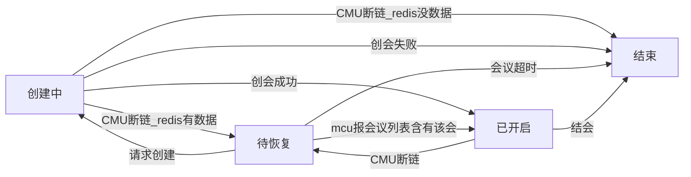
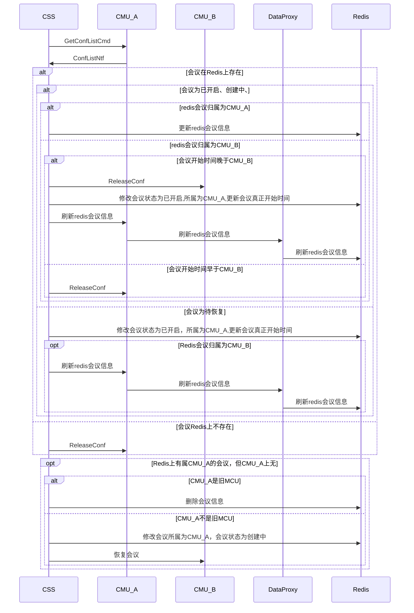
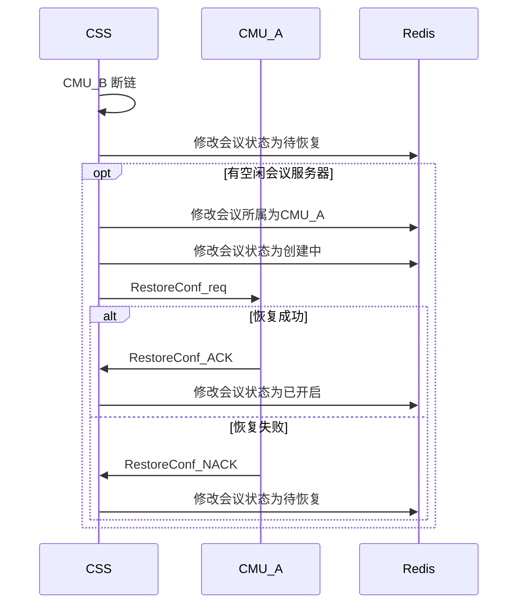
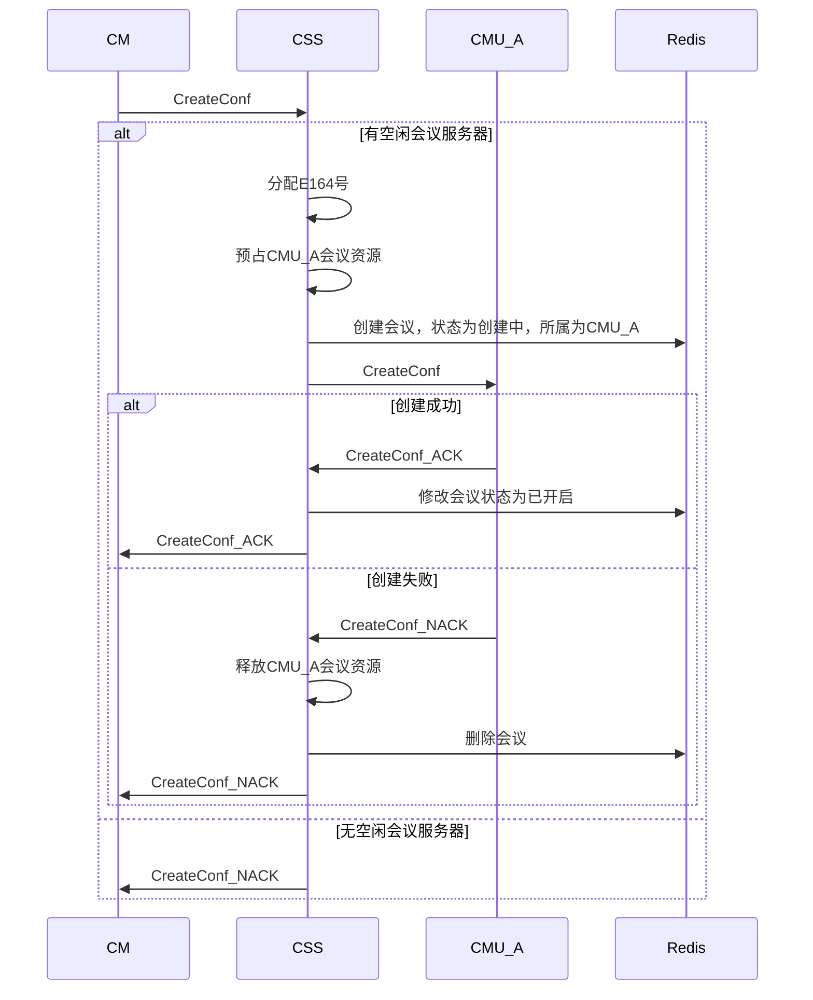
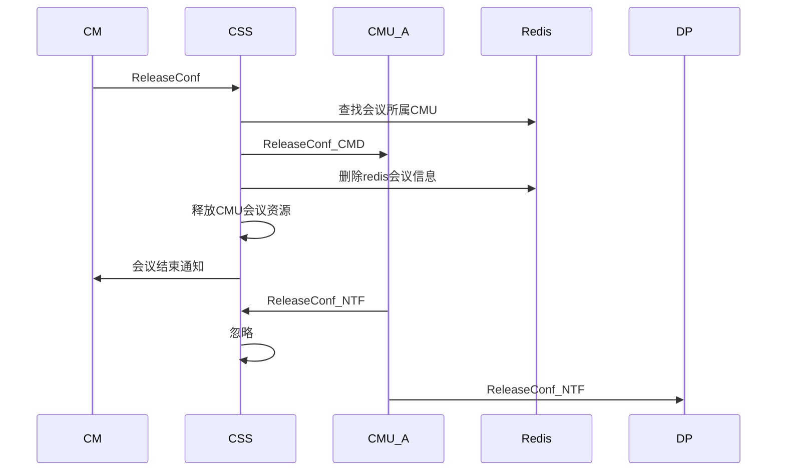
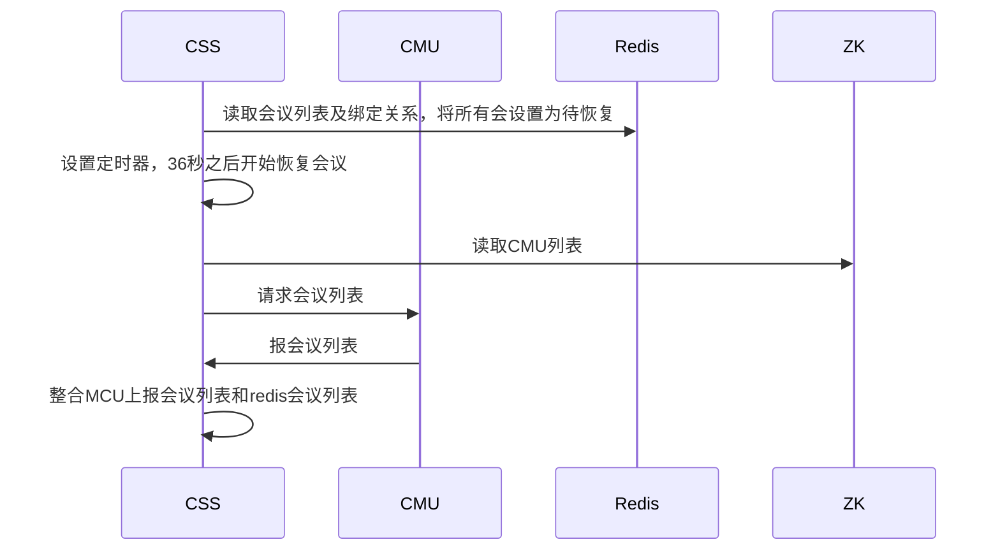
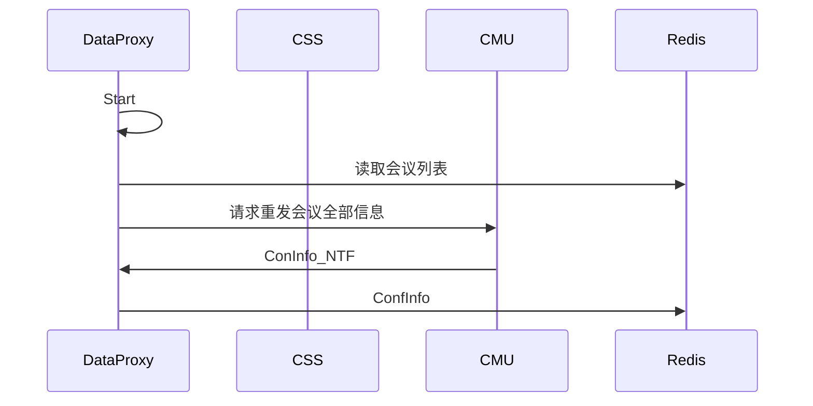

<!-- 请使用haroopd打开本文档 -->

<!-- http://pad.haroopress.com/user.html#download -->

#5.0会议恢复设计方案

[TOC]

##文档信息

作者: 邹俊龙

修改日期: 2015/12/17

##评审纪要

###第一次评审

评审日期：2015/12/17

评审人员：邹俊龙、彭杰、王也、牟兴茂、周广程、杨怀志

会议纪要：

> CSS不再为CMU分配CMU ID，CMU在消息中直接以IP:PID标示自己

> 会议所属CMU发生变化时，CSS需清除被恢复会议的Redis数据，只保留基础数据

> 被恢复的会议不需要自动结会逻辑

> 允许会管主动结束待恢复的会议（待需求确认）

> 恢复会议和创建会议分开处理

> CMU需支持上报会议完整信息

> ReleaseConf改为REQ/ACK模式。同时需要NTF DP

> CMU在每条消息中需要增加CMU标识，此标识也应上报ZK

> DP更新数据时需校验Redis上会议所属的CMU标识

##会议恢复

###1.规格

- [x] 当CSS检测到某一CMU断链后，选择另一空闲的CMU进行恢复

- [x] 当无可用资源时，若有CMU结会或新CMU上线，都需要触发会议恢复(mcu上线，只恢复redis上有但该MCU上没有的会议)

- [x] 会议恢复时，不考虑会议恢复顺序

- [x] 若CSS崩溃，则对ZK上不存在CMU的会议进行恢复

- [x] 若会议已到结束时间，仍未有空闲资源，则不再恢复

- [x] 被恢复的会议，其结束时间为原结束时间

- [x] 若原召开会议的CMU，会议并未结束，则需结束后来创建的会议(调整为结束先开的会议)

- [x] 利旧会议不恢复

- [x] 会议恢复失败后，仍然尝试恢复（暂定5min/次），直至会议结束时间或30分钟后(恢复失败之后，仍然走10S的定时恢复，30分钟之后仍失败并不结会)

- [x] 允许会管主动结束该会议

- [ ] 检查MCU资源，恢复失败后，找下一个MCU进行恢复(当前恢复失败之后, 仍然找开会数量最少的MCU)

- [ ] 处于待恢复的会议是否占用Lisence资源(占用license)

- [ ] 若某会议发生过会议恢复，则上报多点会议话单时，应报一条还是多条(报一条)

- [ ] 若会议异常后一直未恢复，则多点会议话单的结束时间是会议异常时间还是原定结束时间(报话单时刻时间)

###2. Redis数据

CSS在Redis上保存的数据有：

    1. key为confex/confE164的哈希表，内含会议所属CMU(用于标识会议归属)、会议当前状态、会议初始开始时间、当前开始时间等信息

    2. key为cmu/ip/confs的会议e164号集合

    3. key为domain/moid/confs的哈希表, 存储每个用户域的e164及会议状态的键值对列表信息

    4. key为domain/moid/license的哈希表，存储每个用户域的最大license大小方会议数，已license大小方会议数和未license的会议数

    5. key为static/conf的哈希表，存储当前可用的e164号后四位

###3. 会议状态机

注：

1.CSS启动后，会将存在于ZK的CMU的会议标识为已开启，不存在的标识为待恢复

2.如何判定CMU上的会议是被主动结束的还是重启后丢失的

> CMU需使用一种标示符标示自己，该标示符应该唯一，且进程重启后会发生变化

> 建议以IP + PID（ + 启动时间）

> CSS可通过此标识区分会议是自主结束还是重启导致丢失

> CSS发给MCU的MQ消息的routingKey应为：cmu.conf.k:ip:pid, 且Exclusive为Owner(程序结束自动删除该q)

> 为了保证mcu重启(css不感知断链),而zk还未通知css mcu pid变化间隙的创会不能成功

> 否则若允许创会成功，写入redis的会议pid还是之前的mcu的,将会导致mcu新创会议数据无法写入redis(dp会判断会议归属)

###4. CMU建链流程

CMU与CSS之间，仍然使用心跳消息进行保活

>场景说明：

1. Redis上有属CMU_A的会议，但CMU_A上无

  该会议被终端主动结束或因无终端而自动结束

###5. CMU断链流程图

###6. 创会流程

###7. 结会流程

问题点：

DP不感知CreateConf_ACK，如何知道会议是新创建的？

Release目前是CMD，NTF操作，NTF为广播消息，CSS能否收到？

（CMU推条结会消息，一条给DP，一条给CSS）

DP和CMU的数据同步如何处理？

  CMU在与MQ断链的过程中会议已结束。此时DP不会收到会议结束的消息，因此会出现数据不一致的现象

  

###8. 异常处理

####8.1. CSS崩溃重启

   

可能有两种情况：

1. 会议先被恢复后，再收到mcu的会议列表。(css进入正常状态36s后才开始定时恢复会议，保证mcu已经报上会议列表，超时未上报的认为与css发生断链,会议需要恢复)

2. 先收到mcu的会议列表，则直接将会议置为正召开状态

####8.2. DP崩溃

  DP崩溃后，需按会议向MCU发送重发请求

  

####8.3. CMU和MQ断链（低优先级）

  CMU检测到和MQ断链后，需要重新上报所有会议信息到DP

###9. CSS控制DataProxy对会议的写入权限

由于CMU并不感知和CSS的连接状态，因此无法感知到和CSS断链

断链的CMU仍会持续不断地发消息给DataProxy更新数据

存在一种情况，原会议正在开启，但CSS又在另外一个CMU上恢复了一个相同的会议

此时两个CMU都会往Redis上的同一份数据中写入会议信息

CSS需要控制DataProxy丢弃其中一个CMU的消息

~~1. 通过删除CMU->DataProxy的key和queue的绑定关系，使消息无法发送到DataProxy~~

   ~~优点：被删除的CMU消息会全部在MQ侧被丢弃,DataProxy无需处理~~

   ~~缺点：~~

   ~~* 删除绑定关系的时机容易导致时序问题，需要结束非正常的会议后，再绑定key和queue~

   ~~* CSS操作了DataProxy的队列~~

2. DataProxy自行检测Redis上会议和CMU的所属关系，决定哪些消息可以写入会议

   优点：不存在时序问题，控制较为简单

   缺点：DataProxy对每消息都要进行额外的判断

###10. 整合mcu上报会议列表与redis会议列表的策略

mcu上报的会议列表需要与redis上的会议列表进行比较，根据会议状态来做各种处理

比较的因素有：

    1. 会议召开时间
    2. mcuip, 据此判断redis上的会跟mcu上报的会是不是在同一个mcu上面

处理策略：

    1. 如果会议处于待恢复状态
    直接更新redis数据为cmu上报的会议数据，同时若redis会议ip与上报的mcuip不同，
    需要通知该mcu重新刷新会议数据到redis.因为在待恢复状态时，mcu无法刷新会议
    数据到redis(dp会判断会议归属来决定是否写入数据)

    2. 如果会议处于正召开或创建状态
    若mcu上报会议所属ip与redis归属mcuip相同则更新上报信息到redis,否则比较会议
    召开时间，结束较早召开的会议，若结束当前redis上mcu的会议，还需要更新上报
    的MCU会议信息到redis,同时通知该MCU刷新全部会议信息到redis

###11. 利旧会议的生命周期

利旧会议是不恢复的。所以若旧MCU与css断链, css会将归属于该MCU的REDIS会议设
置成待恢复状态,但在定时恢复会议中不会去恢复利旧会议。旧MCU与CSS重新连接之后，
如果mcu会议未结束则重新设置会议为正召开状态。若mcu会议已经结束，则需要删除
会议信息。若该mcu一直未连接，则到会议结束时间CSS会删除会议信息

###12. 会议恢复对定时检测会议是否到时的影响

处于恢复状态的会议，如果当前时间大于或等于会议结束时间则删除会议数据, 且上报话单

处于正召开状态的会议维持旧有逻辑不变

处于创建中状态的会议，若没有会议基础数据且创会超时需要删除该会议数据, 不报话单

若会议存在基础数据且创会超时或恢复超时，则设置该会为待恢复状态

###13. 会议恢复对报话单的影响
加入会议恢复以后，多次恢复的会议也只报一次话单,虽然会议的归属在会议生命周期中会有变化，
但是会议的开始时间只有在创会的时候写入，之后不再变化。而当前对话单真正有影响的也只有
会议的开始时间

