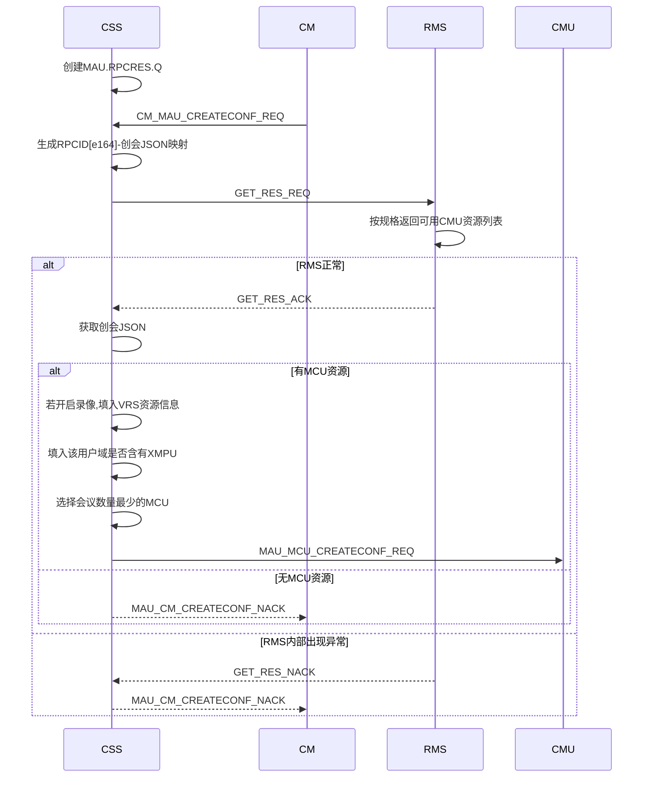
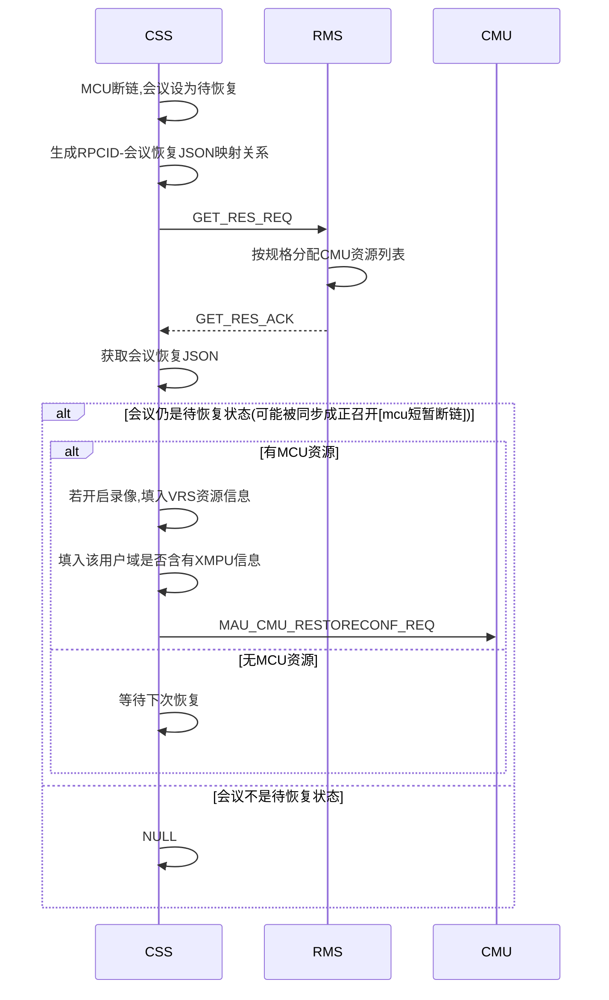
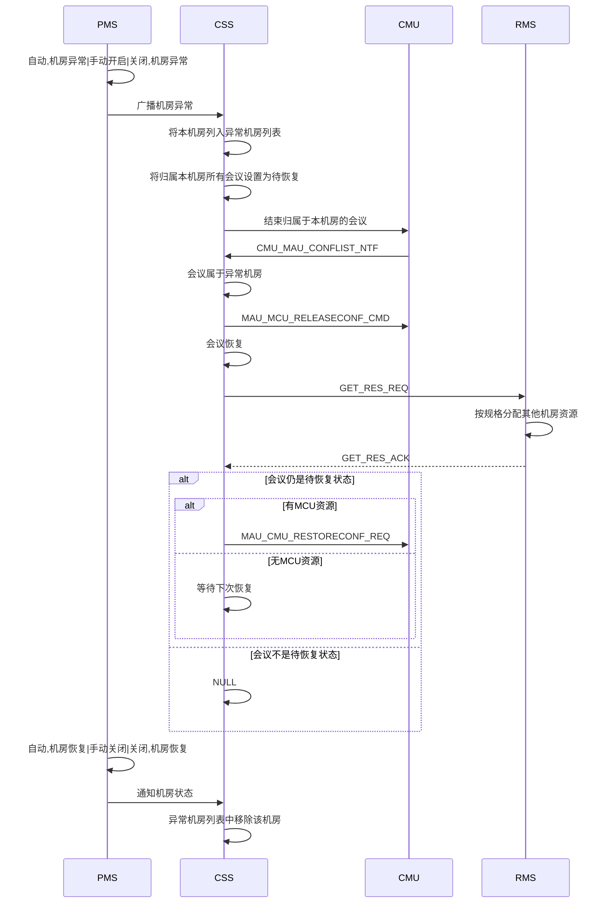
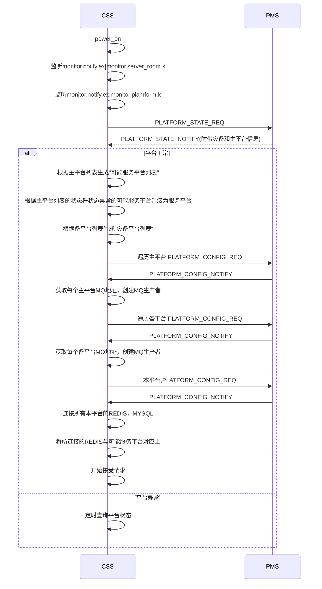
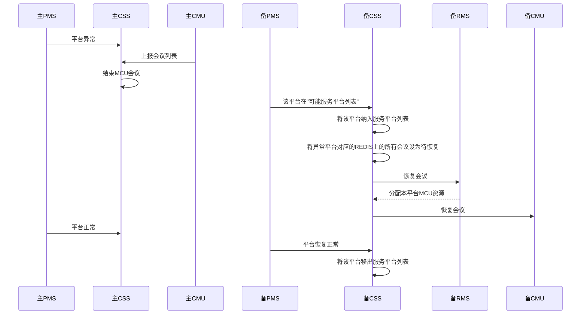
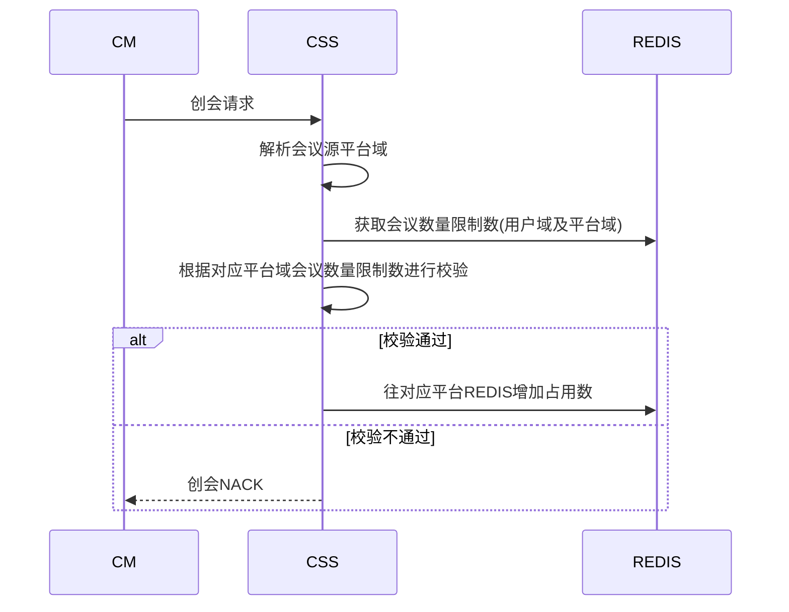
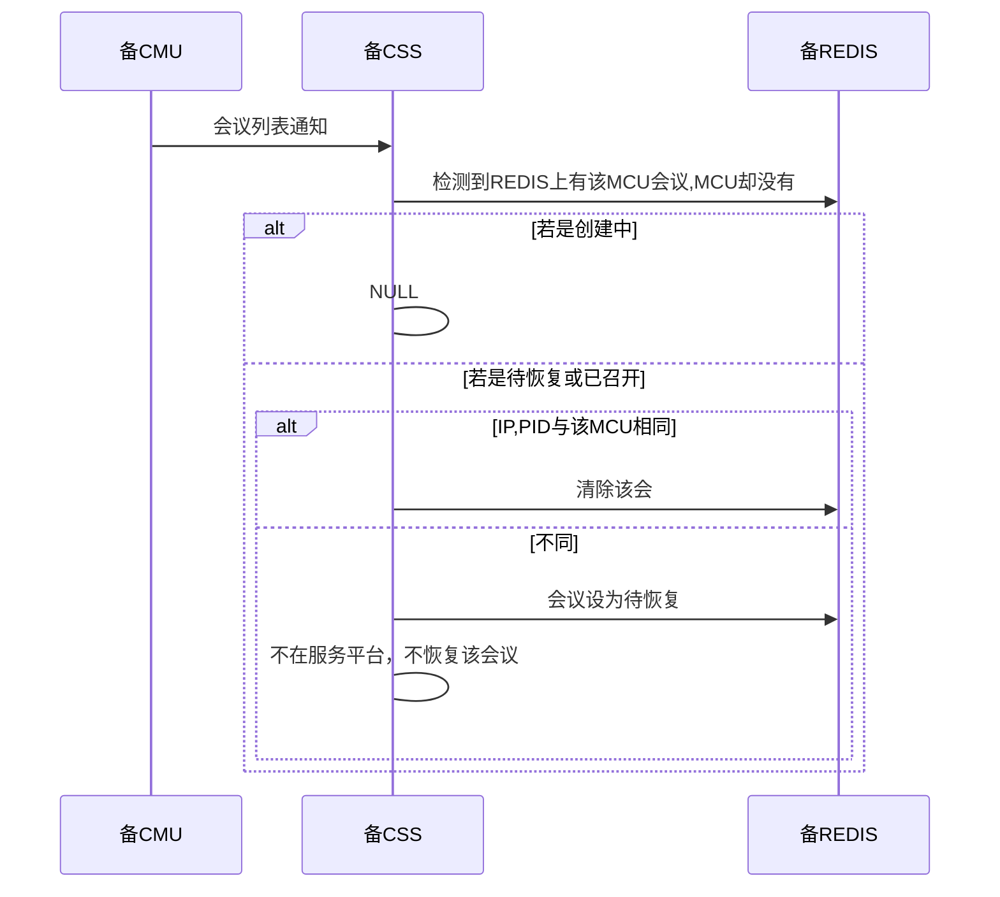
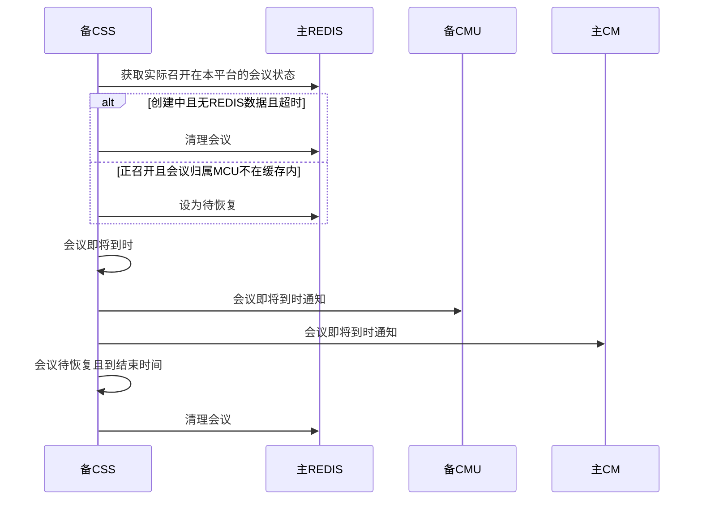
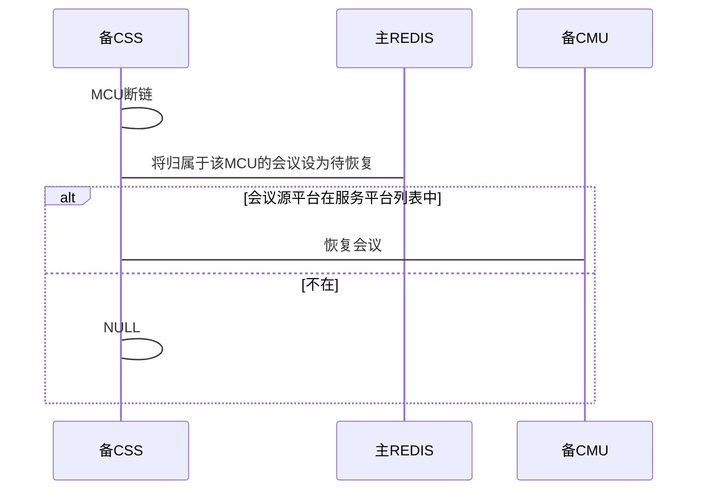
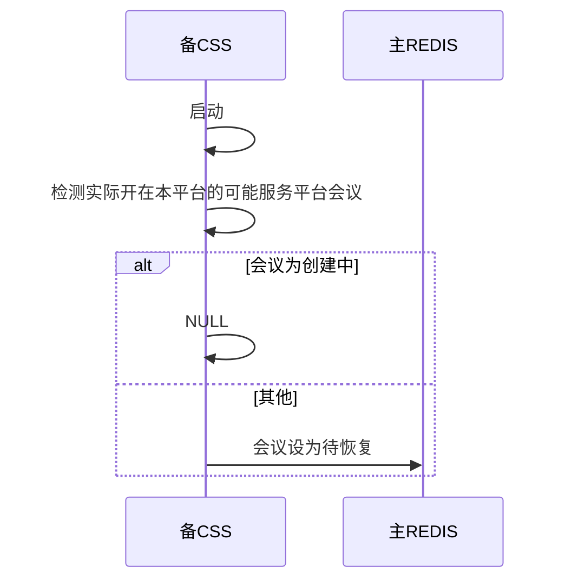

# 5.1sp4CSS概要设计

[TOC]

## 1 RMS波及

### 1.1 创会流程



### 1.2 平台内灾备流程






### 1.3 数据变更
```c++
//新增缓存
vector<string> m_vecExceptRoom  //异常机房列表
```

| confex   |            |      |
| -------- | ---------- | ---- |
| roommoid | 会议归属机房MOID | 新增   |


### 1.4 消息走法

```json
RMS消费者: RMS.RES.Q|RMS.RES.K|RMS.RES.EX
```

```json
CSS消费者(rpc): MAU.RPCRES.Q|(AMQP default)
```

```JSON
{
  "type" : "GET_RES_REQ",
  "moid" : "", //用户域MOID
}
```

```json
{
  "type" : "GET_RES_ACK",
  "roommoid" : "",
  "mcu" :
  [
    "ip" : "",
  ],
  "vrs" :   //若没有则为空数组，多个则取第一个
  [
    "ip" : "",
  ],
  "mps" :   //若没有则为空数组
  [
    "ip" : ""
  ]
}
```

```json
{
  "type" : "GET_RES_NACK",
  "errcode" : ""
}
```

 ```json
{
    "type": "MCU_MAU_CONFLIST_NTF",
    "ip": "172.16.186.32",
    "roommoid" : "", //新增
    "confdatainfo": [],
    "pid": "26645"
}
 ```


### 1.5 其他

> 不再缓存用户域是否含有XMPU,使用RMS返回值

> CSS不再关注灾备模式，感知机房异常, 由RMS感知并分配MCU

> mcu	报会议列表时需报其机房MOID


## 2 PMS波及
###2.1 CSS连接图


### 2.2 启动流程



> 建议新增一条消息，能够下发主备平台的MQ服务器地址信息及本平台的REDIS信息

> CSS所关心的公共模板,confinfodb,AP数据库是不分库的，且同时互为主备，所以无需连接其他平台的数据库


### 2.3 平台间的灾备

#### 2.3.1 时序图



> 平台发生异常之后，不强制所有APP停止服务，因为收到异常通知，REDIS连接将会异常，
>
> 平台的所有操作基本异常，但却能维护和各个模板间的连接，使得平台恢复之后能够更快地开始服务
>
> (上报网管仍正常上报)
>
> LICENSE策略仍继续保持---LICENSE策略考虑之后再决定要不要干预
>
> BMC侧只涉及域信息更新，而域信息已上报REDIS，也没有问题


#### 2.3.2 灾备平台的创会消息处理

```flow
st=>start: 创会请求
end=>end: ack
nack=>end: nack
op1=>operation: 根据用户域获取其所属平台域
cond1=>condition: 平台域是否在服务平台列表
op2=>operation: 往会议源平台域的REDIS写入数据
op3=>operation: 创会成功往本平台域的confinfodb添加数据
st->op1->cond1(yes)->op2->op3->end
cond1(no)->nack
```

> 服务平台列表 = 本平台 + (可能服务平台列表中平台 & PMS通知平台异常)

> 设置主平台灾备关闭，主平台异常，则PMS不通知灾备平台CSS主平台异常
>
> CSS不感知平台域具体灾备参数(自动，手动开启/关闭，关闭)


#### 2.3.3 主平台恢复，开在备平台会议的会控消息处理

```sequence
主PMS->主CSS: 主平台异常
备PMS->备CSS: 主平台异常
备CSS->备CSS: 恢复会议在备平台
备CM->备CSS: 主平台会议会控消息
备CSS->备CSS: 会议实际开启在本平台
备CSS->备CMU: 转发会控消息
备CMU->备CSS: 会议状态通知
备CSS->备CSS: 会议源平台在服务平台列表
备CSS->备CM: 会议状态通知
主PMS->主CSS: 主平台恢复正常
备PMS->备CSS: 主平台恢复正常
备CSS->备CSS: 将该平台移出服务平台列表
主CSS->主CSS: 收到会控消息
主CSS->主CSS: 会议实际在灾备平台
主CSS->备CSS: 转发会控消息(cm.cmmcu.key)
备CSS->备CSS: 会议实际开启在本平台
备CSS->备CMU: 转发会控消息
备CMU->备CSS: 会议状态通知
备CSS->备CSS: 源平台不在服务平台列表
备CSS->备CSS: 找到源平台的MQ生产者句柄
备CSS->主CSS: 转发会议状态控制
备CSS->主CSS: meeting.mccntf.k|rpc
```


#### 2.3.4 REDIS数据变更

| confex       |          |      |
| ------------ | -------- | ---- |
| platformmoid | 会议实际创建平台 | 新增   |


#### 2.3.5 消息走法

```json
CSS消费者(rpc): MAU.RPCPLATINFO.Q|(AMQP default)
```

```json
PMS消费者: monitor.req.q:moid(平台域) //获取平台域状态|平台域公共信息查询
```


#### 2.3.6 其他

> 部署之后，能够灾备到本平台的灾备平台已明确,即“可能服务平台列表”是固定的

> CSS新增"可能服务列表"和"服务平台列表"缓存

> confex:moid(用户域MOID)标识了该会议的源用户域,平台域,据此将会议数据写入到对应平台的REDIS中


##3 域信息处理
### 3.1 为什么需要将域信息写入REDIS

> 当主平台异常，灾备平台接管之后，BMC可能修改主平台的用户域信息
>
> 将域信息放入REDIS，让灾备平台更新域信息，切换回主平台，无需考虑域信息的更新问题


### 3.2 REDIS数据设计

将用户域，平台域，服务域数据按如下格式写入REDIS

| domain/“MOID”/info    |                        |
| --------------------- | ---------------------- |
| moid                  | 域MOID                  |
| level                 | 域层级,0-用户域,1-平台域,2-服务域  |
| uplevelmoid           | 上级域MOID                |
| name                  | 域名称                    |
| used                  | 是否停用,0-停用，1-启用         |
| ~~smallconfnumlimit~~ | 小型会议数量限制,存放于license信息中 |
| ~~largeconfnumlimit~~ | 大型会议数量限制,存放于license信息中 |
| enableh265            | 是否启用H265权限，0-不启用，1-启用  |
| enablehdmeeting       | 是否启用全高清权限，0-不启用，1-启用   |


### 3.3 灾备平台的处理

```sequence
备CSS->备CSS: 启动
备CSS->备CSS: 读取全部域信息
备CSS->备CSS: 写入所有“服务平台列表”平台REDIS
BMC->备CSS: 域信息更新
备CSS->备CSS: 更新所有“服务平台列表”平台的域信息
```


### 3.4 其他

> 所有平台的REDIS域信息应该都是一致的


## 4 license相关

### 4.1 为什么需要将LICENSE信息放入REDIS

> 当主平台异常，灾备平台接管之后，BMC可能修改主平台的LICENSE信息
>
> 将LICENSE信息放入REDIS，让灾备平台更新，切换回主平台，无需考虑LICENSE信息的更新问题

> 主平台域账号在灾备平台域开会，进行会议数量限制，需获取主平台域的LICENSE信息进行会议数量限制


### 4.2 REDIS数据设计

| domain/"MOID"/license |             |
| --------------------- | ----------- |
| license               | 密文形式LICENSE |
| smallconfnum          | 小型会议数量限制    |
| largeconfnum          | 大型会议数量限制    |
| softwarenumlimit      | 软件终端接入数     |
| hardwarenumlimit      | 硬件授权数       |
| monitornumlimit       | 监控授权数       |
| mediaportnumlimit     | 媒体端口授权数     |
| currentcallnumlimit   | 接入端口授权数     |


### 4.3 获取LICENSE

```sequence
CSS->BMC: 获取"可能服务平台"license
BMC->CSS: 依次发送LICENSE
CSS->CSS: 解析LICENSE
CSS->REDIS: 存储各个平台的限制信息
CSS->CSS: 以本平台LICENSE为基础
CSS->CSS: 累加可能服务平台的资源类限制数
CSS->CSS: 修改本平台的LICENSE
CSS->platform.license.ex(platform.license.ntf.k):发送修改后的LICENSE信息
```


### 4.4 更新LICENSE

```sequence
BMC->CSS: 更新某个平台的LICENSE
CSS->CSS: 解析消息
CSS->CSS: 属于“可能服务平台”
CSS->对应平台REDIS: 更新对应平台LICENSE信息
CSS->CSS: 以本平台LICENSE为基础
CSS->CSS: 累加可能服务平台的资源类限制数
CSS->CSS: 修改本平台的LICENSE
CSS->platform.license.ex(platform.license.ntf.k):发送修改后的LICENSE信息
```


### 4.5 处理LICENSE请求

```sequence
MS->CSS: 获取本平台的LICENSE
CSS->CSS: 以本平台LICENSE为基础
CSS->CSS: 累加“可能服务平台”的资源类限制数
CSS->CSS: 修改本平台的LICENSE
CSS->MS:发送修改后的LICENSE信息
```


### 4.6 会议数量限制


> 每个平台域对于会议数量的限制还是基于自身的LICENSE
>
> 平台域对于资源的限制是“可能服务平台”的资源总和
>
> CSS无需将LICENSE写入到REDIS
>
> 平台资源累加的方式下发给MS和PAS，可能导致其他平台开会占了本平台或者另外的灾备平台的资源
>
> MS需要感知服务平台列表中平台的LICENSE限制
>
> CSS启动的时候，获取所有可能服务平台的LICENSE限制，并将其下发给本平台域的所有的MS和PAS
>
> MS和PAS在考虑呼叫对和资源占用的时候，判断其会议或者终端的源平台是哪个平台的，对应去占用该平台的LICENSE
>
> 如果这样，当主平台恢复之后，可以不考虑灾备平台的MS的会议
>
> 可以不存REDIS，主平台恢复之后重新向BMC去获取
>
> LICENSE这块必须尽快去催规格出设计，CSS才能做设计


## 5 MCU请求和通知的处理

### 5.1 修改会议名

#### 5.1.1 新增消息

```json
{
    "type": "CMU_CM_MODIFYCONFNAME_REQ",
    "confE164": "6660175",
    "confname": "1111"
    "ip": "172.16.186.32",
    "pid": "26603",
    "mtreqid": "1",
}
```

```json
{
    "type": "CM_CMU_MODIFYCONFNAME_ACK",
    "confE164": "6660175",
    "confname": "222"
    "ip": "172.16.186.32",
    "pid": "26603",
    "mtreqid": "1",
}
```

```json
{
  "type" : "CM_CMU_MODIFYCONFNAME_NACK",
  "confE164": "6660175",
  "confname": "222"
  "ip": "172.16.186.32",
  "pid": "26603",
  "mtreqid": "1",
  "errcode" : ""
}
```


#### 5.1.2 时序图

正常情况

```sequence
MCU->CSS: CMU_CM_MODIFYCONFNAME_REQ
CSS->CM: CMU_CM_MODIFYCONFNAME_REQ
CM->CSS: CM_MAU_MODIFYCONFNAME_ACK
CSS->MCU: MAU_CM_MODIFYCONFNAME_ACK
MCU->CSS: MCU_MAU_CONFSTATECHANGE_NTF	
CSS->confinfoDB: 更新会议名
```

> REDIS:CONFEX:CONFNAME里不再设置会议名，CSS获取会议名通过REDIS:CONF:CONFNAME

> CMU_CM_MODIFYCONFNAME_REQ作为透传给会管的消息，在发往会管时特别处理,发往MEETING.CSS.Q中

> 如果东进网关不需要会议名，则无需往confinfoDB中设置,不必处理MCU_MAU_CONFSTATECHANGE_NTF
>
> 中修改会议名的通知


主平台恢复，会议在备平台情况:

```sequence
备MCU->备CSS: CMU_CM_MODIFYCONFNAME_RE
备CSS->备CSS: 源平台不在服务列表
备CSS->主CM: 转发
主CM->主CSS: CM_CMU_MODIFYCONFNAME_ACK
主CSS->主CSS: 实际平台在备平台
主CSS->备CSS: CM_CMU_MODIFYCONFNAME_ACK
备CSS->备MCU: CM_CMU_MODIFYCONFNAME_ACK
备MCU->备CSS: MCU_MAU_CONFSTATECHANGE_NTF
备CSS->CONFINFODB:更新会议名
```

> confinfoDB不分库，主备平台互为主备,可以直接修改数据

> MCU_MAU_CONFSTATECHANGE_NTF消息处理的REDIS数据源是为“可能服务平台列表” && 实际在本平台召开的会议


#### 5.1.3 消息走法

```json
备CSS->主CM: MEETING.CSS.EX(MEETING.CSS.K)
主CSS->备CSS: MAU.CMMCU.Q(MAU.CMMCU.K)
```


#### 5.1.4 其他

> 主备平台应可以允许会议名一样的情况，且发生灾备，备平台可以允许有两个相同的会议名的会议存在一个平台


### 5.2 会议密码变更通知

主平台恢复，会议在备平台情况:

```sequence
备MCU->备CSS: MCU_MAU_CONFSTATECHANGE_NTF
备CSS->CONFINFODB:更新会议密码
```

> confinfoDB不分库，主备平台互为主备,可以直接修改数据

> MCU_MAU_CONFSTATECHANGE_NTF消息处理的REDIS数据源是为“可能服务平台列表” && 实际在本平台召开的会议


### 5.3 延长会议(CSS总控)

正常情况：

```sequence
CM->CSS: CM_MAU_DELAYCONF_REQ
CSS->CSS: 校验
CSS->REDIS: 更新会议数据
CSS->CM: CM_MAU_DELAYCONF_ACK
CSS->CM: CM_MAU_CONFDURATION_NTF
CSS->CMU: MAU_CMU_CONFDURATION_NTF
```

```sequence
CMU->CSS: MCU_MAU_DELAYCONF_REQ
CSS->CSS: 校验
CSS->REDIS: 更新会议数据
CSS->CMU: MAU_MCU_DELAYCONF_ACK
CSS->CM: CM_MAU_CONFDURATION_NTF
```


主平台恢复，会议在备平台情况:

> 处理延长会议请求的REDIS数据源为“可能服务平台”

```sequence
主CM->主CSS: CM_MAU_DELAYCONF_REQ
主CSS->主CSS: 校验
主CSS->主REDIS: 更新会议数据
主CSS->主CM: CM_MAU_DELAYCONF_ACK
主CSS->主CM: CM_MAU_CONFDURATION_NTF
主CSS->主CSS: 会议实际在灾备平台
主CSS->备CMU: MAU_CMU_CONFDURATION_NTF
```

```sequence
备CMU->备CSS: MCU_MAU_DELAYCONF_REQ
备CSS->备CSS: 校验
备CSS->主REDIS: 更新会议数据
备CSS->备CMU: MAU_MCU_DELAYCONF_ACK
备CSS->备CSS: 会议源平台不在服务平台列表
备CSS->主CM: CM_MAU_CONFDURATION_NTF
```

> 主平台CSS发往备平台CMU消息走: cmu.conf.q:ip(cmu.conf.q:ip:pid)根据会议归属CMU信息自己组装

> 备平台CSS发往主平台CM消息走: meeting.mccntf.q(meeting.mccntf.k)


## 6 公共模板处理

```sequence
CM->备CSS: 增/删/改公共模板
备CSS->备CSS: 解析出模板所属平台
备CSS->TTEMPLATEINFO: 增/删/改对应平台数据库
备CSS->REDIS: 增/删/改对应平台REDIS数据
备CSS->CM: ADD/MOD/DEL_TEMPLATE_ACK
```

> 公共模板构造E164号交给会管，已在5.1SP4CSS概要设计-会管侧 文档中明确

> 主平台用户在备平台构造公共模板E164号需按主平台规则构造E164号


## 7 上报UPU波及

### 7.1  启动上报项

> 启动上报到UPU的REDIS源扩大到“服务平台列表”

```sequence
CSS->CSS: 启动
CSS->REDIS: 获取预约会议，个人模板，虚拟会议室信息
CSS->UPU: 上报预约会议，个人模板，虚拟会议室信息[实际平台域MOID]
CSS->CSS: 创会/恢复/同步成功
CSS->UPU: 上报正召开会议信息[实际平台域MOID]
REDIS->CSS: 修改/删除预约会议/个人模板/虚拟会议通知
CSS->UPU: 修改/删除对应会议信息
CSS->CSS: 结会
CSS->UPU: 删除对应召开会议信息
```


### 7.2 灾备情况

```sequence
主CSS->主UPU: 上报主平台预约会议,个人模板,固定虚拟会议
主PMS->主CSS: 平台异常
主CSS->主UPU: 清空UPU所有会议信息包括预约会议等
备PMS->备CSS: 主平台异常
备CSS->备UPU: 上报主平台预约会议,个人模板,固定虚拟会议(源用户域,实际平台域)
备CSS->备CSS: 恢复会议
备CSS->备UPU: 上报正召开会议(源用户域,实际平台域)
主PMS->主CSS: 平台恢复
备PMS->备CSS: 平台恢复
备CSS->备UPU: 根据源用户域删除主平台的预约会议,个人模板,虚拟会议室
备CSS->备CSS: 源平台是主平台的会议结束
备CSS->备UPU: 删除备UPU该会议记录
主CSS->主UPU: 上报主平台预约会议,个人模板,固定虚拟会议
主CSS->主CSS: 恢复待恢复的会议
主CSS->主UPU: 上报正召开会议
```


### 7.3 UPU需新增固定虚拟会议室类型

```c++
//会议类型
typedef enum TYPE
{
    INSTANT = 1,    //即时会议
    RESERVE,        //预约会议
    TEMPLET,         //模板
    VIRTUAL         //新增--固定虚拟会议
} EConfType;
```


### 7.4 其他

> 灾备之后，备平台会管也要同样更新预约会议，个人模板，固定虚拟会议室E164号到源平台的REDIS中，CSS也要订阅服务平台的REDIS的发布通道


## 8 NPPCLIENT的波及

```sequence
NPPCLIENT->NPPCLIENT: 启动
NPPCLIENT->本机: 读取服务发现IP地址
NPPCLIENT->服务发现: 获取本平台域下所有REDIS地址及其源平台域MOID
NGI->NPPCLIENT: 获取正召开会议列表
NPPCLIENT->NPPCLIENT: 获取请求的平台域信息
NPPCLIENT->REDIS: 在对应平台获取会议信息
```


> NGI请求需带平台域MOID
>


## 9 会议状态维护

### 9.1 定时恢复会议

> 恢复会议的数据源为“服务平台”REDIS会议数据


### 9.2 会议列表的同步

> 会议列表同步的数据源扩大到“可能服务平台列表"REDIS

> 检测可能服务平台REDIS上有该MCU会议，而MCU无会议，且该会议是正召开状态，将此会议设置为待恢复，但不恢复，由主平台定时恢复

```sequence
备CSS->备CSS: 与MCU短暂断链
备CSS->备REDIS: 会议设为待恢复
主CSS->主CMU: 恢复会议，会议归属为主CMU
主CSS->主CSS: 会议状态可能为创建中和已召开
备CMU->备CSS: 会议列表通知
备CSS->备CSS: 会议归属为其他MCU且本MCU创会时间较早
备CSS->备CMU: 结束会议
备CMU->备CSS: 会议结束通知
备CSS->备CSS: 会议不归属本MCU，忽略消息

```





### 9.3 检测会议是否到时

> 检测会议是否到时的数据源扩大到“可能服务平台”，对其他平台源REDIS的会议，只检测实际召开平台是本平台的会议

> 主平台检测会议是否到时不处理实际开在灾备平台的会议，由实际平台CSS维护




### 9.4 MCU断链处理

> CSS收到MCU断链消息通知，数据源需扩展到"可能服务平台的"REDIS




### 9.5 启动初始化REDIS数据

> 数据源为可能服务平台 && 实际召开在本平台的会议




## 10 会场监控波及

> 会管更新监控心跳消息的REDIS处理扩大到“服务平台列表”

> 获取过期监控的数据源扩大到“可能服务平台列表”

> 监控心跳改成会管透传MCU消息，消息发往mau.cmcmu.ex(mau.cmcmu.k),CSS作特殊处理并且不再下发给MCU

```sequence
CM->主CSS: 会议A开启了监控
主CSS->主CSS: 平台异常
备CSS->备CSS: 恢复会议A
备CSS->CM: 停止监控通知
主CSS->主CSS: 平台正常
CM->主CSS: 会议A开启监控
主CSS->备CSS: 开启监控
备CSS->备CMU: 开启监控
CM->主CSS: 监控心跳保活
主CSS->备CSS: 监控心跳保活
备CSS->主REDIS: 更新时间
备CSS->备CSS: 监控过期
备CSS->备CMU: 关闭监控
```


## 11 上报网管信息

> 不再连接NU，连接NU数量写死为0
>


## 12 其他

> 利旧会议不灾备
>
> 在灾备平台域上报源平台域是主平台域的话单，因为BMC是整个服务域的，会议开在哪个平台就在哪个平台报

> 原则上，会议实际召开在哪个平台，就由实际平台CSS控制及维护该会议包括检测会议是否到时，会议状态维护等

> 恢复召开等设计到资源的操作使用服务平台，数据维护使用可能服务平台


