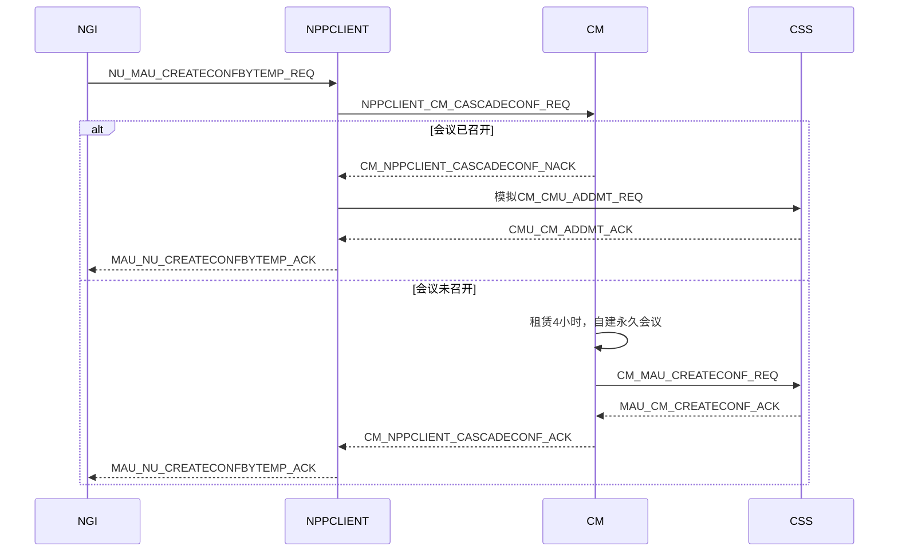
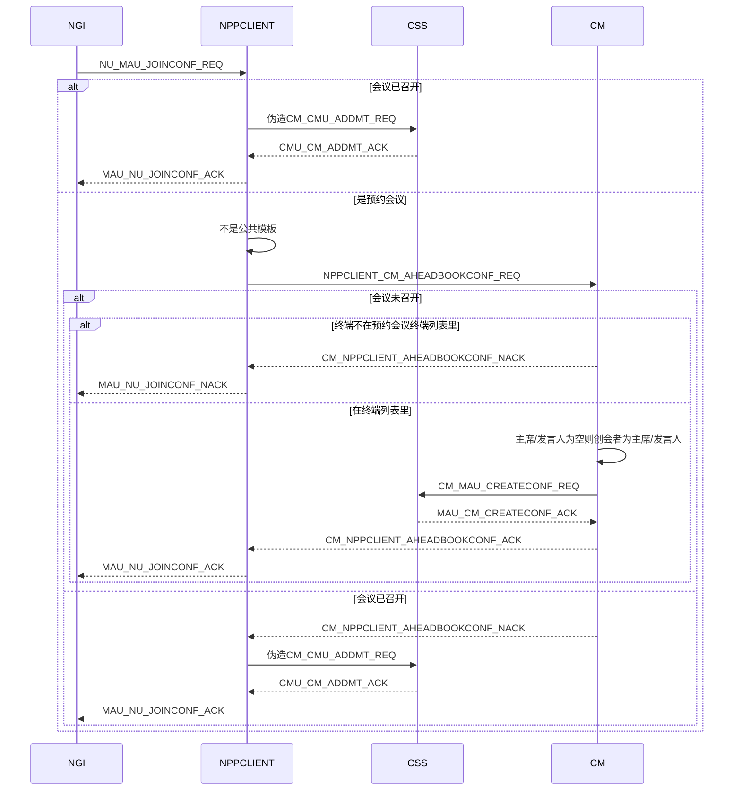
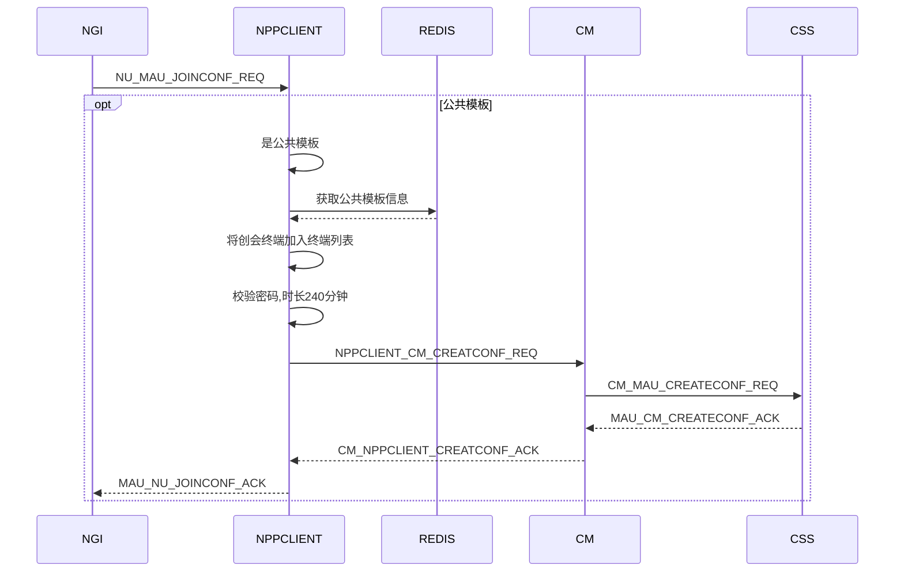
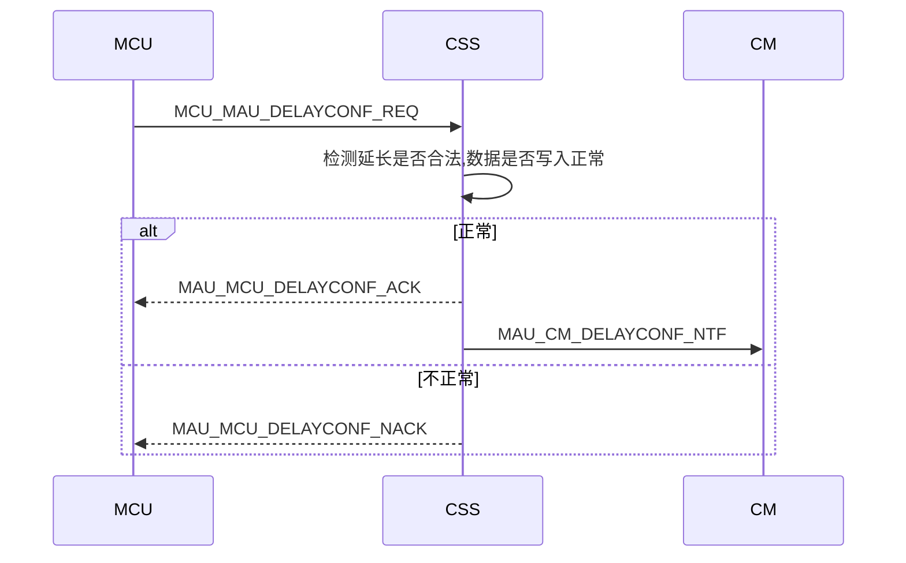

# 5.1sp4CSS概要设计

[TOC]

##1 基础功能移交会管
###1.1 会议重命名检测与修改

### 1.1.1 波及

> 会管通过个人模板创会
>
> 会管立即召开预约会议
>
> 会管通过公共模板创会
>
> 终端直接创会
>
> 终端通过公共模板创会
>
> 终端提前召开预约会议
>
> 跨域呼叫预分配号个人模板


###1.2 会议E164号分配
####1.2.1波及CSS上报UPU会议e164号
| REDIS数据结构 | key             | field       | value                        |
| --------- | --------------- | ----------- | ---------------------------- |
| hash      | confe164/“e164” | type        | 1预约会议,2预分配E164号个人模板,3固定虚拟会议室 |
|           |                 | e164        | 会议E164                       |
|           |                 | moid        | 会议所属用户域MOID                  |
|           |                 | encryptmode | 会议加密类型                       |
> 新增预约会议:

> 删除预约会议:

> 新增预分配个人模板:

> 删除预分配个人模板:

> 新增固定虚拟会议室:

> 删除固定虚拟会议室:

publish 频道: e164_notify 

```json
[
  {
  "conftype" : "1/2/3", //1预约会议,2预分配E164号个人模板,3固定虚拟会议室
  "confe164" : "",
  "moid" : "", //用户域MOID,删除情况可不填
  "encryptmode" : "" //会议加密类型
  "operator" : "update/delete"
  },
  ...
]
```
当前css所用acl::redis库订阅推送功能存在漏消息问题

​	

## 2 公共模板数据存储

CSS负责维护公共模板数据库数据并增加REDIS数据

| REDIS数据结构 | key                     | field  | value          |
| --------- | ----------------------- | ------ | -------------- |
| set       | domain/"moid"/templates |        | 某用户域下公共模板E164号 |
| hash      | template/“e164”         | detail | 公共模板数据         |


> 增加公共模板，会管需构造E164，检测模板重名， 再下发数据，CSS存入MPCDDB:TTEMPLATEINFO和REDIS
>
> CSS将往公共模板详情中写入用户域名,用于终端获取公共模板详情
>
> CSS不再缓存和读取公共模板信息


##3 终端获取会议数量流程

```sequence
participant MT
participant NGI
participant NPPCLIENT
participant REDIS

MT->NGI: GET_CONFNUM_REQ
NGI->NPPCLIENT: NU_MAU_GETCONFNUM_REQ
NPPCLIENT->REDIS: 获取用户域会议数量
REDIS-->>NPPCLIENT: 
NPPCLIENT-->>NGI: MAU_NU_GETCONFNUM_ACK
NGI-->>MT: GET_CONFNUM_ACK
```

### 3.1 用户域MOID及终端是否是受限终端(来宾账户)信息如何获取

- [x] NGI上报UPU，调接口时查询UPU带入

      BOOL32 npp_send_message(void *pBuf, u32 dwBufLen, const u16 wMsgType, const s8 *  userDoaminMOID, const BOOL32 bLimited)

- [ ] NGI上报UPU，NPPCLIENT通过UPUCLINET获取

- [ ] NPPCLIENT缓存终端信息(读取AP数据库和BMC MQ通知)

      ​


##4 终端获取会议列表流程

###4.1 终端获取正在召开会议列表

```sequence
participant MT
participant NGI
participant NPPCLIENT
participant REDIS

MT->NGI: GET_CONFLIST_REQ
NGI->NPPCLIENT: NU_MAU_GETCONFLIST_REQ
NPPCLIENT->REDIS: 获取用户域已召开会议列表
REDIS-->>NPPCLIENT: 
NPPCLIENT-->>NGI: MAU_NU_GETCONFLIST_ACK
NGI-->>MT: GET_CONFLIST_ACK
```


###4.2 终端获取预约会议列表流程

```sequence
NGI->NPPCLIENT: NU_MAU_GETBOOKCONFLIST_REQ
NPPCLIENT->CM: 获取预约会议列表
CM->CM:1.当天
CM->CM:2.指定用户域
CM->CM:3.终端需在预约会议终端列表中
CM-->>NPPCLIENT: 
NPPCLIENT-->>NGI: MAU_NU_GETBOOKCONFLIST_ACK
```

```json
{
  "type" :　"NPPCLIENT_CM_GETBOOKCONFLIST_REQ",
  "mtNO" :  "", //终端E164号
  "moid" :  "", //终端所在用户域MOID
}
```

```json
{
  "type" :　"CM_NPPCLIENT_GETBOOKCONFLIST_ACK",
  "bookconflist" :
  [
    {
       "confname" :　"",    // 会议名
 	   "confE164" : "",    //会议E164号
       "mtnum" :　"",       //终端数量
       "openmode" : "",     //0-隐藏会议；1-公开会议；
       "mediatype":"",      //主视频格式视频类型
	   "mediabitrate":"",   //主视频格式视频码率
	   "mediares":"",       //主视频格式视频分辨率
       "publicconf" : "",   //1-公共会议；0-非公共会议
       "psw" : "",          //会议密码
       "starttime" : ""     //会议开始时间
    },
    ...
  ]
}
```

```json
{
  "type" :　"CM_NPPCLIENT_GETBOOKCONFlIST_NACK",
  "mtNO" : "",
  "errcode": ""
}
```
####4.2.1 其他
> 无需要分包(当前一条MQ消息大概支持380个预约会议)
>


### 4.3 终端获取公共模板列表

```sequence
NGI->NPPCLIENT: NU_MAU_GETTEMPLATELIST_REQ
NPPCLIENT->NPPCLIENT: 获取用户域MOID
NPPCLIENT->REDIS: 获取公共模板列表
REDIS-->>NPPCLIENT: 
NPPCLIENT-->>NGI: MAU_NU_GETTEMPLATELIST_ACK
```


###4.4 2.5老终端获取全部会议列表

```sequence
NGI->NPPCLIENT: NU_MAU_GETCONFLIST_REQ
NPPCLIENT->NPPCLIENT: 2.5终端
NPPCLIENT->CM: NPPCLIENT_CM_GETBOOKCONFLIST_REQ
CM-->>NPPCLIENT: CM_NPPCLIENT_GETBOOKCONFLIST_ACK
NPPCLIENT->NPPCLIENT: 2.5终端
NPPCLIENT->REDIS: 获取正召开和公共模板列表
REDIS-->>NPPCLIENT: 
NPPCLIENT->NGI: MAU_NU_GETCONFLIST_ACK
```


### 4.5 虚拟会议室波及

经需求确认： 2.5终端获取所有会议 无需发送固定虚拟会议室列表


###4.6 错误码

29501 //会管内部错误 


##5 终端获取会议详情流程
```sequence
NGI->NPPCLIENT: NU_MAU_GETCONFDETAIL_REQ
NPPCLIENT->NPPCLIENT: 正召开会议
NPPCLIENT->REDIS: 获取正召开会议详情
REDIS-->>NPPCLIENT:
NPPCLIENT-->>NGI: MAU_NU_GETCONFDETAIL_ACK
```

```sequence
NGI->NPPCLIENT: NU_MAU_GETCONFDETAIL_REQ
NPPCLIENT->NPPCLIENT: 不是正召开是公共模板
NPPCLIENT->REDIS: 获取公共模板详情
REDIS-->>NPPCLIENT:
NPPCLIENT-->>NGI: MAU_NU_GETCONFDETAIL_ACK
```


```sequence
NGI->NPPCLIENT: NU_MAU_GETCONFDETAIL_REQ
NPPCLIENT->NPPCLIENT: 不是正召开会和公共模板
NPPCLIENT->CM: NPPCLIENT_CM_GETBOOKCONFDETAIL_REQ
CM-->>NPPCLIENT:CM_NPPCLIENT_GETBOOKCONFDETAIL_ACK
NPPCLIENT-->>NGI: MAU_NU_GETCONFDETAIL_ACK
```

```json
{
  "type" :　"NPPCLIENT_CM_GETBOOKCONFDETAIL_REQ",
  "mtNO" : "",  //终端E164号
  "confE164" : "", //公共模板E164号
}
```

```json
{
  "type" :　"CM_NPPCLIENT_GETBOOKCONFDETAIL_ACK",
  "moid" : "",   //用户域MOID
  "domainname" : "", //用户域名
  "confE164" : "",    //会议E164号
  "confname" : "",    //会议名
  "mediatype":"",     //主视频格式媒体类型
  "mediabitrate":"",  //主视频格式媒体码率
  "mediares":"",      //主视频格式分辨率
  "openmode" : "",    //0-隐藏会议；1-公开会议
  "publicconf" : "",  //1-公共会议；0-非公共会议
  "dualmode" : "",    //开启双流：1-任意终端,0-主讲人,2-审批
  "nodisturb" : "",   //会议免打扰模式： 0-非免打扰模式  1-免打扰模式
  "maxjoinedmt" : "", //根据会议类型填写对应的最大入会终端数
  "mixmode" : "",     //混音模式
  "psw" : "",         //会议密码
  "starttime" : "",   //会议开始时间
  "endtime" : "",     //会议结束时间
  "creatorname" : "",  //创会者别名
}
```

```json
{
  "type" :　"CM_NPPCLIENT_GETBOOKCONFDETAIL_NACK",
  "confE164" : "",
  "mtNO" : "",
  "errcode": ""
}
```


####5.2.2 错误码

29501 //会管内部错误


##6 终端创会流程
### 6.1 终端直接创会
####6.1.1 时序图

```sequence
NGI->NPPCLIENT: NU_MAU_CREATECONF_REQ
NPPCLIENT->CM: NPPCLIENT_CM_CREATECONF_REQ
CM->CM: 构造e164号
CM->CM: 会议重命名检测
CM->CM: 写数据库
CM->CM: 填入creatormoid
CM->CSS: CM_MAU_CREATECONF_REQ
CSS-->>CM: MAU_CM_CREATECONF_ACK
CM-->>NPPCLIENT: CM_NPPCLIENT_CREATECONF_ACK
NPPCLIENT-->>NGI: MAU_NU_CREATECONF_ACK
```


####6.1.2 新增NPPCLIENT到会管消息

消息定义

```json
{
  "type" : "NPPCLIENT_CM_CREATECONF_REQ",
  "mtNO" : "" //终端E164号
  "createbymt" : "1" //用于结会时报话单,会管需在CM_MAU_CREATECONF_REQ中带给CSS
  "...." //与CM_MAU_CREATECONF_REQ消息格式相同(creatormoid由会管填入)
}
```

```JSON
{
  "type" :　"CM_NPPCLIENT_CREATECONF_ACK",
  "mtNO" : "",
  "confE164" : "",
}
```

```json
{
  "type" :　"CM_NPPCLIENT_CREATECONF_NACK",
  "mtNO" : "",
  "errcode": "",
}
```


#### 6.1.3 其他

> domainname并不需要，可以不填
>
> creatormoid由会管填入


####6.1.4 错误码

> CSS及MCU回的错误码直接透传

> 29501 //会管内部错误


###6.2 级联预分配e164号个人模板或固定虚拟会议室

####6.2.1 时序图




####6.2.2 新增NPPCLIENT到会管消息

```JSON
{
  "type"："NPPCLIENT_CM_CASCADECONF_REQ",
  "mtNO" : "",   //上级会议E164号或终端E164号
  "creatorname" : "",   //上级会议名或终端名，外厂商情况为空
  "confE164" : "", //要创建的个人模板或固定虚拟会议室E164号
  "createbymt" : "1" //用于结会时报话单,会管需在CM_MAU_CREATECONF_REQ中带给CSS
}
```

```JSON
{
  "type" :　"CM_NPPCLIENT_CASCADECONF_ACK",
  "confE164" : "",
}
```

```json
{
  "type" :　"CM_NPPCLIENT_CASCADECONF_NACK",
  "errcode": "",
  "confE164" : ""
}
```
####6.2.3 移交会管功能点

>  租赁环境会议时长为4小时，自建默认为永久会议(会管侧补充)
>
>  上级会议名称或者终端名称作为creatorname由会管填入创会消息(外厂商情况，则带入空值)


####6.2.4 错误码

> CSS及MCU回的错误码直接透传

> 29501 //会管内部错误


###6.3 终端提前召开预约会议或通过公共模板创会

####6.3.1 时序图






####6.3.2 新增NPPCLIENT到会管提前创建预约会议消息
```json
{
  "type"："NPPCLIENT_CM_AHEADBOOKCONF_REQ",
  "mtNO" : "",
  "confE164" : "",
  "createbymt" : "1" //用于结会时报话单,会管需在CM_MAU_CREATECONF_REQ中带给CSS  
}
```

```JSON
{
  "type" :　"CM_NPPCLIENT_AHEADBOOKCONF_ACK",
  "confE164" : ""
}
```

```JSON
{
  "type" :　"CM_NPPCLIENT_AHEADBOOKCONF_NACK",
  "confE164" : "",
  "errcode": ""
}
```


####6.3.3其他

> 手机终端不可能提前召开预约会议和通过公共模板创会，无需考虑

> 终端提前召开预约会议会议时长是原时长 + 提前的时长，而会管点立即召开还是原时长，统一成提前召开还是原时长
>
> 终端提前召开预约会议无需检测密码


####6.3.4 废弃项

> 若终端不在终端列表中，需要将终端补充进终端列表，如果终端列表已满，则将列表中的最后一个终端替换成呼叫终端，且对应修改VMP,POLL,MIX, VIP终端列表

> 终端提前一个小时创建预约会议，则创建一个小时的临时会议

> 会管添加修改删除预约会议不再下发CSS(CSS不再存储预约会议数据信息)
>
> 会管快速新建预约会议并快速马上召开，不带E164号CSS规避策略
>


####6.3.5 错误码

> CSS及MCU回的错误码直接透传

> 29501 //会管内部错误
>
> 29502 // 预约会议不存在，会议也未召开
>
> 29503 //会议已召开
>
> 29504 //终端不在预约会议终端列表里


##7 NPPCLIENT与会管MQ消息走法

```sequence
NGI->NGI: INIT
NPPCLIENT->NPPCLIENT: nppclient.cmnppclient.q:"pid"
CM->CM: meeting.nppclient.q
CM->CM: meeting.nppclient.k
CM->CM: meeting.nppclient.ex
NGI->NPPCLIENT: REQ
NPPCLIENT->NPPCLIENT: MAP(ID:REQINFO)
NPPCLIENT->CM: meeting.nppclient.q(rpc)
CM-->>NPPCLIENT:nppclient.cmnppclient.q:"pid"
NPPCLIENT->NPPCLIENT: REQINFO=MAP[ID]
NPPCLIENT->NPPCLIENT: MAP.REMOVE(ID)
NPPCLIENT-->>NGI: ACK
```

NPPCLIENT需保存终端请求信息
```json
  {
     "protocol" : "",
     "productid" : "",
     "verid" :　"",
     "timeid" : "",
     "mtreqid" : "",
     "mtNO" : ""
  }
```

ID生成规则可简单累加或直接填入REQINFO而不再MAP缓存


##8 延长会议时长



```JSON
{
    "type": "MAU_CM_DELAYCONF_NTF",
    "moid" : "", //用户域MOID
    "confE164": "0002433",
    "delay": "30" //分钟
}
```


经终端需求和MCU组确认，无缩短会议时长实际消息的可能，可以删掉这段代码


##9 虚拟会议室相关

> 会管需要公示固定虚拟会议室的E164号码
>
> CSS和UPU新增虚拟会议室类型


##10 创结会相关

> 创会结会CSS不再修改MEETING,V_MEETING数据库
>


##11 HDU相关


>废除MAU_CM_HDULISTBYMOID_NTF，CSS不再上报HDU相关信息
>
>废除CM_MAU_GETHDUINFO_CMD，CM_MAU_SETHDUVOLUME_REQ，CM_MAU_GETHDUINFOBYMOID_REQ，会管不再通过CSS获取HDU信息及控制HDU


### 12 其他

> 受限终端(来宾账户)不可以获取会议数量，正召开会议列表，预约会议列表，公共模板列表及详情，提前召开会议,通过公共开会，直接召集会议和级联预分配E164号个人模板。若有请求直接NACK。来宾账户仅能够参加公开的正召开会议