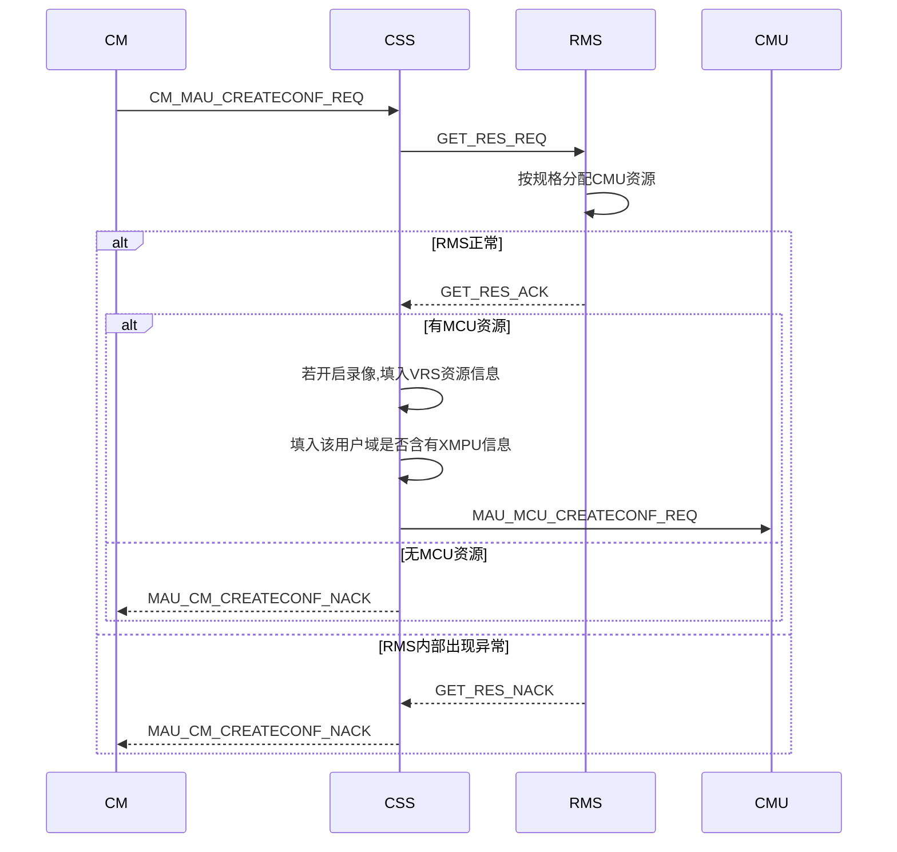
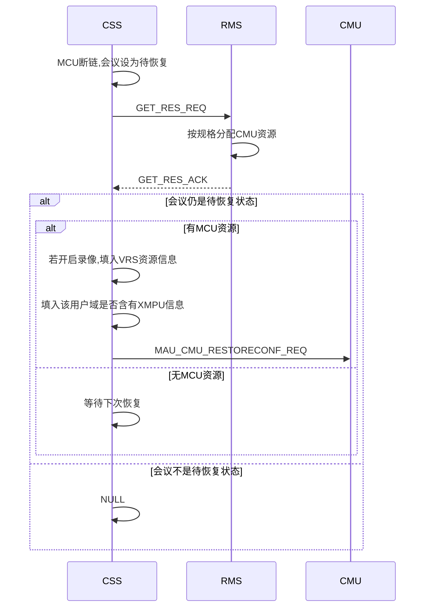
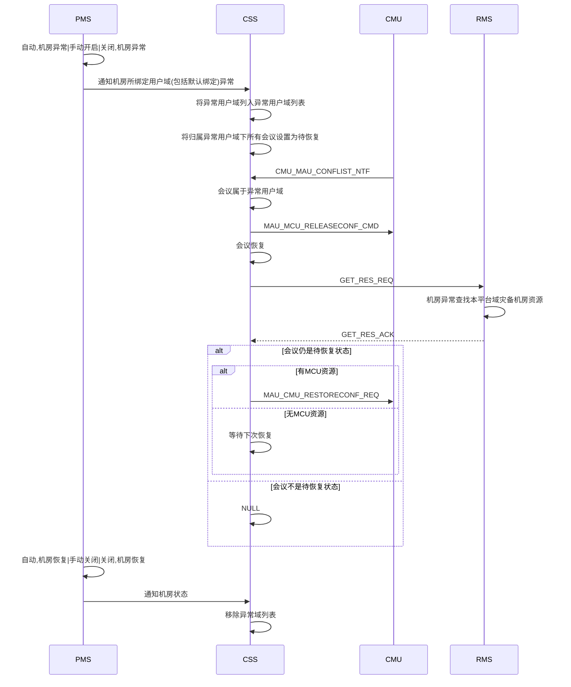
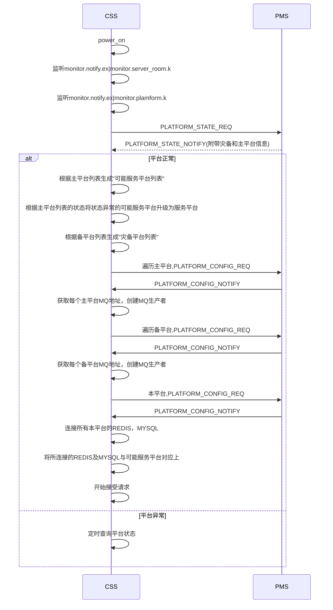
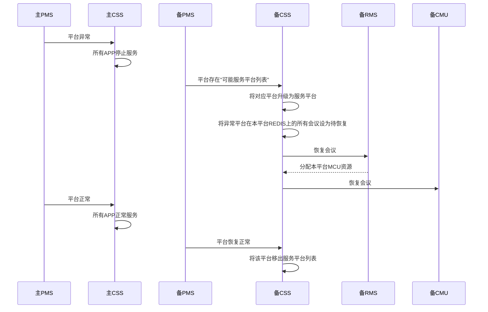
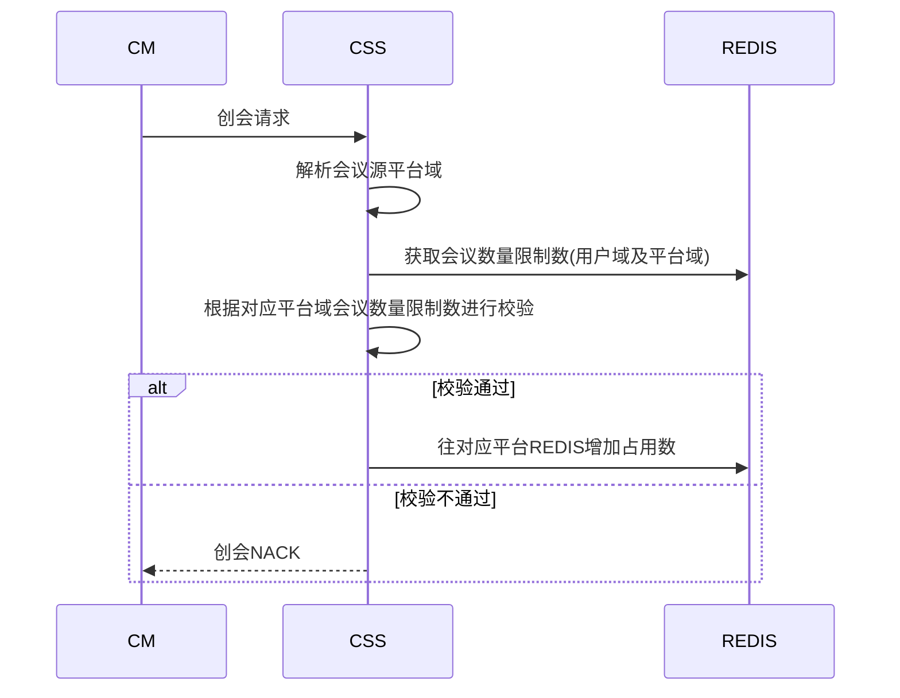

# 5.1sp4CSS概要设计

[TOC]

## 1 RMS波及

### 1.1 创会流程



### 1.2 平台内灾备流程






### 1.3 消息走法

```json
RMS消费者: RMS.RES.Q|RMS.RES.K|RMS.RES.EX
```

```json
CSS消费者(rpc): MAU.RPCRES.Q|(AMQP default)
```

```JSON
{
  "type" : "GET_RES_REQ",
  "moid" : "", //用户域MOID
  "res" : 
  [
    "mcu",
    "vrs",
    "mps"
  ]
}
```

```json
{
  "type" : "GET_RES_ACK",
  "mcu" :
  {
    "ip" : "",
  },
  "vrs" :   //若没有就不填
  {
    "ip" : "",
  },
  "mps" :   //若没有就不填
  {
    "ip" : ""
  }
}
```

```json
{
  "type" : "GET_RES_NACK",
  "errcode" : ""
}
```


### 1.4 错误码

> 29501-30000
>
> 29501-RMS内部错误

 

### 1.5 其他

> 不再缓存用户域是否含有XMPU,使用RMS返回值

> CSS新增异常用户域列表缓存，收到异常用户域会议列表通知便结会

> PMS通知机房状态时，需附带与该机房绑定的所有用户域

> CSS不再关注灾备模式，感知机房异常, 由RMS感知并分配MCU


## 2 PMS波及
###2.1 CSS视角连接图


### 2.2 启动流程



> CSS是否可以不连接主平台的MQ，通过订阅主平台的REDIS，如果主平台收到会空控消息就推送，这样开在灾备平台的CSS也能收到消息


### 2.3 平台间的灾备

#### 2.3.1 时序图




#### 2.3.2 灾备平台的创会消息处理

```flow
st=>start: 创会请求
end=>end: ack
nack=>end: nack
op1=>operation: 根据用户域获取其所属平台域
cond1=>condition: 平台域是否在服务平台列表
op2=>operation: 往会议源平台域的REDIS写入数据
op3=>operation: 往会议源平台域的confinfodb添加数据
st->op1->cond1(yes)->op2->op3->end
cond1(no)->nack
```

> 服务平台列表 = 本平台 + (可能服务平台列表中平台 & PMS通知平台异常)

> 设置主平台灾备关闭，主平台异常，则PMS不通知灾备平台CSS主平台异常
>
> CSS不感知平台域具体灾备参数(自动，手动开启/关闭，关闭)


#### 2.3.3 会控消息处理

```sequence
主PMS->主CSS: 主平台异常
备PMS->备CSS: 主平台异常
备CSS->备CSS: 恢复会议在备平台
备CM->备CSS: 主平台会议会控消息
备CSS->备CSS: 会议实际不在灾备平台列表
备CSS->备CMU: 转发会控消息
备CMU->备CSS: 会议状态通知
备CSS->备CSS: 会议源平台在服务平台列表
备CSS->备CM: 会议状态通知
主PMS->主CSS: 主平台恢复正常
备PMS->备CSS: 主平台恢复正常
备CSS->备CSS: 将该平台移出服务平台列表
主CSS->主CSS: 收到会控消息
主CSS->主CSS: 会议实际在灾备平台
主CSS->备CSS: 转发会控消息(cm.cmmcu.key)
备CSS->备CSS: 会议实际不在灾备平台列表
备CSS->备CMU: 转发会控消息
备CMU->备CSS: 会议状态通知
备CSS->备CSS: 源平台不在服务平台列表
备CSS->主CSS: 转发会议状态控制
备CSS->主CSS: meeting.mccntf.k|rpc
```


#### 2.3.4 REDIS数据变更

| confex       |          |      |
| ------------ | -------- | ---- |
| platformmoid | 会议实际创建平台 | 新增   |


#### 2.3.5 消息走法

```json
CSS消费者(rpc): MAU.RPCPLATINFO.Q|(AMQP default)
```

```json
PMS消费者: monitor.req.q:moid(平台域) //获取平台域状态|平台域公共信息查询
```


#### 2.3.6 其他

> 部署之后，能够灾备到本平台的灾备平台已明确,即“可能服务平台列表”是固定的

> CSS新增"可能服务列表"和"服务平台列表"缓存

> 在每个APP的消息入口判断平台域状态，如果平台为异常状态，则不接收消息请求

> confex:moid(用户域MOID)标识了该会议的源用户域,平台域,据此将会议数据写入到对应平台的REDIS和MYSQL中


##3 域信息处理
### 3.1 为什么需要将域信息及LICENSE信息写入REDIS

> 当主平台异常，灾备平台接管之后，BMC可能修改主平台的用户域信息
>
> 将域信息放入REDIS，让灾备平台更新域信息，切换回主平台，无需考虑域信息的更新问题

> 将CSS无缓存化，利于将来CSS转为集群部署


### 3.2 REDIS数据设计

将用户域，平台域，服务域数据按如下写入REDIS

| domain/“MOID”/info    |                                   |
| --------------------- | --------------------------------- |
| moid                  | 域MOID                             |
| level                 | 域层级,0-用户域,1-平台域,2-服务域             |
| uplevelmoid           | 上级域MOID                           |
| name                  | 域名称                               |
| used                  | 是否停用,0-停用，1-启用                    |
| ~~smallconfnumlimit~~ | 小型会议数量限制,存放于domain/"MOID"/license |
| ~~largeconfnumlimit~~ | 大型会议数量限制,存放于domain/"MOID"/license |
| enableh265            | 是否启用H265权限，0-不启用，1-启用             |
| enablehdmeeting       | 是否启用全高清权限，0-不启用，1-启用              |


### 3.3 灾备平台的处理

```sequence
备CSS->备CSS: 启动
备CSS->备CSS: 读取全部域信息
备CSS->备CSS: 写入所有“服务平台列表”平台
BMC->备CSS: 域信息更新
备CSS->备CSS: 更新所有“服务平台列表”平台域信息
```


## 4 license相关

### 4.1 为什么需要将LICENSE信息放入REDIS

> 当主平台异常，灾备平台接管之后，BMC可能修改主平台的LICENSE信息
>
> 将LICENSE信息放入REDIS，让灾备平台更新，切换回主平台，无需考虑LICENSE信息的更新问题

> 主平台域会管账号在灾备平台域开会，进行会议数量限制，需获取主平台域的LICENSE信息进行会议数量限制


### 4.2 REDIS数据设计

| domain/"MOID"/license |             |
| --------------------- | ----------- |
| license               | 密文形式LICENSE |
| smallconfnum          | 小型会议数量限制    |
| largeconfnum          | 大型会议数量限制    |
| softwarenumlimit      | 软件终端接入数     |
| hardwarenumlimit      | 硬件授权数       |
| monitornumlimit       | 监控授权数       |
| mediaportnumlimit     | 媒体端口授权数     |
| currentcallnumlimit   | 接入端口授权数     |


### 4.1 获取LICENSE

```sequence
CSS->BMC: 获取"可能服务平台"license
BMC->CSS: 依次发送LICENSE
CSS->CSS: 解析LICENSE
CSS->REDIS: 存储各个平台的限制信息
CSS->CSS: 以本平台LICENSE为基础
CSS->CSS: 累加可能服务平台的资源类限制数
CSS->CSS: 修改本平台的LICENSE
CSS->platform.license.ex(platform.license.ntf.k):发送修改后的LICENSE信息
```


### 4.2 更新LICENSE

```sequence
BMC->CSS: 更新某个平台的LICENSE
CSS->CSS: 解析消息
CSS->CSS: 属于“可能服务平台”
CSS->对应平台REDIS: 更新对应平台LICENSE信息
CSS->CSS: 以本平台LICENSE为基础
CSS->CSS: 累加可能服务平台的资源类限制数
CSS->CSS: 修改本平台的LICENSE
CSS->platform.license.ex(platform.license.ntf.k):发送修改后的LICENSE信息
```

> 5.1sp4是否存在链式灾备，如果是，需考虑“可能服务平台”的“可能服务平台”的LICENSE变更处理


### 4.3 处理LICENSE请求

```sequence
MS->CSS: 获取本平台的LICENSE
CSS->CSS: 以本平台LICENSE为基础
CSS->CSS: 累加“可能服务平台”的资源类限制数
CSS->CSS: 修改本平台的LICENSE
CSS->MS:发送修改后的LICENSE信息
```


### 4.4 会议数量限制


> 每个平台域对于会议数量的限制还是基于自身的LICENSE
>
> 平台域对于资源的限制是“可能服务平台”的资源总和
>


## 5 MCU请求和通知的处理

### 5.1 修改会议名

#### 5.1.1 新增消息

```json
{
  "type" : "MAU_CM_MODIFYCONFNAME_REQ",
  "confE164" : "",
  "confname" : "",
}
```

```json
{
  "type" : "CM_MAU_MODIFYCONFNAME_ACK",
  "confE164" : "",	
}
```

```json
{
  "type" : "CM_MAU_MODIFYCONFNAME_NACK",
  "errcode" : ""
}
```


#### 5.1.2 时序图

正常情况

```sequence
MCU->CSS: MCU_MAU_MODIFYCONFNAME_REQ
CSS->CM: MAU_CM_MODIFYCONFNAME_REQ
CM->CSS: CM_MAU_MODIFYCONFNAME_ACK
CSS->MCU: MAU_CM_MODIFYCONFNAME_ACK
MCU->CSS: MCU_MAU_CONFSTATECHANGE_NTF	
CSS->confinfoDB: 更新会议名
CSS->REDIS: 更新会议名
```


主平台恢复，会议在备平台情况(具体实现可复用会议状态控制及会控消息透传灾备处理):

```sequence
备MCU->备CSS: MCU_MAU_MODIFYCONFNAME_REQ
备CSS->备CSS: 会议源平台不在服务平台列表
备CSS->主CM: MAU_CM_MODIFYCONFNAME_REQ
主CM->主CSS: CM_MAU_MODIFYCONFNAME_ACK
主CSS->主CSS: 会议实际召开平台在灾备平台
主CSS->备CSS: CM_MAU_MODIFYCONFNAME_ACK
备CSS->备MCU: MAU_MCU_MODIFYCONFNAME_ACK
备MCU->备CSS: MCU_MAU_CONFSTATECHANGE_NTF
备CSS->备CSS: 会议源平台不在服务平台列表
备CSS->主CSS: MCU_MAU_CONFSTATECHANGE_NTF
主CSS->主REDIS:更新会议名
主CSS->主CONFINFODB:更新会议名
```


#### 5.1.3 消息走法

```json
备CSS->主CM: MEETING.CSS.EX(MEETING.CSS.K)
主CSS->备CSS: MAU.CMMAU.Q(MAU.CMMAU.K)
```


#### 5.1.4 其他

> redis:confex:confname 是否有必要去掉

> MCU_MAU_MODIFYCONFNAME_REQ消息在主备间的转发可复用会控及会议状态通知的灾备传递机制

> MCU_MAU_CONFSTATECHANGE_NTF直接在cmussn:DaemonInstance中处理(包括会议名和密码修改通知)
>


### 5.2 会议密码变更通知

主平台恢复，会议在备平台情况:

```sequence
备MCU->备CSS: MCU_MAU_CONFSTATECHANGE_NTF
备CSS->备CSS: 会议源平台不在服务平台列表
备CSS->主CSS: MCU_MAU_CONFSTATECHANGE_NTF
主CSS->主REDIS:更新会议名
主CSS->主CONFINFODB:更新会议名
```


> MCU_MAU_CONFSTATECHANGE_NTF直接在cmussn:DaemonInstance中处理(包括会议名和密码修改通知)
>


### 5.3 延长会议(CSS总控)

正常情况：

```sequence
CM->CSS: CM_MAU_DELAYCONF_REQ
CSS->CSS: 校验
CSS->REDIS: 更新会议数据
CSS->CM: CM_MAU_DELAYCONF_ACK
CSS->CM: CM_MAU_CONFDURATION_NTF
CSS->CMU: MAU_CMU_CONFDURATION_NTF
CMU->CSS: MCU_MAU_DELAYCONF_REQ
CSS->CSS: 校验
CSS->REDIS: 更新会议数据
CSS->CMU: MAU_MCU_DELAYCONF_ACK
CSS->CM: CM_MAU_CONFDURATION_NTF
```

主平台恢复，会议在备平台情况:
```sequence
主CM->主CSS: CM_MAU_DELAYCONF_REQ
主CSS->主CSS: 校验
主CSS->主REDIS: 更新会议数据
主CSS->主CM: CM_MAU_DELAYCONF_ACK
主CSS->主CM: CM_MAU_CONFDURATION_NTF
主CSS->主CSS: 会议实际在灾备平台
主CSS->备CMU: MAU_CMU_CONFDURATION_NTF
```

```sequence
备CMU->备CSS: MCU_MAU_DELAYCONF_REQ
备CSS->备CSS: 校验
备CSS->主REDIS: 更新会议数据
备CSS->备CMU: MAU_MCU_DELAYCONF_ACK
备CSS->备CSS: 会议源平台不在服务平台列表
备CSS->主CM: CM_MAU_CONFDURATION_NTF
```

> 主平台CSS发往备平台CMU消息走: cmu.conf.q:ip(cmu.conf.q:ip:pid)根据会议归属CMU信息自己组装

> 备平台CSS发往主平台CM消息走: meeting.mccntf.q(meeting.mccntf.k)


## 6 公共模板处理

```sequence
CM->备CSS: 增/删/改公共模板
备CSS->备CSS: 解析出模板所属平台
备CSS->TTEMPLATEINFO: 增/删/改对应平台数据库
备CSS->REDIS: 增/删/改对应平台REDIS数据
备CSS->CM: ADD/MOD/DEL_TEMPLATE_ACK
```


## 7 上报UPU波及

### 7.1  启动上报项

```sequence
CSS->CSS: 启动
CSS->REDIS: 获取预约会议，个人模板，虚拟会议室信息
CSS->UPU: 上报预约会议，个人模板，虚拟会议室信息
CSS->CSS: 创会/恢复/同步成功
CSS->REDIS: 上报正召开会议信息
REDIS->CSS: 修改/删除预约会议/个人模板/虚拟会议通知
CSS->UPU: 修改/删除对应会议信息
CSS->CSS: 结会
CSS->UPU: 删除对应召开会议信息
```


### 7.2 灾备情况

```sequence
主CSS->主UPU: 上报主平台预约会议,个人模板,固定虚拟会议
主CSS->主UPU: (源用户域及源平台域)
主PMS->主CSS: 平台异常
备PMS->备CSS: 主平台异常
备CSS->备UPU: 上报主平台预约会议,个人模板,固定虚拟会议
备CSS->备UPU: (源用户域及源平台域)
备CSS->备CSS: 恢复会议
备CSS->备UPU: 上报正召开会议(实际召开用户域及平台域)
主PMS->主CSS: 平台恢复
备PMS->备CSS: 平台恢复
备CSS->备UPU: 删除对应平台的预约会议,个人模板,虚拟会议室
备CSS->备CSS: 源平台是主平台的会议结束
备CSS->备UPU: 删除备UPU该会议记录
备CSS->备CSS: 结会
备CSS->备UPU: 删除本平台UPU该会议信息
主CSS->主UPU: 上报主平台预约会议,个人模板,固定虚拟会议
主CSS->主UPU: (源用户域及源平台域)
主CSS->主CSS: 恢复待恢复的会议
主CSS->主UPU: 上报正召开会议(实际召开用户域及平台域)


```


### 7.3 UPU需新增固定虚拟会议室类型

```c++
//会议类型
typedef enum TYPE
{
    INSTANT = 1,    //即时会议
    RESERVE,        //预约会议
    TEMPLET,         //模板
    VIRTUAL         //新增--固定虚拟会议
} EConfType;
```


### 7.4 其他

> 平台间切换灾备之后，在备平台会管也要同样公示预约会议，个人模板，固定虚拟会议室E164号到源平台的REDIS中，CSS也要订阅服务平台的REDIS的公示通道


## 8 NPPCLIENT的波及

```sequence
NPPCLIENT->NPPCLIENT: 启动
NPPCLIENT->本机: 读取服务发现IP地址
NPPCLIENT->服务发现: 获取本平台域下所有REDIS地址及其源平台域MOID
NGI->NPPCLIENT: 获取正召开会议列表
NPPCLIENT->NPPCLIENT: 获取请求的平台域信息
NPPCLIENT->REDIS: 在对应平台获取会议信息
```


> NGI请求需带平台域MOID
>


## 9 正召开会议状态相关

### 9.1 定时恢复会议

> 定时恢复会议/其他任何形式的恢复会议的数据源为“服务平台”REDIS会议数据


### 9.2 会议列表的同步

> 会议列表同步的数据源扩大到“可能服务平台列表"REDIS，即使开在本平台的会议，源平台是主平台
>
> 与MCU短暂断链了，此时可能服务平台的REDIS上的该会议是待恢复,则仍将该会议归属于灾备平台MCU，若会议是正创建或正召开状态，正会将本平台的MCU会议结掉( 当前逻辑已能处理)

> 检测可能服务平台REDIS上有该MCU会议，而MCU无会议，且该会议是正召开状态，将此会议设置为待恢复，但不恢复，由主平台定时恢复


### 9.3 检测会议是否到时

> 检测会议是否到时的数据源扩大到“可能服务平台”，对其他平台源REDIS的会议，只检测实际召开平台是本平台的会议

> 主平台检测会议是否到时不处理实际开在灾备平台的会议

> 会议即将到时的通知，对发给会管的通知，需判断会议源平台是否本平台的服务平台列表中，如果不在，则要发给主平台的会管

> 对于待恢复且到时会议的结会，需判断会议源平台是否在本平台的服务平台列表中，如果不在，则不处理，交由主平台自己处理


### 9.4 MCU断链处理

> CSS收到MCU断链消息通知，数据源需扩展到"可能服务平台的"REDIS，将可能服务平台的REDIS上开在本平台的会议设置为待恢复，但本平台恢复会议的REDIS数据仅限于服务平台列表REDIS


### 9.5 启动时如何初始化REDIS数据

> 对于实际召开平台不在本平台的正召开会议不初始化为待恢复


## 10 会场监控波及

> 会管更新监控心跳消息的REDIS处理扩大到服务平台列表

> 获取过期监控的数据源扩大到服务平台列表

> 若在主平台开启监控，发生灾备，备平台在会议恢复的时候会通知会管关闭监控

> 对于会议开在灾备平台，主平台恢复的会议，
>
> 若已经在灾备平台开启监控的，在主平台恢复时刻会管的监控心跳消息应该是发往主平台的CSS
>
> 主平台在检测到监控监控过期时，需模拟关闭监控消息，发往灾备平台MCU
>
> 检测监控失效的时候，需判断会议是否开启在灾备平台，如果是则需要往灾备平台发送停止监控信息


## 11 上报网管信息

> 不再连接NU，连接NU数量写死为0
>
> CSS不再感知预约会议数量，写死为0


## 12 其他

> 利旧会议不灾备
>
> 在灾备平台域上报主平台域的话单，因为BMC是整个服务域的，在哪个平台域是否没有影响

> 启动流程:初始化会议数据时，将判断会议是否实际召开在灾备平台且状态是正召开
>
> 如果是，不会将该会议状态设为待恢复
>
> 
>
> 可能服务平台和服务平台是否也存REDIS
>
> 重启CSS，REDIS数据的处理
>
> 将CMUSSN,ZKSSN移除的可能性


