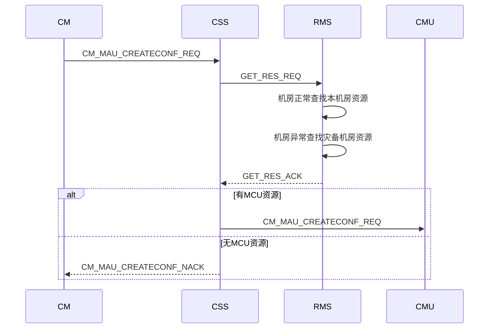
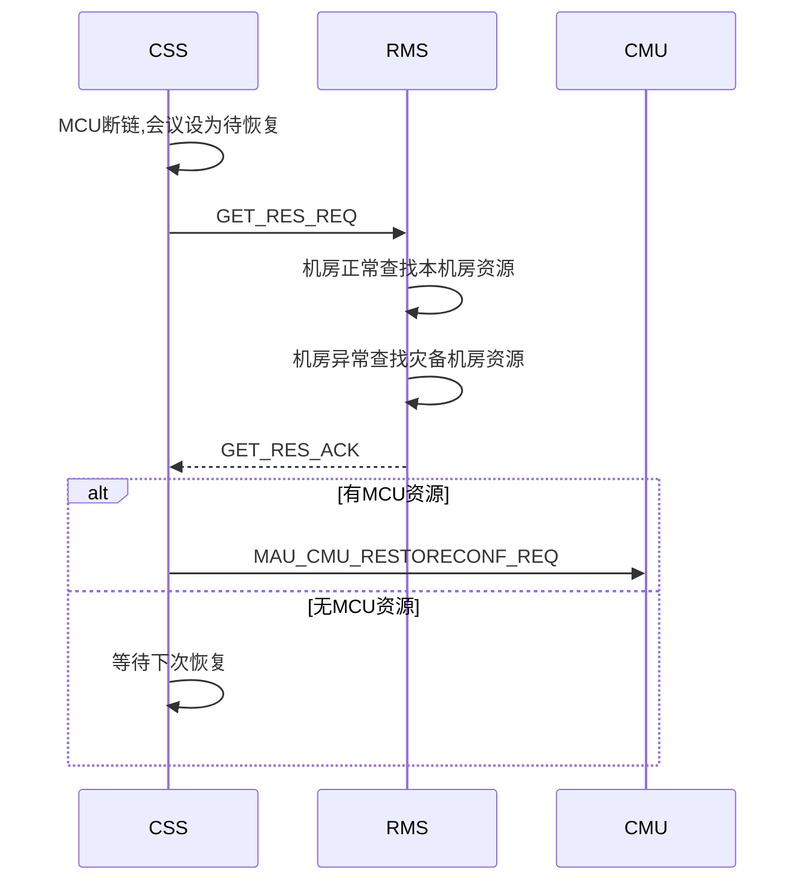
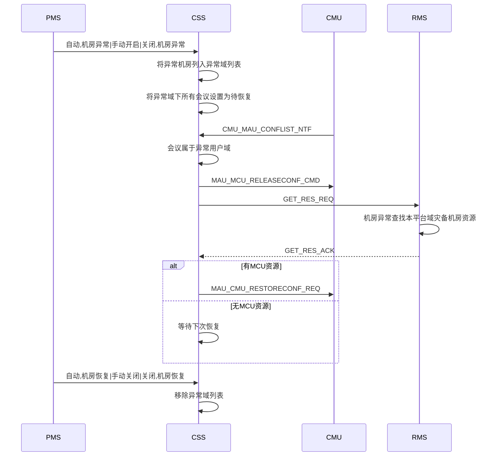
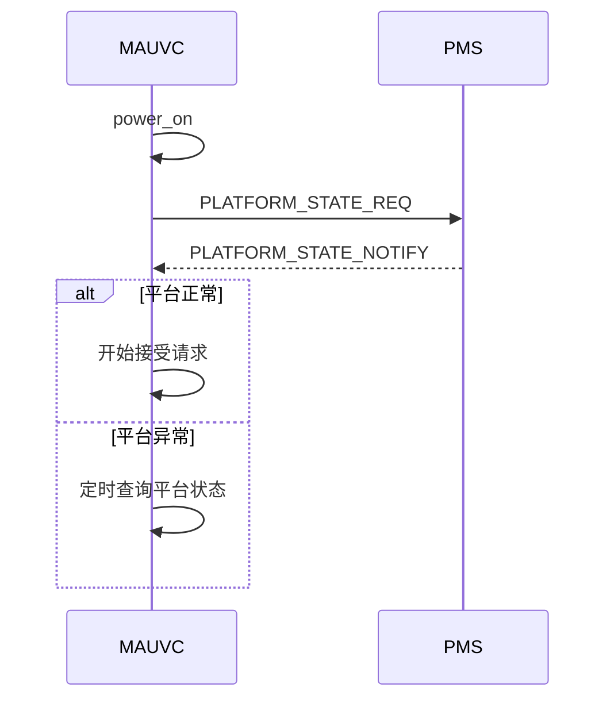
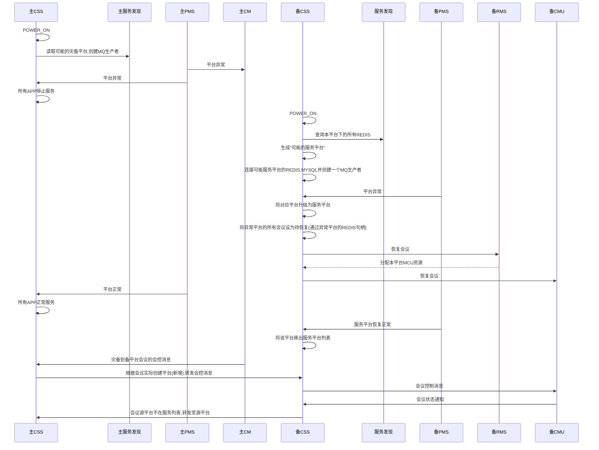

# 5.1sp4CSS概要设计

[TOC]

1 RMS波及

1.1 创会流程



1.3 平台内灾备流程





1.2 消息走法

```json
向RMS请求资源消费者: RMS.RES.Q|RMS.RES.K|RMS.RES.EX
```

```json
CSS接收请求结果消费者(rpc): MAU.RPCRES.Q|(AMQP default)
```

```JSON
{
  "type" : "GET_RES_REQ",
  "moid" : "", //用户域MOID
  "res" : 
  [
    "mcu",
    "vrs",
    "mps"
  ]
}
```

```json
{
  "type" : "GET_RES_ACK",
  "mcu" :
  {
    "ip" : "",
  },
  "vrs" :
  {
    "ip" : "",
  },
  "mps" :
  {
    "ip" : ""
  }
}
```

```json
{
  "type" : "GET_RES_NACK",
  "errcode" : ""
}
```


1.4 错误码

> 29501-30000
>
> 29501-RMS内部错误


1.5 新增RMS_APP

```c++
class CResMgrSsnInstance : public CInstance
```

 

1.6 其他

>是否判断会议能力的逻辑也交给RMS，毕竟是资源管理
>
>手动迁回的情况，CSS通过感知PMS平台通知，通知主平台恢复，
>
>灾备平台的CSS将主平台移出服务平台域列表
>
>如果会议在非服务平台域列表，在可能服务平台列表，则说明该会恢复在灾备平台，主平台之后恢复正常，
>
>这个会议的数据应该是由灾备平台的CSS来写入主平台的REDIS中


2 PMS波及

2.1 启动流程




2.2 平台间的灾备




> 部署之后，CSS启动之后，能够灾备到本平台的灾备平台已明确
>
> CSS缓存mayserverplats(mysql, redis), 而服务平台(本平台，在 myaserverplat &&  收到该平台的异常通知)
>
> confex需添加会议实际召开在哪个平台域属性
>
> 在每个APP的消息入口判断平台域状态，如果平台为异常状态，则不接收消息请求
>
> 灾备平台的MQ地址也是在启动时候，根据REDIS的所有可能的灾备平台去读(可能灾备平台列表是确定的)


3 修改会议名请求

```sequence
MCU->CSS: MCU_MAU_MODIFYCONFNAME_REQ
CSS->CM: MAU_CM_MODIFYCONFNAME_REQ
CM->CSS: MAU_CM_MODIFYCONFNAME_ACK/NACK
CSS->MCU: MAU_CM_MODIFYCONFNAME_ACK/NACK
MCU->CSS: MCU_MAU_CONFSTATECHANGE_NTF	
CSS->CSS: 更新confinfodb
```

> 会议在灾备平台，主平台恢复情况，应将请求发往主平台的会管，如果能够改成会议状态类的请求，
>
> 让CSS透传，则CSS无需做额外改动


4 总控延长会议时长

```sequence
CM->CSS: CM_MAU_DELAYCONF_REQ
CSS->CSS: 校验
CSS->CM: CM_MAU_DELAYCONF_ACK
CSS->CM: CM_MAU_CONFDURATION_NTF
CSS->CMU: MAU_CMU_CONFDURATION_NTF
CMU->CSS: MCU_MAU_DELAYCONF_REQ
CSS->CSS: 校验
CSS->CMU: MAU_MCU_DELAYCONF_ACK
CSS->CM: CM_MAU_CONFDURATION_NTF

```

> 若会议在备平台且主平台已恢复正常，主平台会管来请求了则MAU_CMU_CONFDURATION_NTF需要转发给备平台的CMU
>
> 若会议在备平台且主平台已恢复正常，备平台MCU来请求了则CM_MAU_CONFDURATION_NTF需要转发给备平台的会管


4 数据库

4.1 公共模板数据库

```sequence
备CM->备CSS: ADD/MOD/DEL_TEMPLATE_REQ
备CSS->备MPCDDB_TTEMPLATEINFO(主): ADD/MOD/DEL TEMPLATE
备CSS->备CM: ADD/MOD/DEL_TEMPLATE_ACK

```

4.2 confinfoDB

```sequence
备CMU->备CSS: 创会ACK
备CSS->备CONFINFODDB_TCONFINFO(主): 添加会议数据
备CMU->备CSS: 更改会议名字/密码通知
备CSS->备CONFINFODDB_TCONFINFO(主): 改名/密码

```

4.3 ap(user_domain,platform_domain,service_domain)

> 这部分信息CSS读取所有域信息，不必单独连接其他域数据库读取

>不允许BMC，BMC_LICENSE在灾备发生之后，还能够修改(主平台CSS已停止服务，不能够更新缓存)


5 平台域是否部署XMPU,VRS

```sequence
CM->CSS: CM_MAU_CREATECONF_REQ
CSS->RMS: GET_RES_REQ
RMS->CSS: GET_RES_ACK
CSS->CSS: 解析是否有XMPU
CSS->CSS: 如果开启录像解析VRS地址
CSS->CMU: CM_MAU_CREATECONF_REQ
```


```sequence
CSS->RMS: GET_RES_REQ
RMS->CSS: GET_RES_ACK
CSS->CSS: 解析是否有XMPU
CSS->CSS: 如果开启录像解析VRS地址
CSS->CMU: CM_MAU_RESTORECONF_REQ
```


6 删除部分

> meeting, v_meeting, scheduledDB相关
>
> ap:user_info, server_info 数据
>
> 预约会议，公共模板缓存
>
> 添加终端的ACK和NACK不再处理
>
> 删除减少会议时长的请求


7 创会流程

```flow
st=>start: begin
end=>end: end
cond1=>condition: 检测创会域是否在需服务平台域列表
op1=>operation: NACK
op2=>operation: 将会议数据写入对应平台的REDIS中
st->cond1(yes)->op2->end
cond1(no)->op1->end
```

> 需服务域包括本服务域+灾备到本平台且出现异常的域


8 灾备期间灾备平台不能修改点

> BMC不能修改域信息
>
> BMC不能修改LICENSE信息


9 license相关

灾备平台的LICENSE=SUM（服务平台域LICENSE）


10 CSS的连接图


> 源平台为A，实际开在平台B上，源平台正常的会议，由源平台CSS转发会控消息到平台B的CSS中
>
> 平台B上的MCU的会议的会议通知消息，由平台B的CSS转发消息到平台A的CSS上
>
> 会控消息由主平台转发至灾备平台cm.cmmcu.ex(cm.cmmcu.key)
>
> 会议状态通知消息由灾备平台转发至主平台的meeting.mccntf.ex(meeting.mccntf.k)|rpc消费者
>
> 也就是说会控消息会判断会议实际召开平台是否非本平台且是灾备平台，若是则发往灾备平台的消费者中
>
> 状态通知消息会判断会议所属平台是否不在服务平台且在可能服务平台列表中，若是则发往可能服务平台的消费者中


11 其他

> 利旧会议不灾备


12 会场监控波及

> 会管在主平台挂了之后，自动跳转到灾备平台的时候，应该停止其会议监控


12 上报网管信息

> 连接NU数量写死为0
>
> 不再缓存公共模板和预约会议数量，是否可以不上报


13 上报UPU波及

> 一个平台只部署一个UPU

> 正召开会议，预约会议，预分配E164号个人模板，固定虚拟会议室
>
> 若是会议恢复到灾备平台，数据是写在主平台的REDIS和MYSQL
>
> UPU上报还是上报该灾备会议的源用户域和平台域

```sequence
主PMS->主CSS: 平台异常
备PMS->备CSS: 主平台异常
备CSS->备UPU: 重新上报主平台预约会议,个人模板,固定虚拟会议
备CSS->备CSS: 恢复会议
备CSS->备UPU: 上报正召开会议(仍归属源用户域及平台域)
```


12 疑问点

> 在灾备平台域上报主平台域的话单，因为BMC是整个服务域的，在哪个平台域是否没有影响
>
> 会控消息走RPC？
>
> 一个主机房可以对应多个用户域？


13 会议列表调整

> 会议开在灾备平台，主平台恢复，此时主平台的MCU仍保有该会，按照当前逻辑，会结束主平台的MCU的会议这是对的，无需修改


14 NPPCLIENT的波及

NPPCLIENT也要感知需要服务哪些平台，

和CSS的处理是一致的。当终端请求到来，NGI需带上该终端所属的平台域信息


