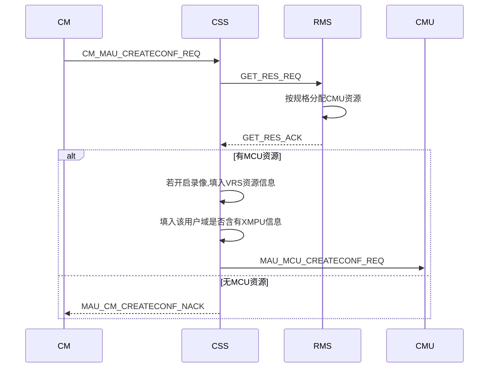
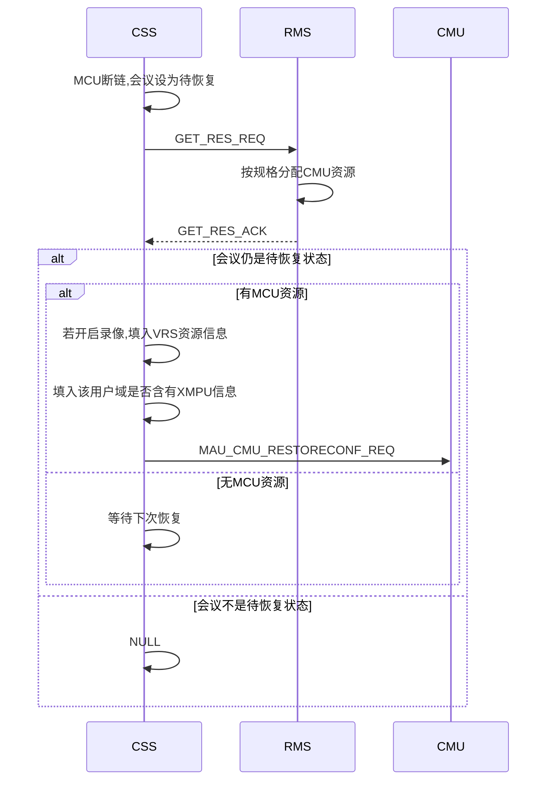
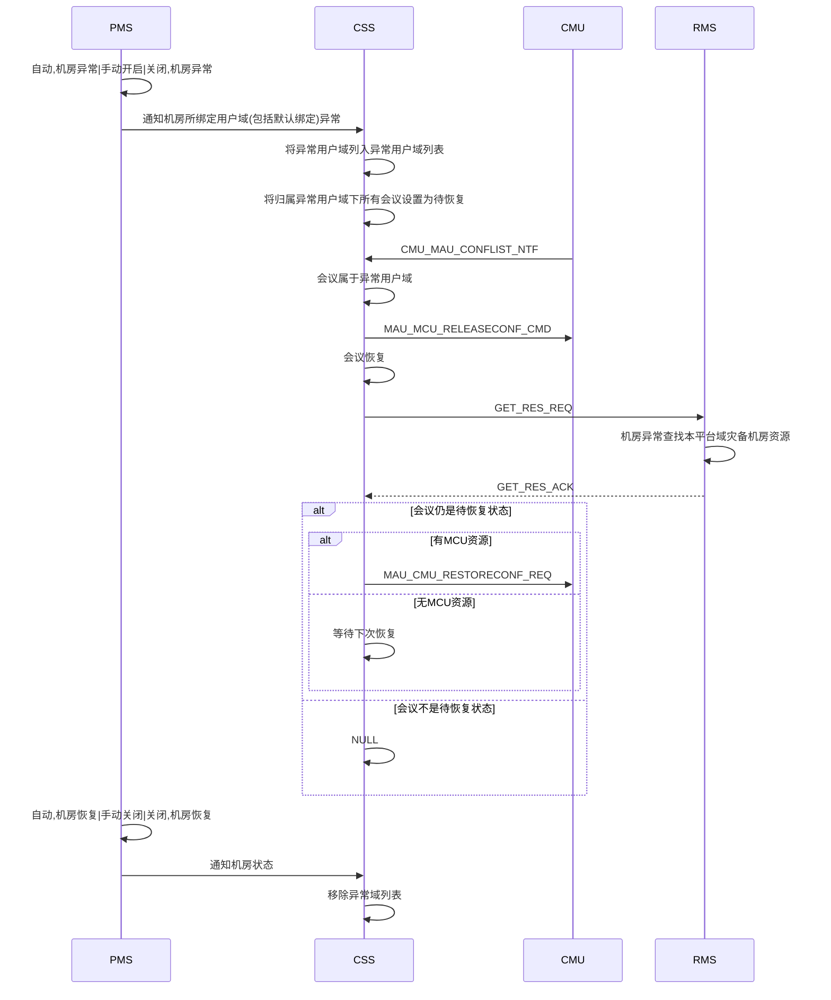
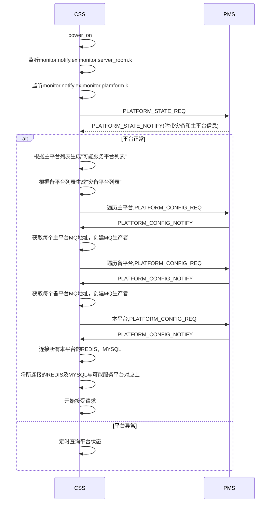
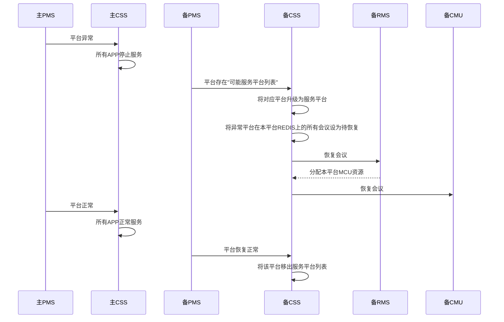

# 5.1sp4CSS概要设计

[TOC]

## 1 RMS波及

### 1.1 创会流程



### 1.2 平台内灾备流程






### 1.3 消息走法

```json
RMS消费者: RMS.RES.Q|RMS.RES.K|RMS.RES.EX
```

```json
CSS消费者(rpc): MAU.RPCRES.Q|(AMQP default)
```

```JSON
{
  "type" : "GET_RES_REQ",
  "moid" : "", //用户域MOID
  "res" : 
  [
    "mcu",
    "vrs",
    "mps"
  ]
}
```

```json
{
  "type" : "GET_RES_ACK",
  "mcu" :
  {
    "ip" : "",
  },
  "vrs" :
  {
    "ip" : "",
  },
  "mps" :
  {
    "ip" : ""
  }
}
```

```json
{
  "type" : "GET_RES_NACK",
  "errcode" : ""
}
```


### 1.4 错误码

> 29501-30000
>
> 29501-RMS内部错误

 

### 1.5 其他

> 不再缓存用户域是否含有XMPU(ap,bmc),使用RMS返回值

> CSS新增异常用户域列表缓存，收到异常用户域会议列表通知便结会

> PMS通知机房状态时，需附带与该机房绑定的所有用户域

> CSS不再关注灾备模式，感知机房异常, 由RMS感知并分配MCU


## 2 PMS波及
###2.1 CSS视角连接图


### 2.2 启动流程



#### 

### 2.3 平台间的灾备

#### 2.3.1 时序图




#### 2.3.2 灾备平台的创会消息处理

```flow
st=>start: 创会请求
end=>end: ack
nack=>end: nack
op1=>operation: 根据用户域获取其所属平台域
cond1=>condition: 平台域是否在服务平台列表
op2=>operation: 往会议源平台域的REDIS写入数据
op3=>operation: 往会议源平台域的confinfodb添加数据
st->op1->cond1(yes)->op2->op3->end
cond1(no)->nack
```

> 服务平台列表 = 本平台 + (可能服务平台列表中平台 & PMS通知平台异常)

> 设置主平台灾备关闭，主平台异常，则PMS不通知灾备平台CSS主平台异常
>
> CSS不感知平台域具体灾备参数(自动，手动开启/关闭，关闭)


#### 2.3.3 会控消息处理

```sequence
主PMS->主CSS: 主平台异常
备PMS->备CSS: 主平台异常
备CSS->备CSS: 恢复会议在备平台
备CM->备CSS: 主平台会议会控消息
备CSS->备CSS: 会议实际不在灾备平台列表
备CSS->备CMU: 转发会控消息
备CMU->备CSS: 会议状态通知
备CSS->备CSS: 会议源平台在服务平台列表
备CSS->备CM: 会议状态通知
主PMS->主CSS: 主平台恢复正常
备PMS->备CSS: 主平台恢复正常
备CSS->备CSS: 将该平台移出服务平台列表
主CSS->主CSS: 收到会控消息
主CSS->主CSS: 会议实际在灾备平台
主CSS->备CSS: 转发会控消息(cm.cmmcu.key)
备CSS->备CSS: 会议实际不在灾备平台列表
备CSS->备CMU: 转发会控消息
备CMU->备CSS: 会议状态通知
备CSS->备CSS: 源平台不在服务平台列表
备CSS->主CSS: 转发会议状态控制
备CSS->主CSS: meeting.mccntf.k|rpc
```


#### 2.3.4 REDIS数据变更

| confex       |          |      |
| ------------ | -------- | ---- |
| platformmoid | 会议实际创建平台 | 新增   |


#### 2.3.5 消息走法

```json
CSS消费者(rpc): MAU.RPCPLATINFO.Q|(AMQP default)
```

```json
PMS消费者: monitor.req.q:moid(平台域) //获取平台域状态|平台域公共信息查询
```


#### 2.3.6 其他

> 部署之后，能够灾备到本平台的灾备平台已明确,即“可能服务平台列表”是固定的

> CSS新增"可能服务列表"和"服务平台列表"缓存

> 在每个APP的消息入口判断平台域状态，如果平台为异常状态，则不接收消息请求

> confex:moid(用户域MOID)标识了该会议的源用户域,平台域,据此将会议数据写入到对应平台的REDIS和MYSQL中


## 3 MCU请求和通知的处理

### 3.1 修改会议名

#### 3.1.1 新增消息

```json
{
  "type" : "MAU_CM_MODIFYCONFNAME_REQ",
  "confE164" : "",
  "confname" : "",
}
```

```json
{
  "type" : "CM_MAU_MODIFYCONFNAME_ACK",
  "confE164" : "",	
}
```

```json
{
  "type" : "CM_MAU_MODIFYCONFNAME_NACK",
  "errcode" : ""
}
```


#### 3.1.2 时序图

正常情况

```sequence
MCU->CSS: MCU_MAU_MODIFYCONFNAME_REQ
CSS->CM: MAU_CM_MODIFYCONFNAME_REQ
CM->CSS: CM_MAU_MODIFYCONFNAME_ACK
CSS->MCU: MAU_CM_MODIFYCONFNAME_ACK
MCU->CSS: MCU_MAU_CONFSTATECHANGE_NTF	
CSS->confinfoDB: 更新会议名
CSS->REDIS: 更新会议名
```


主平台恢复，会议在备平台情况(具体实现可复用会议状态控制及会控消息透传灾备处理):

```sequence
备MCU->备CSS: MCU_MAU_MODIFYCONFNAME_REQ
备CSS->备CSS: 会议源平台不在服务平台列表
备CSS->主CM: MAU_CM_MODIFYCONFNAME_REQ
主CM->主CSS: CM_MAU_MODIFYCONFNAME_ACK
主CSS->主CSS: 会议实际召开平台在灾备平台
主CSS->备CSS: CM_MAU_MODIFYCONFNAME_ACK
备CSS->备MCU: MAU_MCU_MODIFYCONFNAME_ACK
备MCU->备CSS: MCU_MAU_CONFSTATECHANGE_NTF
备CSS->备CSS: 会议源平台不在服务平台列表
备CSS->主CSS: MCU_MAU_CONFSTATECHANGE_NTF
主CSS->主REDIS:更新会议名
主CSS->主CONFINFODB:更新会议名
```


#### 3.1.3 消息走法

```json
备CSS->主CM: MEETING.CSS.EX(MEETING.CSS.K)
主CSS->备CSS: MAU.CMMAU.Q(MAU.CMMAU.K)
```


#### 3.1.4 其他

> redis:confex:confname 是否有必要去掉

> MCU_MAU_MODIFYCONFNAME_REQ消息在主备间的转发可复用会控及会议状态通知的灾备传递机制

> MCU_MAU_CONFSTATECHANGE_NTF直接在cmussn:DaemonInstance中处理(包括会议名和密码修改通知)
>


### 3.2 会议密码变更通知

主平台恢复，会议在备平台情况:

```sequence
备MCU->备CSS: MCU_MAU_CONFSTATECHANGE_NTF
备CSS->备CSS: 会议源平台不在服务平台列表
备CSS->主CSS: MCU_MAU_CONFSTATECHANGE_NTF
主CSS->主REDIS:更新会议名
主CSS->主CONFINFODB:更新会议名
```


> MCU_MAU_CONFSTATECHANGE_NTF直接在cmussn:DaemonInstance中处理(包括会议名和密码修改通知)
>


### 3.3 延长会议(CSS总控)

正常情况：

```sequence
CM->CSS: CM_MAU_DELAYCONF_REQ
CSS->CSS: 校验
CSS->REDIS: 更新会议数据
CSS->CM: CM_MAU_DELAYCONF_ACK
CSS->CM: CM_MAU_CONFDURATION_NTF
CSS->CMU: MAU_CMU_CONFDURATION_NTF
CMU->CSS: MCU_MAU_DELAYCONF_REQ
CSS->CSS: 校验
CSS->REDIS: 更新会议数据
CSS->CMU: MAU_MCU_DELAYCONF_ACK
CSS->CM: CM_MAU_CONFDURATION_NTF
```

主平台恢复，会议在备平台情况:
```sequence
主CM->主CSS: CM_MAU_DELAYCONF_REQ
主CSS->主CSS: 校验
主CSS->主REDIS: 更新会议数据
主CSS->主CM: CM_MAU_DELAYCONF_ACK
主CSS->主CM: CM_MAU_CONFDURATION_NTF
主CSS->主CSS: 会议实际在灾备平台
主CSS->备CMU: MAU_CMU_CONFDURATION_NTF
```

```sequence
备CMU->备CSS: MCU_MAU_DELAYCONF_REQ
备CSS->备CSS: 校验
备CSS->主REDIS: 更新会议数据
备CSS->备CMU: MAU_MCU_DELAYCONF_ACK
备CSS->备CSS: 会议源平台不在服务平台列表
备CSS->主CM: CM_MAU_CONFDURATION_NTF
```

> 主平台CSS发往备平台CMU消息走: cmu.conf.q:ip(cmu.conf.q:ip:pid)根据会议归属CMU信息自己组装

> 备平台CSS发往主平台CM消息走: meeting.mccntf.q(meeting.mccntf.k)


## 4 license相关

### 4.1 获取LICENSE

```sequence
CSS->BMC: 获取"可能服务平台"license
BMC->CSS: 依次发送LICENSE
CSS->CSS: 解析LICENSE
CSS->CSS: 存储各个平台的限制信息
CSS->CSS: 存储本平台的LICENSE
CSS->CSS: 累加各个平台的资源限制数,修改本平台的LICENSE
CSS->platform.license.ex(platform.license.ntf.k):发送修改后的LICENSE信息
```

数据结构:

```c++
map<platmoid, CPlatLimit> m_mapPlatLimit;//存储可能服务平台的解析出的LICENSE信息
string platLicense; //本平台域的LICENSE
```


### 4.2 更新LICENSE

```sequence
BMC->CSS: 更新某个平台的LICENSE
CSS->CSS: 解析消息
CSS->CSS: 属于“可能服务平台”
CSS->CSS: 更新对应平台限制信息
CSS->CSS: 累加各个平台的资源限制数,修改本平台的LICENSE
CSS->platform.license.ex(platform.license.ntf.k):发送修改后的LICENSE信息
```


### 4.3 处理LICENSE请求

```sequence
MS->CSS: 获取本平台的LICENSE
CSS->CSS: 累加各个平台的资源限制数,修改本平台的LICENSE
CSS->MS:发送修改后的LICENSE信息
```


### 4.4 会议数量限制

``` sequence
CM->CSS: 创会请求
CSS->CSS: 解析会议源平台域
CSS->CSS: 根据对应平台域进行数量判断
CSS->REDIS:往对应平台REDIS增加占用数
```
> 每个平台域对于会议数量的限制还是基于自身的LICENSE
>
> 平台域对于资源的限制是其自身及所有灾备到本平台的资源总和
>
> 因为所有平台维护的用户域缓存是一致的，会议开会也对应占用其用户域LICENSE，用户域数量限制无需改变


## 5 公共模板处理
```sequence
CM->备CSS: 增/删/改公共模板
备CSS->备CSS: 解析出模板所属平台
备CSS->TTEMPLATEINFO: 增/删/改对应平台数据库
备CSS->REDIS: 增/删/改对应平台REDIS数据
备CSS->CM: ADD/MOD/DEL_TEMPLATE_ACK
```


## 6 ap数据库及缓存

> 这部分信息CSS读取所有域信息，不必单独连接其他域数据库读取

>不允许BMC，BMC_LICENSE在灾备发生之后，还能够修改(主平台CSS已停止服务，不能够更新缓存)


## 7 上报UPU波及

> 一个平台只部署一个UPU

> 正召开会议，预约会议，预分配E164号个人模板，固定虚拟会议室
>
> 若是会议恢复到灾备平台，数据是写在主平台的REDIS和MYSQL
>
> UPU上报还是上报该灾备会议的源用户域和平台域

> 平台间切换灾备之后，在备平台会管也要同样公示会议E164号到源平台的REDIS中

```sequence
主PMS->主CSS: 平台异常
备PMS->备CSS: 主平台异常
备CSS->备UPU: 重新上报主平台预约会议,个人模板,固定虚拟会议
备CSS->备CSS: 恢复会议
备CSS->备UPU: 上报正召开会议(仍归属源用户域及平台域)
```


## 8 NPPCLIENT的波及

方案1

> nppclient启动连接PMS，获取各个可能服务平台的REDIS进行连接
>
> NGI需要带上请求终端的平台域信息


方案2

> nppclient需要从REDIS获取信息的请求都发到CSS


方案3

> 因为可能灾备到本平台的平台域部署之后已经确定，
>
> nppclient启动连接服务发现，直接获取本平台的所有主平台的REDIS
>
> 并进行连接
>
> 后续NGI的请求不判断是否实际发生灾备
>
> NGI请求需带平台域MOID
>
> (需让NGI感知服务发现地址，写入初始化函数)


## 9 会议列表通知处理

> 灾备平台CMU短暂断链，会议在主平台恢复的会议，灾备平台CSS将会结束MCU上报会议


## 10 会场监控波及

> 会管在主平台挂了之后，自动跳转到灾备平台的时候，应该停止其会议监控
>
> 对于会议开在灾备平台，主平台恢复的会议，后续开启了监控，当检测到监控过期，
>
> 需向灾备平台的MCU发送停止监控信息


## 11 上报网管信息

> 连接NU数量写死为0
>
> 不再缓存公共模板和预约会议数量，是否可以不上报


## 12 疑问点

> 在灾备平台域上报主平台域的话单，因为BMC是整个服务域的，在哪个平台域是否没有影响
>


## 13 域信息及LICENSE信息转移至REDIS

> 在灾备期间,修改域信息或LICENSE信息，可以在灾备恢复之后，同步REDIS信息到主平台
>
> 建议在主平台恢复之后重启CSS(不能将实际已经在灾备平台召开的REDIS会议设为待恢复)


## 14 删除部分

> meeting, v_meeting, scheduledDB相关
>
> ap:user_info, server_info 数据
>
> 预约会议，公共模板缓存
>
> 添加终端的ACK和NACK不再处理
>
> 删除减少会议时长的请求


## 15 其他

> 利旧会议不灾备

> 启动流程:初始化会议数据时，将判断会议会议是否实际召开在灾备平台且状态是正召开
>
> 如果是，不会将该会议状态设为待恢复


