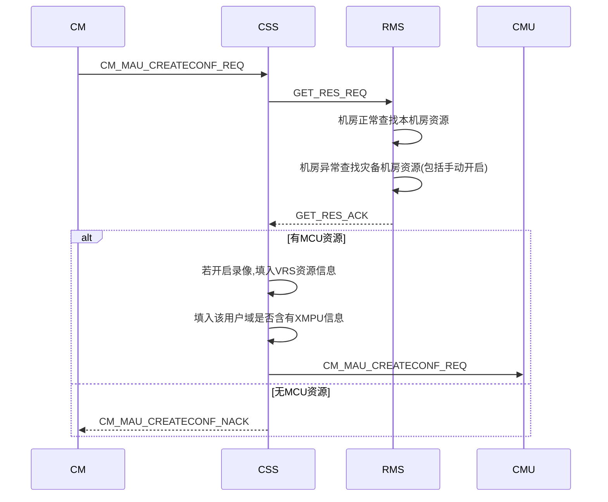
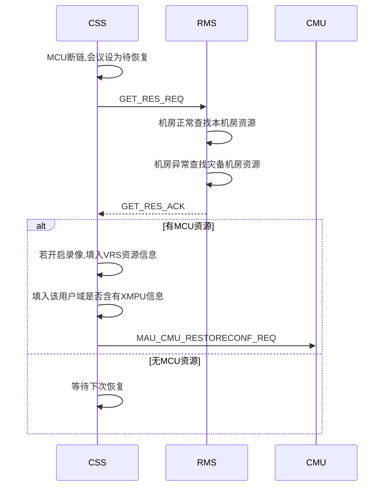
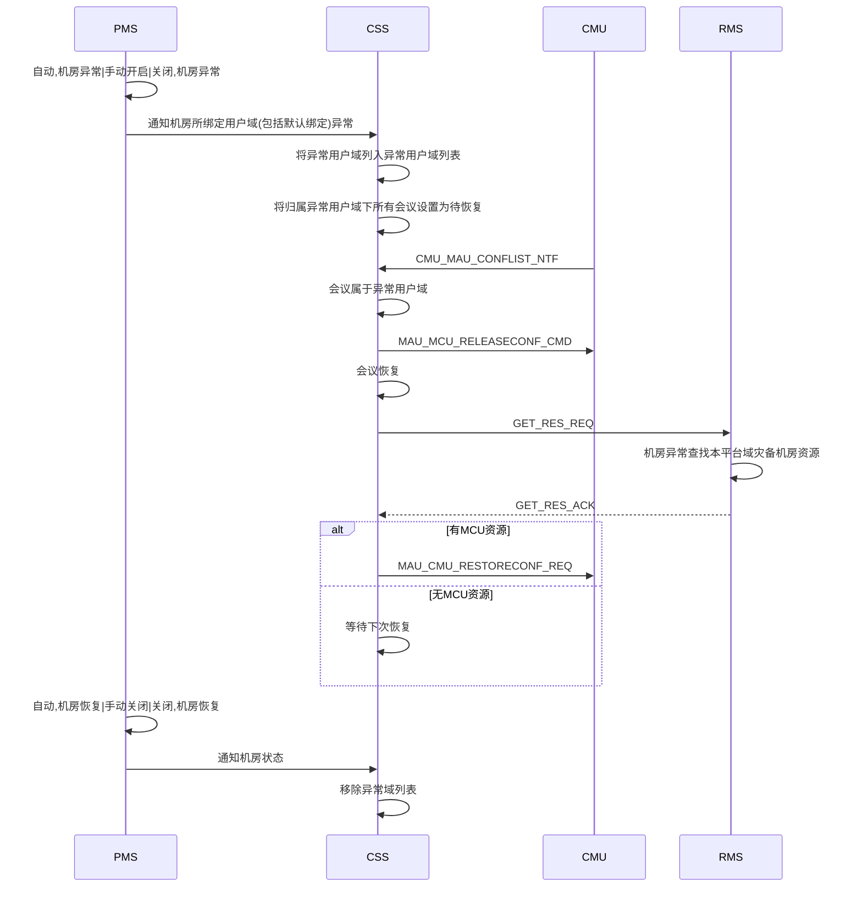
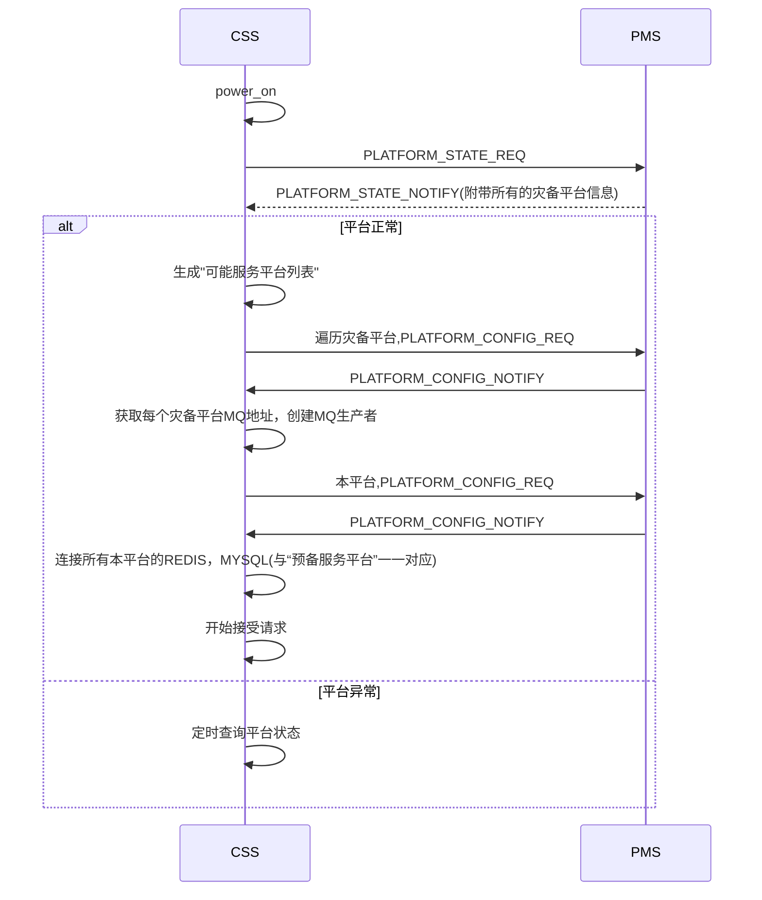
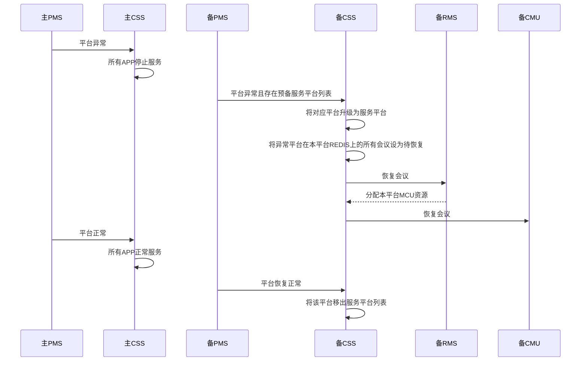

# 5.1sp4CSS概要设计

[TOC]

## 1 RMS波及

### 1.1 创会流程



### 1.2 平台内灾备流程






### 1.3 消息走法

```json
RMS消费者: RMS.RES.Q|RMS.RES.K|RMS.RES.EX
```

```json
CSS消费者(rpc): MAU.RPCRES.Q|(AMQP default)
```

```JSON
{
  "type" : "GET_RES_REQ",
  "moid" : "", //用户域MOID
  "res" : 
  [
    "mcu",
    "vrs",
    "mps"
  ]
}
```

```json
{
  "type" : "GET_RES_ACK",
  "mcu" :
  {
    "ip" : "",
  },
  "vrs" :
  {
    "ip" : "",
  },
  "mps" :
  {
    "ip" : ""
  }
}
```

```json
{
  "type" : "GET_RES_NACK",
  "errcode" : ""
}
```


### 1.4 错误码

> 29501-30000
>
> 29501-RMS内部错误

 

### 1.5 其他

> 不再缓存用户域是否含有XMPU(ap,bmc感知),使用RMS返回值

> CSS新增异常用户域列表缓存，收到异常用户域会议列表通知便结会

> PMS通知机房状态时，需附带与该机房绑定的所有用户域


## 2 PMS波及
###2.1 CSS视角连接图


### 2.2 启动流程




### 2.3 平台间的灾备

#### 2.3.1 时序图




#### 2.3.2 灾备平台的创会消息处理

```flow
st=>start: 创会请求
end=>end: ack
nack=>end: nack
op1=>operation: 根据用户域获取其所属平台域
cond1=>condition: 平台域是否在服务平台列表
op2=>operation: 往归属所属平台域的REDIS写入数据
st->op1->cond1(yes)->op2->end
cond1(no)->nack
```

> 服务平台列表 = 本平台 + (可能服务平台列表中平台 & 平台异常)


#### 2.3.3 会控消息处理

```sequence
主PMS->主CSS: 主平台异常
备PMS->备CSS: 主平台异常
备CSS->备CSS: 恢复会议在备平台
备CM->备CSS: 主平台会议会控消息
备CSS->备CSS: 会议实际召开平台为本平台
备CSS->备CMU: 转发会控消息
备CMU->备CSS: 会议状态通知
备CSS->备CSS: 会议源平台在服务平台列表
备CSS->备CM: 会议状态通知
主PMS->主CSS: 主平台恢复正常
备PMS->备CSS: 主平台恢复正常
备CSS->备CSS: 将备平台移出服务平台列表
主CSS->主CSS: 收到会控消息
主CSS->主CSS: 会议实际不归属本平台
主CSS->备CSS: 转发会控消息(cm.cmmcu.key)
备CSS->备CSS: 会议实际召开平台为本平台
备CSS->备CMU: 转发会控消息
备CMU->备CSS: 会议状态通知
备CSS->备CSS: 源平台不在服务平台列表
备CSS->主CSS: 转发会议状态控制
备CSS->主CSS: meeting.mccntf.k|rpc
```


#### 2.3.4 REDIS数据变更

| confex       |          |      |
| ------------ | -------- | ---- |
| platformmoid | 会议实际创建平台 | 新增   |


#### 2.3.5 其他

> 部署之后，能够灾备到本平台的灾备平台已明确,即“可能服务平台列表”是固定的
>
> CSS新增"可能服务列表"缓存和"服务列表缓存"
>
> 在每个APP的消息入口判断平台域状态，如果平台为异常状态，则不接收消息请求
>


## 3 MCU请求和通知的处理

### 3.1 修改会议名

```sequence
MCU->CSS: MCU_MAU_MODIFYCONFNAME_REQ
CSS->CM: MAU_CM_MODIFYCONFNAME_REQ
CM->CSS: MAU_CM_MODIFYCONFNAME_ACK
CSS->MCU: MAU_CM_MODIFYCONFNAME_ACK
MCU->CSS: MCU_MAU_CONFSTATECHANGE_NTF	
CSS->confinfoDB: 更新会议名
CSS->REDIS: 更新会议名
```

> redis:confex:confname 是否有必要去掉，或者说无关紧要，更新失败了也不要紧，不做异常处理

> 若MCU_MAU_MODIFYCONFNAME_REQ能走会议状态通知透传消息，则可以不考虑灾备情况的单独处理


### 3.2 延长会议(CSS总控)

正常情况：

```sequence
CM->CSS: CM_MAU_DELAYCONF_REQ
CSS->CSS: 校验
CSS->REDIS: 更新会议数据
CSS->CM: CM_MAU_DELAYCONF_ACK
CSS->CM: CM_MAU_CONFDURATION_NTF
CSS->CMU: MAU_CMU_CONFDURATION_NTF
CMU->CSS: MCU_MAU_DELAYCONF_REQ
CSS->CSS: 校验
CSS->REDIS: 更新会议数据
CSS->CMU: MAU_MCU_DELAYCONF_ACK
CSS->CM: CM_MAU_CONFDURATION_NTF
```

主平台恢复，会议在备平台情况:
```sequence
主CM->主CSS: CM_MAU_DELAYCONF_REQ
主CSS->主CSS: 校验
主CSS->主REDIS: 更新会议数据
主CSS->主CM: CM_MAU_DELAYCONF_ACK
主CSS->主CM: CM_MAU_CONFDURATION_NTF
主CSS->主CSS: 会议实际召开平台非本平台
主CSS->备CMU: MAU_CMU_CONFDURATION_NTF
```

```sequence
备CMU->备CSS: MCU_MAU_DELAYCONF_REQ
主CSS->主CSS: 校验
备CSS->主REDIS: 更新会议数据
备CSS->备CMU: MAU_MCU_DELAYCONF_ACK
主CSS->主CSS: 会议所属平台不在服务平台列表
备CSS->主CM: CM_MAU_CONFDURATION_NTF
```


> 主平台CSS发往备平台CMU消息走: cmu.conf.q:ip(cmu.conf.q:ip:pid)根据会议归属CMU信息自己组装

> 备平台CSS发往主平台CM消息走: meeting.mccntf.q(meeting.mccntf.k)


> 若会议在备平台且主平台已恢复正常，主平台会管来请求了则MAU_CMU_CONFDURATION_NTF需要转发给备平台的CMU(mau.cmmau.q)
>
> 若会议在备平台且主平台已恢复正常，备平台MCU来请求了则CM_MAU_CONFDURATION_NTF需要转发给备平台的会管


### 3.3 会议密码变更通知


## 4 数据库

### 4.1 公共模板数据库

```sequence
备CM->备CSS: ADD/MOD/DEL_TEMPLATE_REQ
备CSS->备MPCDDB_TTEMPLATEINFO(主): ADD/MOD/DEL TEMPLATE
备CSS->备CM: ADD/MOD/DEL_TEMPLATE_ACK

```

### 4.2 confinfoDB

```sequence
备CMU->备CSS: 创会ACK
备CSS->备CONFINFODDB_TCONFINFO(主): 添加会议数据
备CMU->备CSS: 更改会议名字/密码通知
备CSS->备CONFINFODDB_TCONFINFO(主): 改名/密码

```

### 4.3 ap(user_domain,platform_domain,service_domain)

> 这部分信息CSS读取所有域信息，不必单独连接其他域数据库读取

>不允许BMC，BMC_LICENSE在灾备发生之后，还能够修改(主平台CSS已停止服务，不能够更新缓存)


## 5 平台域是否部署XMPU,VRS

```sequence
CM->CSS: CM_MAU_CREATECONF_REQ
CSS->RMS: GET_RES_REQ
RMS->CSS: GET_RES_ACK
CSS->CSS: 解析是否有XMPU
CSS->CSS: 如果开启录像解析VRS地址
CSS->CMU: CM_MAU_CREATECONF_REQ
```


```sequence
CSS->RMS: GET_RES_REQ
RMS->CSS: GET_RES_ACK
CSS->CSS: 解析是否有XMPU
CSS->CSS: 如果开启录像解析VRS地址
CSS->CMU: CM_MAU_RESTORECONF_REQ
```


## 9 license相关

> 每个平台域对于会议数量的限制还是基于自身的LICENSE
>
> 平台域对于资源的限制是其自身及所有灾备到本平台的资源总和

``` sequence
CSS->核心域BMC: 获取可能服务平台LICENSE
核心域BMC-->>CSS: 
CSS->CSS: 缓存并累加可能服务平台域的LICENSE
MS->CSS: 获取LICENSE
CSS-->>MS: 回复累加后的LICENSE
核心域BMC->CSS: 可能服务平台域更新LICENSE
CSS->CSS: 更新回复给MS的LICENSE
CSS->MS: LICENSE更新
```


## 12 会场监控波及

> 会管在主平台挂了之后，自动跳转到灾备平台的时候，应该停止其会议监控


## 12 上报网管信息

> 连接NU数量写死为0
>
> 不再缓存公共模板和预约会议数量，是否可以不上报


## 13 上报UPU波及

> 一个平台只部署一个UPU

> 正召开会议，预约会议，预分配E164号个人模板，固定虚拟会议室
>
> 若是会议恢复到灾备平台，数据是写在主平台的REDIS和MYSQL
>
> UPU上报还是上报该灾备会议的源用户域和平台域

```sequence
主PMS->主CSS: 平台异常
备PMS->备CSS: 主平台异常
备CSS->备UPU: 重新上报主平台预约会议,个人模板,固定虚拟会议
备CSS->备CSS: 恢复会议
备CSS->备UPU: 上报正召开会议(仍归属源用户域及平台域)
```


## 13 会议列表调整

> 会议开在灾备平台，主平台恢复，此时主平台的MCU仍保有该会，按照当前逻辑，会结束主平台的MCU的会议这是对的，无需修改


## 14 NPPCLIENT的波及

NPPCLIENT也要感知需要服务哪些平台，

和CSS的处理是一致的。当终端请求到来，NGI需带上该终端所属的平台域信息


## 12 疑问点

> 在灾备平台域上报主平台域的话单，因为BMC是整个服务域的，在哪个平台域是否没有影响
>
> 会控消息走RPC？
>
> 一个主机房可以对应多个用户域？


## 8 灾备期间灾备平台不能修改点

> BMC不能修改域信息
>
> BMC不能修改LICENSE信息


## 6 删除部分

> meeting, v_meeting, scheduledDB相关
>
> ap:user_info, server_info 数据
>
> 预约会议，公共模板缓存
>
> 添加终端的ACK和NACK不再处理
>
> 删除减少会议时长的请求


## 11 其他

> 利旧会议不灾备


