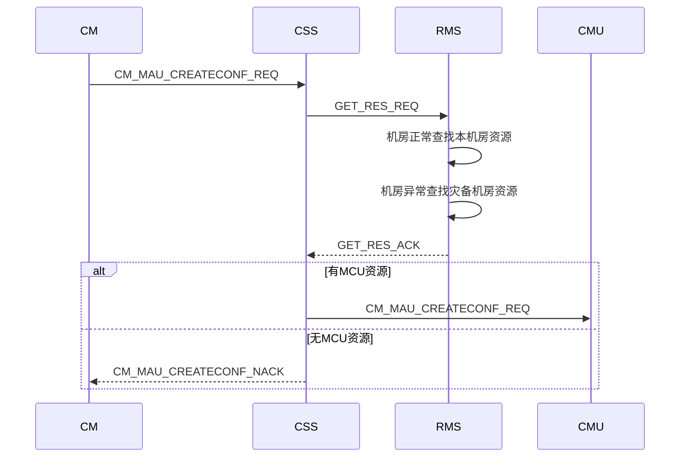
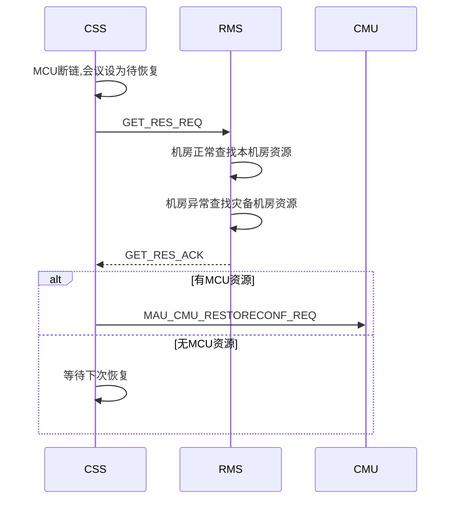
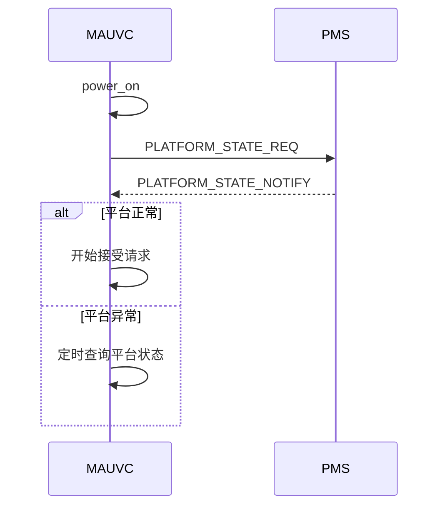
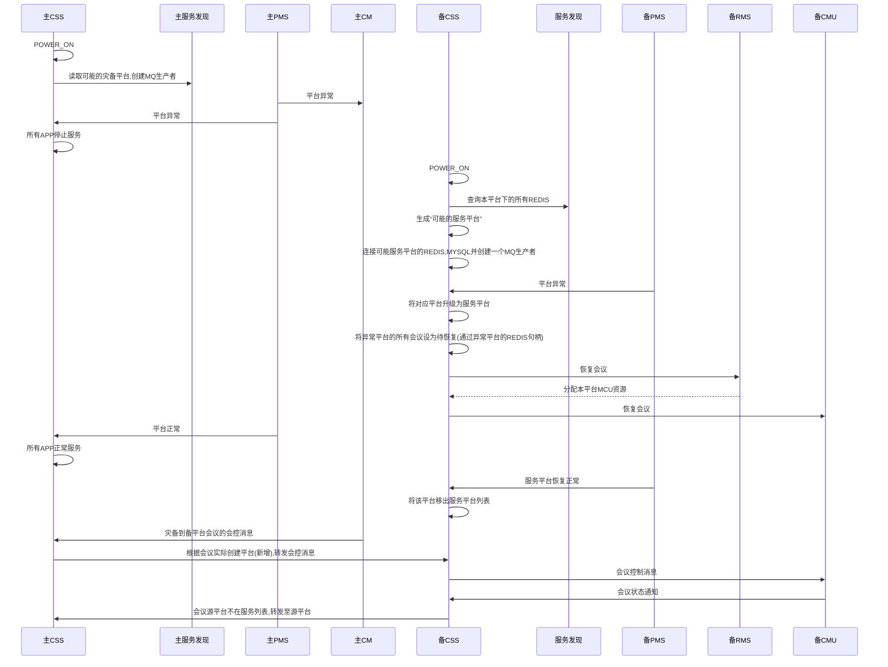

# 5.1sp4CSS概要设计

[TOC]

1 RMS波及

1.1 创会流程



1.3 平台内灾备流程

```mermaid
sequenceDiagram
PMS->>CSS: 自动,机房异常|手动开启|关闭,机房异常
CSS->>CSS: 将异常机房列入异常域列表
CSS->>CSS: 将异常域下所有会议设置为待恢复
CMU->>CSS: CMU_MAU_CONFLIST_NTF
CSS->>CSS: 会议属于异常用户域
CSS->>CMU: MAU_MCU_RELEASECONF_CMD
CSS->>RMS: GET_RES_REQ
RMS->>RMS: 机房异常查找本平台域灾备机房资源
RMS-->>CSS: GET_RES_ACK
alt 有MCU资源
CSS->>CMU: MAU_CMU_RESTORECONF_REQ
else 无MCU资源
CSS->>CSS: 等待下次恢复
end
PMS->>CSS: 自动,机房恢复|手动关闭|关闭,机房恢复
CSS->>CSS: 移除异常域列表
```





1.2 消息走法

```json
向RMS请求资源消费者: RMS.RES.Q|RMS.RES.K|RMS.RES.EX
```

```json
CSS接收请求结果消费者(rpc): MAU.RPCRES.Q|(AMQP default)
```

```JSON
{
  "type" : "GET_RES_REQ",
  "moid" : "", //用户域MOID
  "res" : 
  [
    "mcu",
    "vrs",
    "mps"
  ]
}
```

```json
{
  "type" : "GET_RES_ACK",
  "mcu" :
  {
    "ip" : "",
  },
  "vrs" :
  {
    "ip" : "",
  },
  "mps" :
  {
    "ip" : ""
  }
}
```

```json
{
  "type" : "GET_RES_NACK",
  "errcode" : ""
}
```


1.4 错误码

> 29501-30000
>
> 29501-RMS内部错误


1.5 新增RMS_APP

```c++
class CResMgrSsnInstance : public CInstance
```


2 PMS波及

2.1 启动流程




2.2 平台间的灾备




> 部署之后，CSS启动之后，能够灾备到本平台的灾备平台已明确
>
> CSS缓存mayserverplats(mysql, redis), 而服务平台(本平台，在 myaserverplat &&  收到该平台的异常通知)
>
> confex需添加会议实际召开在哪个平台域属性


3 修改会议名请求

```sequence
MCU->CSS: MCU_MAU_MODIFYCONFNAME_REQ
CSS->CM: MAU_CM_MODIFYCONFNAME_REQ
CM->CSS: MAU_CM_MODIFYCONFNAME_ACK/NACK
CSS->MCU: MAU_CM_MODIFYCONFNAME_ACK/NACK
MCU->CSS: MCU_MAU_CONFSTATECHANGE_NTF	
CSS->CSS: 更新confinfodb
```

> 会议在灾备平台，主平台恢复情况，应将请求发往主平台的会管，如果能够改成会议状态类的请求，
>
> 让CSS透传，则CSS无需做额外改动


4 总控延长会议时长

```sequence
CM->CSS: CM_MAU_DELAYCONF_REQ
CSS->CSS: 校验
CSS->CM: CM_MAU_DELAYCONF_ACK
CSS->CM: CM_MAU_CONFDURATION_NTF
CSS->CMU: MAU_CMU_CONFDURATION_NTF
CMU->CSS: MCU_MAU_DELAYCONF_REQ
CSS->CSS: 校验
CSS->CMU: MAU_MCU_DELAYCONF_ACK
CSS->CM: CM_MAU_CONFDURATION_NTF

```

> 若会议在备平台且主平台已恢复正常，主平台会管来请求了则MAU_CMU_CONFDURATION_NTF需要转发给备平台的CMU
>
> 若会议在备平台且主平台已恢复正常，备平台MCU来请求了则CM_MAU_CONFDURATION_NTF需要转发给备平台的会管


4 数据库

4.1 公共模板数据库

```sequence
备CM->备CSS: ADD/MOD/DEL_TEMPLATE_REQ
备CSS->备MPCDDB_TTEMPLATEINFO(主): ADD/MOD/DEL TEMPLATE
备CSS->备CM: ADD/MOD/DEL_TEMPLATE_ACK

```

4.2 confinfoDB

```sequence
备CMU->备CSS: 创会ACK
备CSS->备CONFINFODDB_TCONFINFO(主): 添加会议数据
备CMU->备CSS: 更改会议名字/密码通知
备CSS->备CONFINFODDB_TCONFINFO(主): 改名/密码

```

4.3 ap(user_domain,platform_domain,service_domain)

> 这部分信息CSS读取所有域信息，不必单独连接其他域数据库读取

>不允许BMC，BMC_LICENSE在灾备发生之后，还能够修改(主平台CSS已停止服务，不能够更新缓存)


5 平台域是否部署XMPU,VRS

```sequence
CM->CSS: CM_MAU_CREATECONF_REQ
CSS->RMS: GET_RES_REQ
RMS->CSS: GET_RES_ACK
CSS->CSS: 解析是否有XMPU
CSS->CSS: 如果开启录像解析VRS地址
CSS->CMU: CM_MAU_CREATECONF_REQ
```


```sequence
CSS->RMS: GET_RES_REQ
RMS->CSS: GET_RES_ACK
CSS->CSS: 解析是否有XMPU
CSS->CSS: 如果开启录像解析VRS地址
CSS->CMU: CM_MAU_RESTORECONF_REQ
```


6 删除部分

> meeting, v_meeting, scheduledDB相关
>
> ap:user_info, server_info 数据
>
> 预约会议，公共模板缓存
>
> 添加终端的ACK和NACK不再处理
>
> 删除减少会议时长的请求


7 创会流程

```flow
st=>start: begin
end=>end: end
cond1=>condition: 检测创会域是否在需服务平台域列表
op1=>operation: NACK
op2=>operation: 将会议数据写入对应平台的REDIS中
st->cond1(yes)->op2->end
cond1(no)->op1->end
```

> 需服务域包括本服务域+灾备到本平台且出现异常的域


8 灾备期间灾备平台不能修改点

> BMC不能修改域信息
>
> BMC不能修改LICENSE信息


9 license相关


10 CSS的连接图


> 源平台为A，实际开在平台B上，源平台正常的会议，由源平台CSS转发会控消息到平台B的CSS中
>
> 平台B上的MCU的会议的会议通知消息，由平台B的CSS转发消息到平台A的CSS上
>
> 会控消息由主平台转发至灾备平台cm.cmmcu.ex(cm.cmmcu.key)
>
> 会议状态通知消息由灾备平台转发至主平台的meeting.mccntf.ex(meeting.mccntf.k)|rpc消费者
>
> 也就是说会控消息会判断会议实际召开平台是否非本平台且是灾备平台，若是则发往灾备平台的消费者中
>
> 状态通知消息会判断会议所属平台是否不在服务平台且在可能服务平台列表中，若是则发往可能服务平台的消费者中


11 其他

> 利旧会议不灾备


12 会场监控波及


12 上报网管信息

> 连接NU数量写死为0
>
> 不再缓存公共模板和预约会议数量，是否可以不上报


13 上报UPU波及


12 疑问点

> 在灾备平台域上报主平台域的话单


1. 正常创会流程要怎么走?

   CSS创会走RPC的原因? --暂不明，先不走

   (是否判断会议能力的逻辑也交给RMS，毕竟是资源管理--可以提)

   创会ACK的内容:更改redis状态，写confinfo数据库，回复会管 保持不变

   创会NACK：删除redis会议，回复会管 保持不变


1. 不跨平台的机房内和机房间的灾备怎么走?

   机房间的灾备：

   CSS需要感知 机房MOID对应的多个用户域MOID的内容

   自然机房灾备和手动开启灾备

   ```sequence
   PMS->CSS: 机房1异常了
   CSS->CSS: 获取绑定该机房的所有用户域，将这些用户域设为异常用户域
   CSS->CSS: 将这些用户域上的会议都设为待恢复
   CMU->CSS: 会议列表通知
   CSS->CSS: 如果会议归属于这些异常用户域就结掉
   CSS->RMS: 恢复会议
   RMS->CSS: 分配灾备机房的MCU，如果自动或者手动灾备情况

   ```

   即时机房崩溃，但是MCU还正常连接CSS，也没什么，RMS不会分配会议，会议列表推送过来，也会被结掉。

   ​

   如果切换到手动开启的话，由PMS报机房的状态，CSS收到通知，发条消息给主控函数，让主控函数先将会议设置成待恢复状态。而在会议列表通知的时候，将该机房的MCU的会议（CSS会缓存都有哪些机房是手动开启状态），直接结束掉。而会议恢复的时候，RMS则会选择一个正确的备份机房进行会议恢复.

   手动关闭的情况：

   ```sequence
   RMS->CSS: 机房1正常
   CSS->CSS: 移除该机房对应的所有用户域为移除用户域
   CMU->CSS: 会议列表通知
   CSS->CSS: 如果此时，还有会议过来，该会议若已经被恢复，则结掉会议
   CSS->CSS: 如果会议仍未恢复，则同步，新开的会，RMS分配在该用户域上面
   CSS->CSS: 正在召开的会议不做处理
   ```

   ​

   同时灾备的时候，选择对应的MCU的时候，RMS也要对应的分配同MCU机房的VRS


   ＣＳＳ如何感知是手动灾备？

   CSS无需感知是否是手动灾备，手动灾备和机房崩溃一样，PMS通知机房异常之后，CSS就将该机房对应的所有会议都设置为待恢复，会去结束掉该机房的所有会议


1. 平台间的灾备怎么走?

平台间的灾备就要考虑到MYSQL,REDIS，MQ，ZK节点的部署

平台间的灾备就跟PMS有关了，

平台间的灾备，平台的CSS就不可以用了，另外一个平台的CSS利用云上的数据，继续工作

当本平台需要灾备的时候，PMS会通知业务，

CSS是否需要知道自己所属哪个用户域？查询LUBAN可以知道自己在哪个用户域

PMS广播平台域的状态作为平台域间灾备的起点。

当主机房的灾备机房是另外一个平台的机房，然后主机房开启了手动灾备或者主机房发送业务起不来的崩溃情况

首先会有PMS广播该机房不可用，在广播机房不可用的时候，数据其实已经写不到云平台了。但这个时候，CSS如果仍在运行的话，MCU报会议列表的话，在会议列表的处理函数中，将异常机房的会议都结掉。CSS将会收到所有机房的异常通知和平台的异常通知，平台的异常通知可以不感知


而在灾备平台侧：按照REDIS的会议数据，CSS会感知到。那么如此，CSS就能够知道都有哪些用户域灾备到我这个用户域上面了。平台域下-》多个用户域，其他平台-》多个用户域。PMS通知，哪个平台挂了。就将该平台设置为需要服务的平台。在创会的时候，接收服务平台的创会。 

无论哪个平台的CSS都只连接本平台的MCU

自然情况和手动迁移是一个样子。手动迁移一个主机房，代表者哪个平台不可用了。


```sequence
PMS->CSS: 平台1挂了
CSS->CSS: 将该平台下的所有用户域的会议全部设置为待恢复
CSS->RMS: 申请其他平台的会议在本平台下的资源
RMS->CSS: 返回可用的CMS
```

手动迁回的情况：

因为在手动迁回的情况下，恢复成功过的后面又要恢复的会议迁移回

MCU需要接受不是本平台的用户域的会议的创会请求。会议恢复和创会还是写的原始用户域，但是用的资源是灾备平台的。迁回的时候，直接CSS不服务。原始平台的CSS接管恢复。

```sequence
PMS->CSS: 平台1恢复正常
CSS->CSS: 对比不是本平台，将该平台剔除出服务平台
CSS->CSS: 正在召开的会议不做处理
CSS->CSS: 需要恢复的会议，也不做处理，另外一个平台
```

对于，已经恢复到备平台的会议，主平台恢复以后，如何对其进行会议控制？

创会ACK的时候，添加一个会议属性，意义是：会议实际上是创建在哪个平台的

假设CSS需要去连接灾备平台的MQSERVER

1. CSS如何知道灾备平台的MQ地址是啥?

   可以在启动的时候向PMS请求平台信息（包含灾备平台MOID)

   通过服务发现寻找灾备平台-》主机房-》MQ的地址

   然后和灾备平台的MQ，创建一个生产者和消费者。

   会议控制消息，发给该平台MQSERVER，然后转头到对应的mau.cmcmu.ex中去

   主平台也是可以选择会议的归属，然后写REDIS的


1. 是否还需要连MCU？

   RMS不会告知MCU断链，

   会控消息透传，仍需要知道发往哪个MCU，MCU的routingkey

   如果RMS能支持实时的通知MCU的连接情况也是可以的

   届时可以去除MCUAPP，通过RMS来缓存在线的MCU的情况


1. LICENSE有影响吗?

LICENSE改动及规格后续

灾备到本平台的会议，占用本平台的LICENSE？

必须占用本平台的资源，所以必须占用本平台的LICENSE和原平台的LICENSE


1. 上报UPU有影响吗?

会议恢复到了其他机房应该是不需要改其归属的用户域的

会议恢复到其他平台的主机房，应该也是不需要改其归属的用户域的

那么会议恢复到了其他平台的主机房的时候，上报的UPU也还是原来的用户域和平台域

上报给UPU的不仅仅是正召开会议，还包括预约会议，个人模板，虚拟会议室，

这些是为了跨域呼叫的，对于跨平台域呼叫的请求，应该讲这些会议改成这个平台的主机房绑定的用户域吗？

1. 会管通知CSS并上报个人模板E164，预约会议E164，虚拟会议E164上报UPU

   不用管，还是报原来的用户域和平台域，NGI可能需要想办法能够将呼叫请求转到灾备平台，会管也需要

   准备处理好，其他主用户域终端直接创会的请求，提前召开预约会议的请求等。相当于这个平台域也是之前的主平台域。


1. MCU的请求和通知消息有影响吗?

   ​

   延长会议时长不走数据库，简单判断，如果修改，通知会管。

   将会管的请求和MCU的请求结合于一块处理

   灾备之后，也是相同的处理


​	更改会议名的请求，漏掉了，应该发给会管总控了。

​	CSS做下转发咯，发给会管。会管回ACK给MCU，走会控消息CM_CMU_CONFOPR_NTF

​	然后，CSS再收到MCU的改名NOTIFY消息，进行修改会议名

​	修改会议名和修改密码，都是MCU的通知

​	mau.conf.q还是继续保留。confinfodb那块需要了解是怎么同步数据的


1. BMC的更新消息的影响

如果发生平台域间的灾备，应该是暂不支持修改这些域信息。


1. 连接网管的影响

2. 会管终端监控逻辑的影响

   监控

3. 会议列表协调的影响

4. 检测会议到时的影响


1. 一些想法

公共模板其实就是让CSS把公共模板详情写到REDIS上面，让NPPCLIENT应对会议列表详情和创会

无需放到主控函数里面，单做个DAEMON，去处理

平台域不可用时，是否在CSS里面设置一个平台域的状态，只要不可用，主控DAEMON（或者其他daemon）就不工作了


21. 延长会议的影响

22. NPPCLIENT接收其他域中终端的请求

    NPPCLIENT也要感知需要服务哪些平台，

    和CSS的处理是一致的。当终端请求到来，NGI需带上该终端所属的平台域信息


