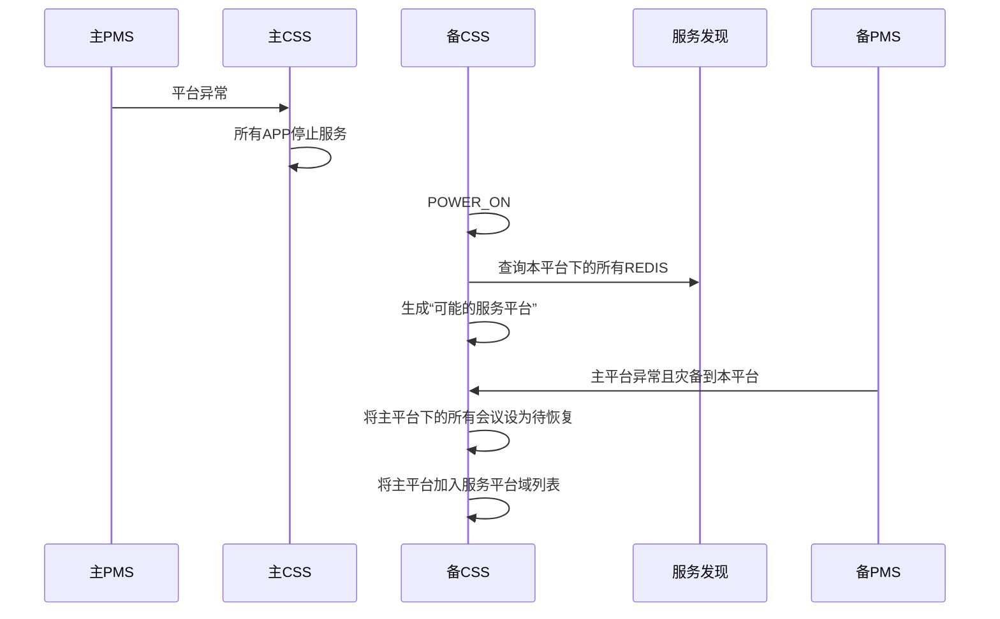

# 5.1sp4CSS概要设计

[TOC]

1 RMS波及

1.1 创会流程


1.3 平台内灾备流程


1.2 消息走法

```json
向RMS请求资源消费者: RMS.RES.Q|RMS.RES.K|RMS.RES.EX
```

```json
CSS接收请求结果消费者(rpc): MAU.RPCRES.Q|(AMQP default)
```

```JSON
{
  "type" : "GET_RES_REQ",
  "moid" : "", //用户域MOID
  "res" : 
  [
    "mcu",
    "vrs",
    "mps"
  ]
}
```

```json
{
  "type" : "GET_RES_ACK",
  "mcu" :
  {
    "ip" : "",
  },
  "vrs" :
  {
    "ip" : "",
  },
  "mps" :
  {
    "ip" : ""
  }
}
```

```json
{
  "type" : "GET_RES_NACK",
  "errcode" : ""
}
```


1.4 错误码

> 29501-30000
>
> 29501-RMS内部错误


1.5 新增RMS_APP

```c++
class CResMgrSsnInstance : public CInstance
```


2 PMS波及

2.1 启动流程


2.2 平台间的灾备




> 部署之后，CSS启动之后，能够灾备到本平台的灾备平台已明确
>
> CSS缓存mayserverplats(mysql, redis), 而服务平台(本平台，在 myaserverplat &&  收到该平台的异常通知)


5.1sp4是怎么部署的?


由上分析是有两套部署场景。

第一套是：省市单平台，　第二套是省市多平台

主要是省市单平台的出现，之前是没有省市单平台的场景的

为什么要有省市单平台？

这样可以让码流走市，信令走省。对于市区不必要去部署平台的业务。


５.１ＳＰ４的需求及波及?

1. 对于省市单平台的灾备，即多机房间的灾备
2. 平台间的灾备
3. 新增RMS模块，用于分配资源（包括创会，恢复会议，会管开录像需要分配VRS资源）
4. 新增PMS模块，用于平台间的灾备，通知机房状态和平台状态
5. 适应基础云平台(为了平台间的灾备)的设计（这样的设计应该是有原因的，应该是有利于灾备的)就是让同个服务域下的平台，有个用于灾备的平台，能够集和所有其他平台的数据
6. 新增服务发现-可以感知这个平台的其他业务
7. 去除server_info表，不再BMC入网服务器
8. 全面去除GUID
9. 上新的复杂部署工具的波及


1. CSS启动流程

   应该要多出来，PMS和RMS的APP

   启动的时候，不断向PMS去请求本平台的状态，类似于请求LICENSE

   可以去除掉预约会议的初始化

   终端账号的初始化及缓存

2. CSS如何和REDIS建链

   CSS需要连接多个平台的REDIS

   通过服务发现去查找平台下，主机房下，的REDIS信息，分别进行连接


1. 正常创会流程要怎么走?

   CSS创会走RPC的原因? --暂不明，先不走

   cm->css将只走cm_mau_createconf_req携带完整的创会消息，消息体与现在无异，将会携带用户域MOID

   css首先进行，会议数量限制判断，会议能力判断（一个用户域是否有XMPU，是否开启H265和全高清权限是否也可以通过RMS一次性获取?)

   ​

   继而申请MCU和VRS资源，最好是能够在一条消息里面都请求到，需要缓存的上下文有:创会JSON，请求到

   MCU和VRS之后就将MCU和VRS设置入创会JSON中，并将内容写入redis中.

   (是否判断会议能力的逻辑也交给RMS，毕竟是资源管理--可以提)

   创会ACK的内容:更改redis状态，写confinfo数据库，回复会管 保持不变

   创会NACK：删除redis会议，回复会管 保持不变


​	因为每个CSS都有可能连接多个REDIS，使用哪个REDIS的根据是：

​	创会所带的账户的用户域，不要往主平台的REDIS里面写入灾备平台的会议数据

​	直接往用户域归属的平台域里面写数据，即使会议开在另外一个平台域上面，对应的MCU，也应该把REDIS的数据写入到对应的REDIS上面。会议数据具体写到哪个REDIS上面，由终端的账户决定。


​	这是正常的创会流程，还有就是，平台崩溃，账户登录到了灾备平台，届时的创会：

有是根据，账户归属的用户域归属的平台域来决定，会议数据写到哪个REDIS实例中

​	

​	


1. 不跨平台的机房内和机房间的灾备怎么走?

   机房内的灾备：

   本机房内的灾备是感知MCU断链，然后由RMS选出本机房内的其他MCU进行灾备

   机房间的灾备：

   CSS需要感知 机房MOID对应的多个用户域MOID的内容

   自然机房灾备和手动开启灾备

   ```sequence
   PMS->CSS: 机房1异常了
   CSS->CSS: 获取绑定该机房的所有用户域，将这些用户域设为异常用户域
   CSS->CSS: 将这些用户域上的会议都设为待恢复
   CMU->CSS: 会议列表通知
   CSS->CSS: 如果会议归属于这些异常用户域就结掉
   CSS->RMS: 恢复会议
   RMS->CSS: 分配灾备机房的MCU，如果自动或者手动灾备情况

   ```

   即时机房崩溃，但是MCU还正常连接CSS，也没什么，RMS不会分配会议，会议列表推送过来，也会被结掉。

   ​

   如果切换到手动开启的话，由PMS报机房的状态，CSS收到通知，发条消息给主控函数，让主控函数先将会议设置成待恢复状态。而在会议列表通知的时候，将该机房的MCU的会议（CSS会缓存都有哪些机房是手动开启状态），直接结束掉。而会议恢复的时候，RMS则会选择一个正确的备份机房进行会议恢复.

   手动关闭的情况：

   ```sequence
   RMS->CSS: 机房1正常
   CSS->CSS: 移除该机房对应的所有用户域为移除用户域
   CMU->CSS: 会议列表通知
   CSS->CSS: 如果此时，还有会议过来，该会议若已经被恢复，则结掉会议
   CSS->CSS: 如果会议仍未恢复，则同步，新开的会，RMS分配在该用户域上面
   CSS->CSS: 正在召开的会议不做处理
   ```

   ​

   同时灾备的时候，选择对应的MCU的时候，RMS也要对应的分配同MCU机房的VRS


   ＣＳＳ如何感知是手动灾备？

   CSS无需感知是否是手动灾备，手动灾备和机房崩溃一样，PMS通知机房异常之后，CSS就将该机房对应的所有会议都设置为待恢复，会去结束掉该机房的所有会议


1. 平台间的灾备怎么走?

平台间的灾备就要考虑到MYSQL,REDIS，MQ，ZK节点的部署

平台间的灾备就跟PMS有关了，

平台间的灾备，平台的CSS就不可以用了，另外一个平台的CSS利用云上的数据，继续工作

当本平台需要灾备的时候，PMS会通知业务，

CSS是否需要知道自己所属哪个用户域？查询LUBAN可以知道自己在哪个用户域

PMS广播平台域的状态作为平台域间灾备的起点。

当主机房的灾备机房是另外一个平台的机房，然后主机房开启了手动灾备或者主机房发送业务起不来的崩溃情况

首先会有PMS广播该机房不可用，在广播机房不可用的时候，数据其实已经写不到云平台了。但这个时候，CSS如果仍在运行的话，MCU报会议列表的话，在会议列表的处理函数中，将异常机房的会议都结掉。CSS将会收到所有机房的异常通知和平台的异常通知，平台的异常通知可以不感知


而在灾备平台侧：按照REDIS的会议数据，CSS会感知到。那么如此，CSS就能够知道都有哪些用户域灾备到我这个用户域上面了。平台域下-》多个用户域，其他平台-》多个用户域。PMS通知，哪个平台挂了。就将该平台设置为需要服务的平台。在创会的时候，接收服务平台的创会。 

无论哪个平台的CSS都只连接本平台的MCU

自然情况和手动迁移是一个样子。手动迁移一个主机房，代表者哪个平台不可用了。


```sequence
PMS->CSS: 平台1挂了
CSS->CSS: 将该平台下的所有用户域的会议全部设置为待恢复
CSS->RMS: 申请其他平台的会议在本平台下的资源
RMS->CSS: 返回可用的CMS
```

手动迁回的情况：

因为在手动迁回的情况下，恢复成功过的后面又要恢复的会议迁移回

MCU需要接受不是本平台的用户域的会议的创会请求。会议恢复和创会还是写的原始用户域，但是用的资源是灾备平台的。迁回的时候，直接CSS不服务。原始平台的CSS接管恢复。

```sequence
PMS->CSS: 平台1恢复正常
CSS->CSS: 对比不是本平台，将该平台剔除出服务平台
CSS->CSS: 正在召开的会议不做处理
CSS->CSS: 需要恢复的会议，也不做处理，另外一个平台
```

对于，已经恢复到备平台的会议，主平台恢复以后，如何对其进行会议控制？

创会ACK的时候，添加一个会议属性，意义是：会议实际上是创建在哪个平台的

假设CSS需要去连接灾备平台的MQSERVER

1. CSS如何知道灾备平台的MQ地址是啥?

   可以在启动的时候向PMS请求平台信息（包含灾备平台MOID)

   通过服务发现寻找灾备平台-》主机房-》MQ的地址

   然后和灾备平台的MQ，创建一个生产者和消费者。

   会议控制消息，发给该平台MQSERVER，然后转头到对应的mau.cmcmu.ex中去

   主平台也是可以选择会议的归属，然后写REDIS的


1. 是否还需要连MCU？

   RMS不会告知MCU断链，

   会控消息透传，仍需要知道发往哪个MCU，MCU的routingkey

   如果RMS能支持实时的通知MCU的连接情况也是可以的

   届时可以去除MCUAPP，通过RMS来缓存在线的MCU的情况


1. 报话单有影响吗？

   如果用户域在灾备的其他机房和其他平台不变的情况下，

   所报话单的参数是不会有变化的。

   但报话单是报给BMC的，如果会议在灾备平台结会了。话单将报给灾备平台的BMC，是否会有问题?---BMC话单波及


1. LICENSE有影响吗?

LICENSE改动及规格后续


1. 透传会议控制消息有影响吗?

   CSS会连接主备的MQ，会议属性会添加，创建平台MOID

   如果会议归属于本平台，则和正常情况一致

   如果会议归属于灾备平台，则发往灾备平台的mau.cmcmu.ex中


1. 上报UPU有影响吗?

会议恢复到了其他机房应该是不需要改其归属的用户域的

会议恢复到其他平台的主机房，应该也是不需要改其归属的用户域的

那么会议恢复到了其他平台的主机房的时候，上报的UPU也还是原来的用户域和平台域

上报给UPU的不仅仅是正召开会议，还包括预约会议，个人模板，虚拟会议室，

这些是为了跨域呼叫的，对于跨平台域呼叫的请求，应该讲这些会议改成这个平台的主机房绑定的用户域吗？

1. 会管通知CSS并上报个人模板E164，预约会议E164，虚拟会议E164上报UPU

   不用管，还是报原来的用户域和平台域，NGI可能需要想办法能够将呼叫请求转到灾备平台，会管也需要

   准备处理好，其他主用户域终端直接创会的请求，提前召开预约会议的请求等。相当于这个平台域也是之前的主平台域。


1. MCU的请求和通知消息有影响吗?

   添加终端的ACK和NACK不再处理

   删除减少会议时长的请求

   延长会议时长不走数据库，简单判断，如果修改，通知会管。

   将会管的请求和MCU的请求结合于一块处理

   灾备之后，也是相同的处理


​	更改会议名的请求，漏掉了，应该发给会管总控了。

​	CSS做下转发咯，发给会管。会管回ACK给MCU，走会控消息CM_CMU_CONFOPR_NTF

​	然后，CSS再收到MCU的改名NOTIFY消息，进行修改会议名

​	修改会议名和修改密码，都是MCU的通知

​	mau.conf.q还是继续保留。confinfodb那块需要了解是怎么同步数据的


1. BMC的更新消息的影响

如果发生平台域间的灾备，应该是暂不支持修改这些域信息。


1. 数据库的影响(公共模板，AP，confinfodb,serverinfo)


公共模板数据库应该也是和REDIS一致，在灾备平台，也有一份数据。

REDIS上已经有了公共模板的数据，灾备之后，会管上做修改的话，数据库也要同步做修改、

同时主平台恢复以后，也要支持能够将数据库进行同步


1. 连接网管的影响

2. REDIS的影响

3. MQ的影响

4. 服务发现的影响

5. 利旧MCU的影响

6. 会管终端监控逻辑的影响

   监控

7. 会议列表协调的影响

8. 检测会议到时的影响

9. 数据库部署波及

10. ZK部署波及

11. MQ部署波及


1. 一些想法

公共模板其实就是让CSS把公共模板详情写到REDIS上面，让NPPCLIENT应对会议列表详情和创会

无需放到主控函数里面，单做个DAEMON，去处理

平台域不可用时，是否在CSS里面设置一个平台域的状态，只要不可用，主控DAEMON（或者其他daemon）就不工作了


21. 延长会议的影响


