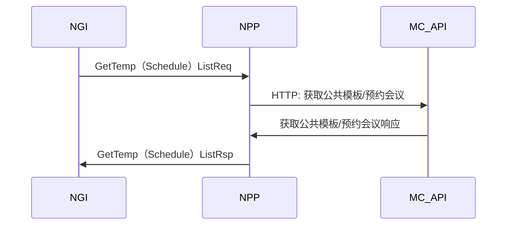
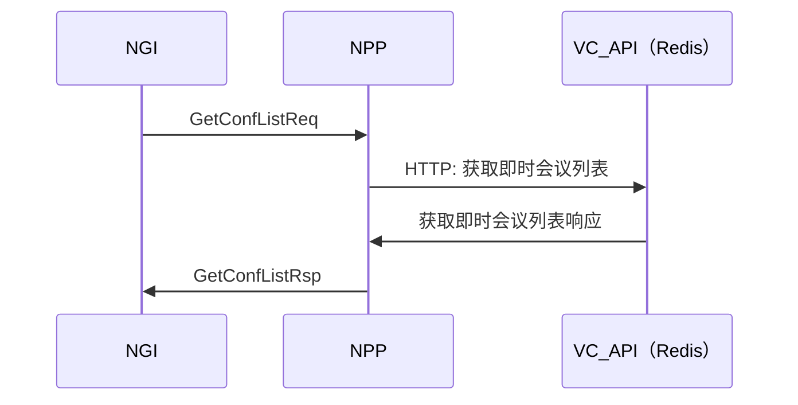
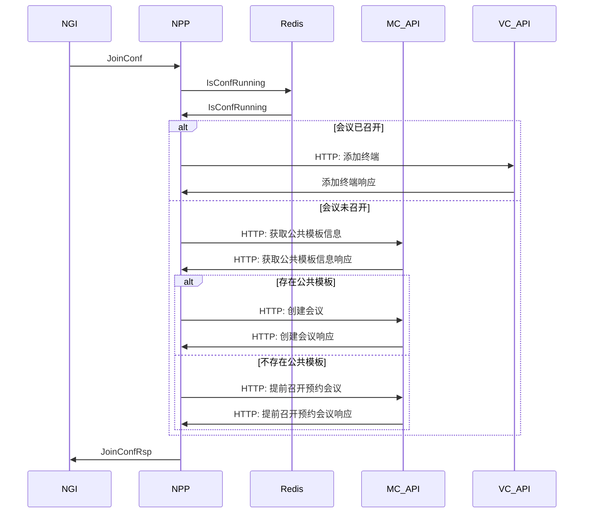
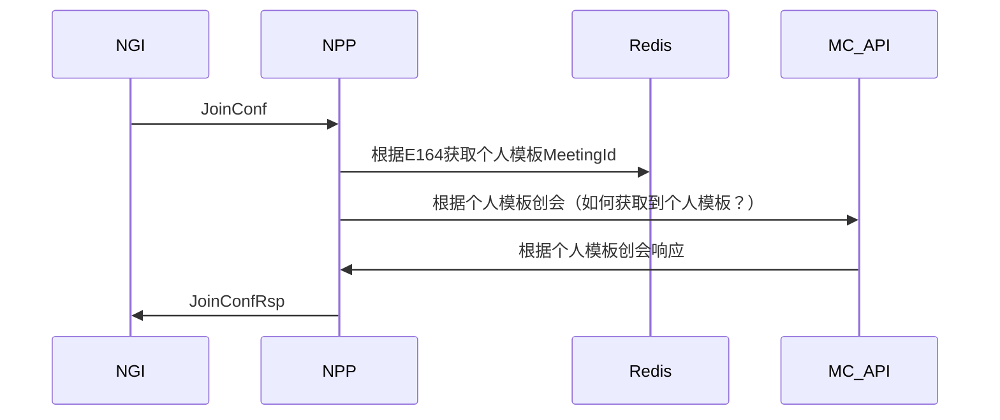

# CSS改进方案
[TOC]

## 一、终端非标信令转为API请求
### 1. SP2版本CSS模块功能图

### 2. 主要问题
1. 与会管数据库耦合
    * 为了允许终端创建会议，CSS需要修改meeting和vmeeting表
2. 做了许多缓存信息
    * 为了推送会议列表给终端，CSS缓存了预约会议、模板会议信息，缓存信息存在一致性问题
3. 创建了额外的数据库
    * 为了允许终端通过模板创会，公共模板数据库由CSS管理
    * 为了允许终端提前召开预约会议，把预约会议信息以JSON形式存到了数据库中
4. 做了额外的逻辑
    * 为了允许终端创会，CSS承担了即时、预约会议、公共模板E164号分配的任务，而个人模板的E164分配则是由会管处理
    * 由于E164号是CSS分配、公共模板由CSS写入数据库，因此一旦CSS不可用，创建的预约会议会缺少E164，会议模板则无法创建成功
    * 为了保证E164号、会议名唯一，CSS需要缓存所有预约会议和即时会议的E164
	* 存在多种形式的创会逻辑，终端召集会议、终端根据公共模板创会、会管创会、会管根据公共模板创会、终端提前召开预约会议、API创会
5. 数据库难以维护
    * 预约会议、公共模板数据库内所存均为JSON字符串，如内容变动，需编写额外工具修改JSON，无法直接用SQL语句完成升级
    * 由于会管也有一个预约会议数据库，两个数据库存在数据一致性问题
    * 创会和结会的时候，需删该表数据
    * 启动时，和vmeeting同步数据
    * 增删改预约会议时，同步修改该表

### 3. 改进方案
针对上述问题，提出以下改进方案：

1. 与会管数据库耦合
    * 创会API由会管提供
    * 所有终端创会请求，转为API调用
    * 级联创会也转为API请求
2. 做了需多缓存信息
    * 拉取预约会议、会议模板信息等操作，转为API调用
    * 即时会议等信息可从redis读取或转为API调用
3. 创建了额外的数据库
    * 公共模板数据库（ttemplateinfo）交由会管维护，CSS不再读写
    * 删除预约会议模板数据库（tscheduledconfinfo），预约会议信息通过API接口获取
4. 做了额外的逻辑
    * 公共模板、已召开会议、预分配号码个人模板的会议号由会管分配
    * 删除会管根据公共模板创会消息，会管到CSS只有一种创会消息
5. 数据库难以维护
    * 公共模板数据库由会管维护，可不以JSON形式存储
    * 没有了tscheduledconfinfo，无需考虑同步问题

#### 3.1 方案风险点
1. 消息传递处理路径变长，响应时间增加
2. 依赖模块增多，可靠性下降
3. 对会管、会控API的压力增大
4. 会管的部分API接口需要作调整

#### 3.2 API请求Token问题
使用API需要登录会管并获取token，会管在创会时，会将登录账号设置为创会人，在查询会议列表时，会根据登录信息进行过滤。
而终端通过非标信令请求时，并不会携带token信息，NPP也无法通过其他途径获取到终端的登陆token。
解决方案：
为NPP分配特殊的App Token和（平台域）用户账号，相关API加入参数，允许在消息体中指定用户域和用户信息（仅对此账号开放）。

#### 3.3 UPU注册问题
目前CSS会向UPU上报预约会议、已召开会议和预分配号码的个人模板
其中预约会议和预分配号码的个人模板是从会管处获取的。
预分配号码个人模板已设计了CSS和会管的交互消息，CSS可以从会管拉取到。
预约会议是由CSS从数据库中读取的，但上报后并没有实际用途，应该可以去掉。
如后续有需求，可以与会管协商增加拉取全部预约会议的消息。

预约会议隐含逻辑：
终端提前召开预约会议，如果距离原定开始时间长于一小时，则创建一个临时会议（E164号相同），该会议结束后，会议仍保持预约状态。

### 4. 改进后模块功能图

### 5. 具体流程
获取公共/预约模板：

获取已召开会议列表：

终端入会（提前召开预约会议/加入已召开会议）：

MCU级联创会：

P.S.:可以考虑NGI直接调用API创会，不过NPP。

### 6. 外部模块波及分析
BMC:
1. 出厂时在数据库中增加NPP的token和账号信息

会管API：
1. 修改接口，允许NPP设置用户域和用户信息
	* 获取预约会议列表（详情）
	* 获取公共模板列表（详情）
2. 新增提前召开预约会议接口
3. 新增通过个人模板开会接口

会管业务：
1. 分配已召开会议的E164（待定）
2. 分配预约会议的E164号（待定）
3. 管理公共模板（待定）
	* 分配公共模板的E164号
	* 设计公共模板数据库结构

迁移工具：
1. 支持将公共模板迁移到会管的数据库（待定）

会控API:
1. 修改接口，允许NPP设置用户域和用户信息
	* 创建即时会议
	* 获取已召开会议列表（详情）
	* 新增获取当前已用/剩余会议数
	* 终端入会

##  二、终端非标代理模块拆分及集群

### SP2版本部署图：

集群部署主要是为了解决以下两个问题：

1. 高负载下的横向扩展
2. 高可用性

### 1.高负载下的横向扩展
CSS现有的模块功能中，会议调度（会控信令转发），会议恢复，话单上报，UPU上报等，从消息量上来说，并不会很大，因此不会构成瓶颈。

目前负载比较高的主要是以下几部分：
#### 1.1 MCU向会管发送的NTF消息
在级联、轮询、大容量会议中，NTF消息的量会非常大，可以达到kps级别。
SP3中，这部分消息由CMU通过MQ发送给DP，并由DP写入Redis
对于DP的部署方式，如果简单的使用集群，会导致消息写入时序的问题
如应该先写入终端列表，再写入画面合成内的终端信息，若采用集群，则可能变成先写入画面合成内的终端信息，再写入终端列表
因此，如果DP成为瓶颈，建议采用DP与CMU一一绑定的方式部署，不同的会议中，并不存在写入时序的问题。

#### 1.2 终端通过NGI发来的非标请求
当终端数量较多时，终端侧来的非标请求量可能很大，成为系统瓶颈。
因此可以将非标终端接入模块独立出去，以负载均衡集群方式部署。
NGI目前与CSS使用OSP方式连接，如果使用集群，则应改为RMQ连接，由RMQ进行负载均衡。

#### 1.3 Redis
目前Redis以主从集群、读写分离方式部署。
如有必要可以将REST API、非标终端接入、从Redis打包部署，以缓解主Redis的压力。

### 2. 高可用性
拆分了终端非标协议代理后，CSS中剩下的逻辑主要是会议调度、会议恢复、上报UPU、上报多点会议话单等。
这些业务都需要有唯一的主来处理，否则容易造成重复恢复、重复上报等问题，即便做集群，也是有主集群。
考虑到CSS的启动速度很快，且没有额外的需要同步的数据，因此冷备与有主集群在效果上差异不大。

### 3. 改进后部署图

### 外部模块波及分析
NGI：
1. 非标请求改用MQ消息

## 三、实施计划
考虑到整个方案改动点较多，且波及到会管、NGI等外部业务，在实施的时候可以分阶段进行

1. CSS 接入模块拆分为单独进程，CSS和NPP之间使用MQ RPC消息
2. 会管API接口修改、NPP改用会管API（优先创会接口，涉及到5.1策略）
3. NPP和NGI之间改用MQ
4. 公共模板数据库转移给会管、会议号码分配逻辑转给会管
5. CSS代码清理

## 四、后续规划
5.0 新终端后续版本会改用API。2.6的老终端、行业终端也会提供升级版本。
旧版本的终端会越来越少，届时，此模块可以直接抛弃掉，剩下的级联创会逻辑可合并到CSS或者NGI中。
