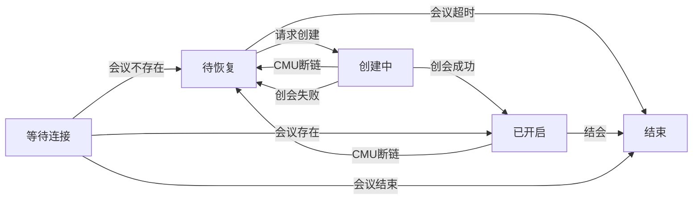
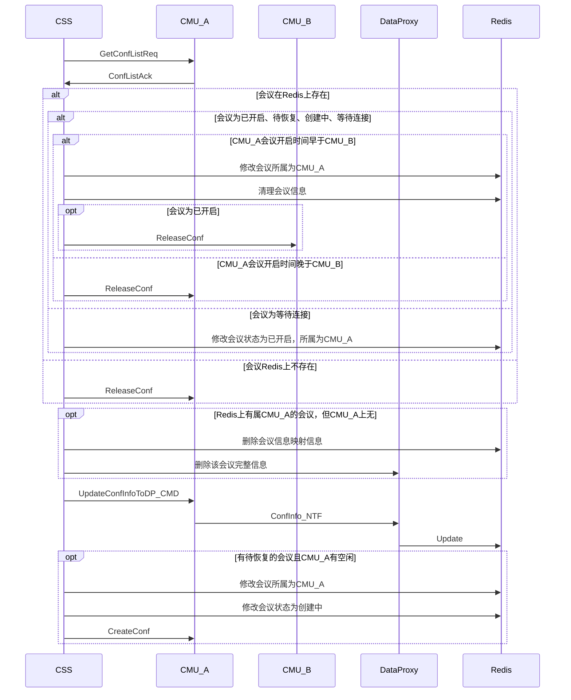
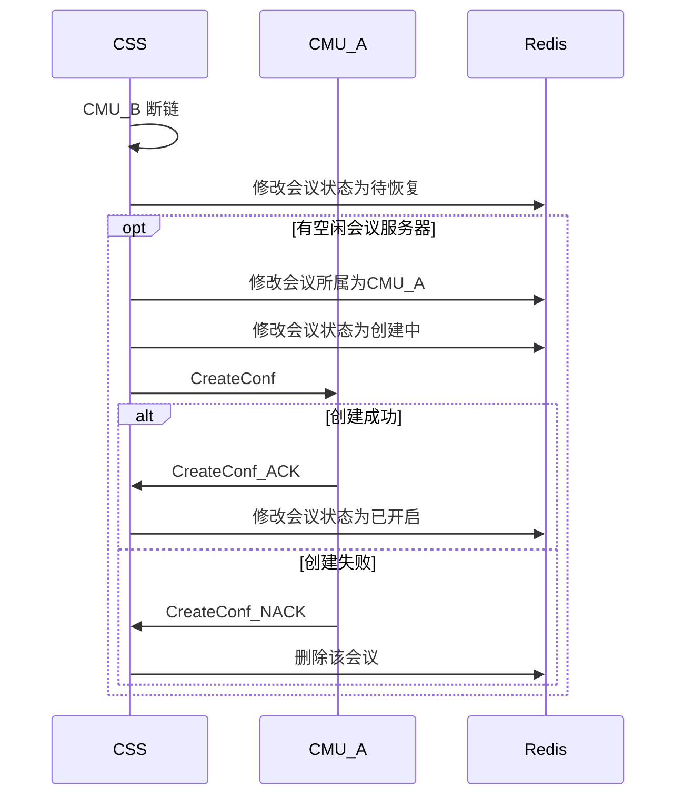
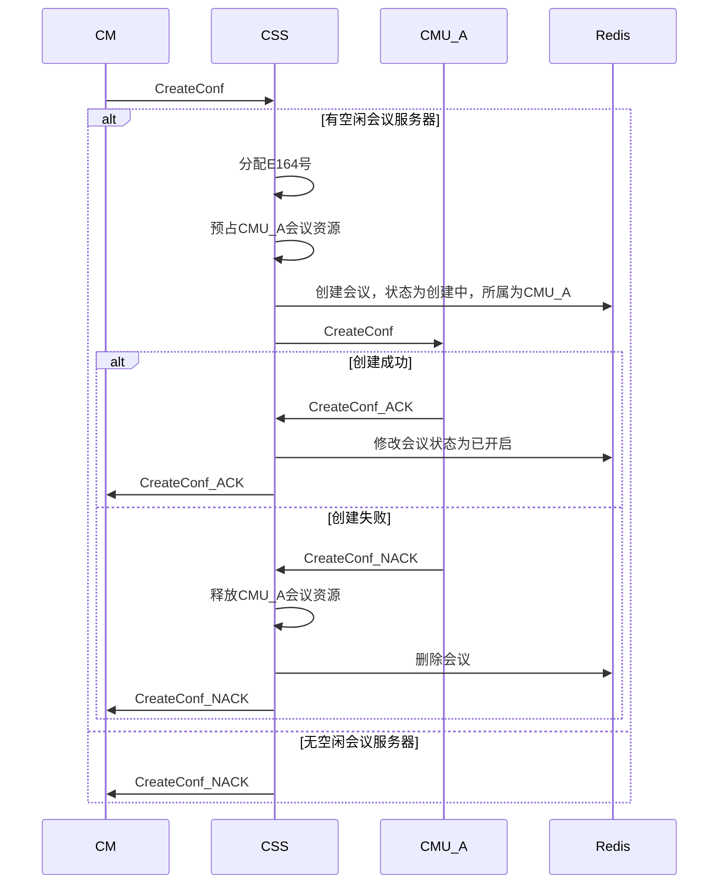
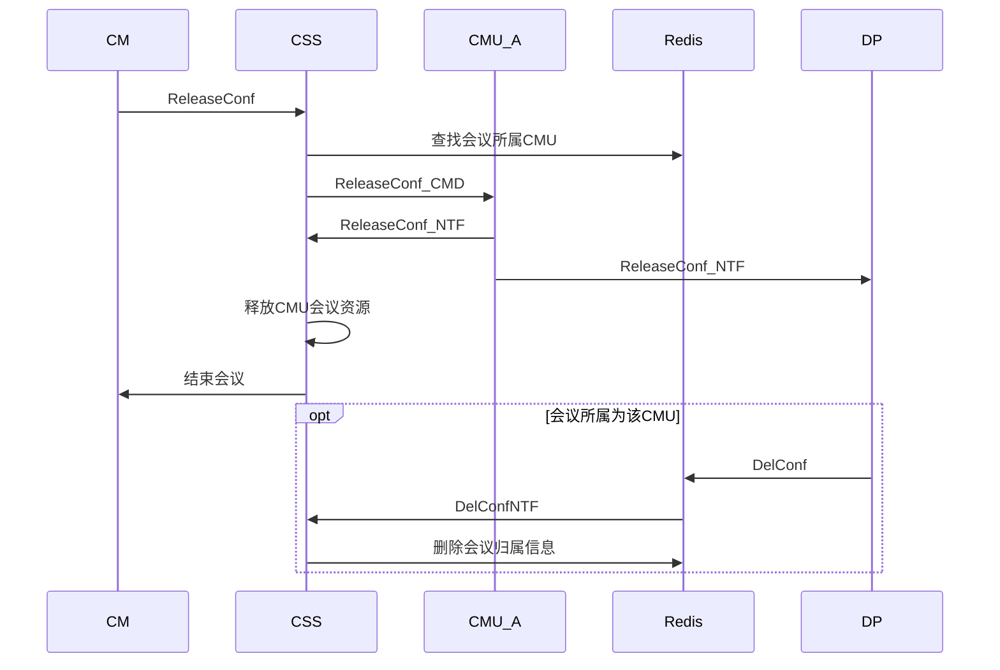
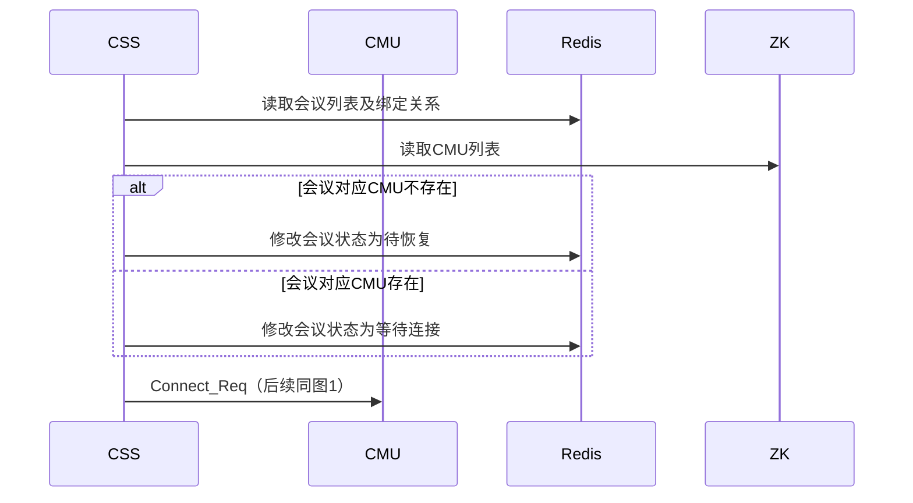
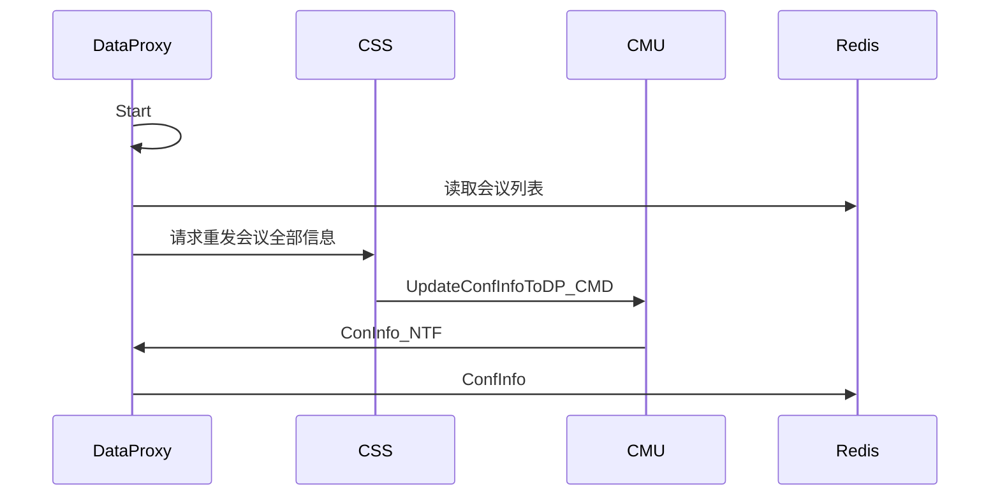

<!-- 请使用haroopd打开本文档 -->
<!-- http://pad.haroopress.com/user.html#download -->
#5.0会议恢复设计方案
[TOC]
##文档信息
作者: 邹俊龙
修改日期: 2015/12/17
##评审纪要
###第一次评审
评审日期：2015/12/17
评审人员：邹俊龙、彭杰、王也、牟兴茂、周广程、杨怀志
会议纪要：
> CSS不再为CMU分配CMU ID，CMU在消息中直接以IP:PID标示自己
> 会议所属CMU发生变化时，CSS需清除被回复会议的Redis数据，只保留基础数据
> 被恢复的会议不需要自动结会逻辑
> 允许会管主动结束待恢复的会议（待需求确认）
> 恢复会议和创建会议分开处理
> CMU需支持上报会议完整信息
> ReleaseConf改为REQ/ACK模式。同时需要NTF DP
> CMU在每条消息中需要增加CMU标识，此标识也应上报ZK
> DP更新数据时需校验Redis上会议所属的CMU标识

##会议恢复
###1.规格
- [x] 当CSS检测到某一CMU断链后，选择另一空闲的CMU进行恢复
- [x] 当无可用资源时，若有CMU结会或新CMU上线，都需要触发会议恢复
- [x] 会议恢复时，不考虑会议恢复顺序
- [x] 若CSS崩溃，则对ZK上不存在CMU的会议进行恢复
- [x] 若会议已到结束时间，仍未有空闲资源，则不再恢复
- [x] 被恢复的会议，其结束时间为原结束时间
- [x] 若原召开会议的CMU，会议并未结束，则需结束后来创建的会议
- [x] 利旧会议不恢复
- [x] 会议恢复失败后，仍然尝试恢复（暂定5min/次），直至会议结束时间或30分钟后
- [x] 允许会管主动结束该会议
- [ ] 检查MCU资源，恢复失败后，找下一个MCU进行恢复
- [ ] 处于待恢复的会议是否占用Lisence资源
- [ ] 若某会议发生过会议恢复，则上报多点会议话单时，应报一条还是多条
- [ ] 若会议异常后一直未回复，则多点会议话单的结束时间是会议异常时间还是原定结束时间

###2. Redis数据
CSS在Redis上保存的数据有：
    key为confex/confE164，value为 会议所属CMU(用于标识会议归属)、会议当前状态、
    会议开始时间(用于标识哪个MCU是最初创会MCU)
    key为cmu/ip/confs的集合

###3. 会议状态机

注：
1.CSS启动后，会将存在于ZK的CMU的的会议标识为已开启，不存在的标识为待恢复
2.如何判定CMU上的会议是被主动结束的还是重启后丢失的
> CMU需使用一种标示符标示自己，该标示符应该唯一，且进程重启后会发生变化
> 建议以IP + PID（ + 启动时间）
> CSS可通过此标识区分会议是自主结束还是重启导致丢失

###4. CMU建链流程
CMU与CSS之间，仍然使用心跳消息进行保活

>场景说明：
1. Redis上有属CMU_A的会议，但CMC_A上无
  该会议被终端主动结束或因无终端而自动结束
2. 会议Redis上不存在
  该会议被恢复了，但被NACK，因而会议被删除

###5. CMU断链流程图

###6. 创会流程

###7. 结会流程

问题点：
DP不感知CreateConf_ACK，如何知道会议是新创建的？
Release目前是CMD，NTF操作，NTF为广播消息，CSS能否收到？
（CMU推条结会消息，一条给DP，一条给CSS）

DP和CMU的数据同步如何处理？
  CMU在与MQ断链的过程中会议已结束。此时DP不会收到会议结束的消息，因此会出现数据不一致的现象
  
###8. 异常处理
####8.1. CSS崩溃
   

####8.2. DP崩溃

  DP崩溃后，需按会议向CSS发送重发请求，CSS根据会议所属，转发给指定CMU
  
####8.3. CMU和MQ断链（低优先级）
  CMU检测到和MQ断链后，需要重新上报所有会议信息到DP

###9. CSS控制DataProxy对会议的写入权限
由于CMU并不感知和CSS的连接状态，因此无法感知到和CSS断链
断链的CMU仍会持续不断地发消息给DataProxy更新数据
存在一种情况，原会议正在开启，但CSS又在另外一个CMU上恢复了一个相同的会议
此时两个CMU都会往Redis上的同一份数据中写入会议信息
CSS需要控制DataProxy丢弃其中一个CMU的消息
~~1. 通过删除CMU->DataProxy的key和queue的绑定关系，使消息无法发送到DataProxy~~
   ~~优点：被删除的CMU消息会全部在MQ侧被丢弃,DataProxy无需处理~~
   ~~缺点：~~
   ~~* 删除绑定关系的时机容易导致时序问题，需要结束非正常的会议后，再绑定key和queue~
   ~~* CSS操作了DataProxy的队列~~
2. DataProxy自行检测Redis上会议和CMU的所属关系，决定哪些消息可以写入会议
   优点：不存在时序问题，控制较为简单
   缺点：DataProxy对每消息都要进行额外的判断
